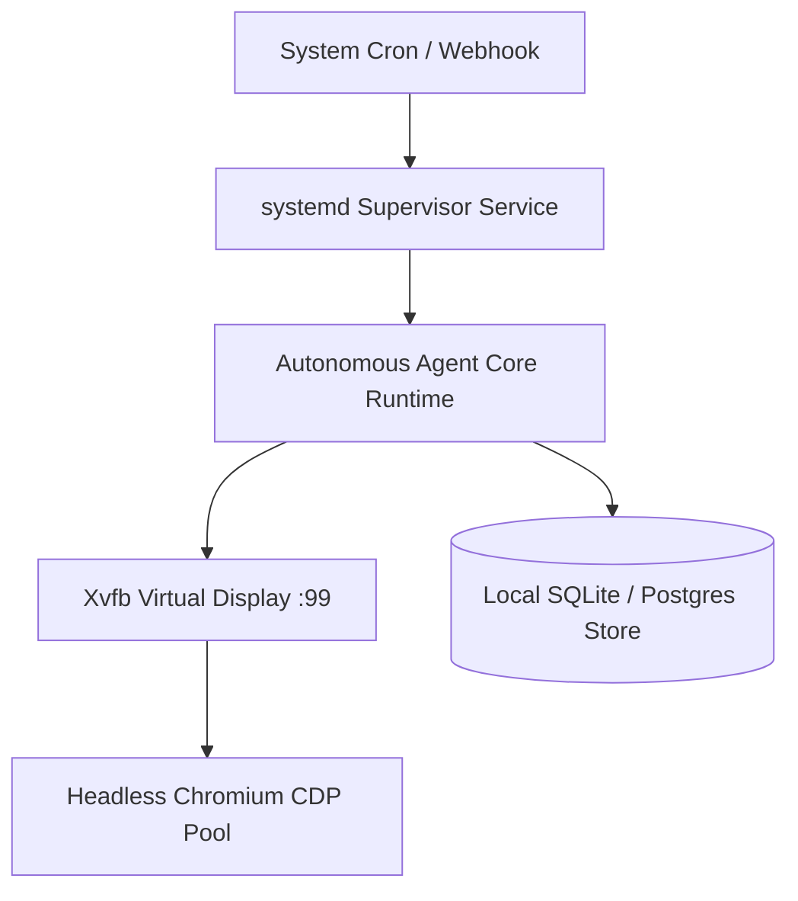

# Recipe: Self-Hosting Autonomous Agents on Ubuntu VPS

Production harness and supervision configurations for running autonomous AI agents on Ubuntu 24.04 LTS VPS with Xvfb virtual displays, headless Chromium browser pools, and systemd sandboxing.

Companion to the live ZeroLabs intelligence guide:
[Self-Hosting Autonomous Agents on Ubuntu](https://labs.zeroshot.studio/agents/self-hosting-headless-agent-vps)

## Architecture Overview



## Quick Start

### 1. Install Dependencies
```bash
sudo apt-get update && sudo apt-get install -y \
    xvfb \
    chromium-browser \
    libnss3 \
    libxss1 \
    libasound2t64 \
    fonts-liberation
```

### 2. Deploy Supervisor Service
```bash
sudo cp systemd/agent-worker.service /etc/systemd/system/
sudo systemctl daemon-reload
sudo systemctl enable agent-worker.service
sudo systemctl start agent-worker.service
```

### 3. Schedule Browser Cleanup
```cron
*/15 * * * * /usr/bin/python3 /opt/autonomous-agent/scripts/cleanup_stale_browsers.py >> /var/log/chrome-cleanup.log 2>&1
```
