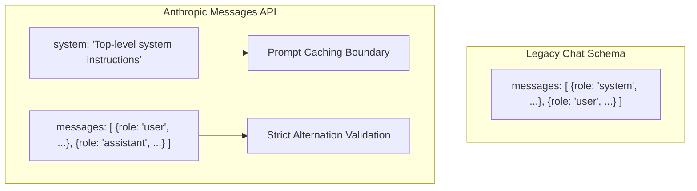
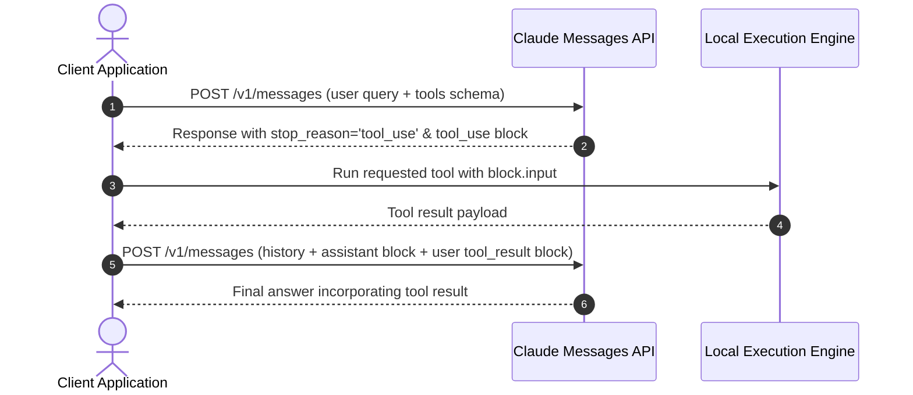

> **Key Takeaway:** The Anthropic Messages API enforces root-level system parameter configuration, strict user and assistant turn alternation, and typed content blocks for vision, documents, and tool executions.

## Contents
- [Messages API Architecture vs Legacy Endpoints](#messages-api-architecture-vs-legacy-endpoints)
- [Prerequisites and Setup](#prerequisites-and-setup)
- [Root-Level System Prompts](#root-level-system-prompts)
- [Strict Message Role Alternation](#strict-message-role-alternation)
- [Structuring Multi-Modal Content Blocks](#structuring-multi-modal-content-blocks)
- [Tool Use and Tool Result Blocks](#tool-use-and-tool-result-blocks)
- [Sub-5s Verification Probes](#sub-5s-verification-probes)
- [Common Failure Modes and Debugging](#common-failure-modes-and-debugging)
- [Next Steps](#next-steps)
- [FAQ](#faq)

## Messages API Architecture vs Legacy Endpoints

When designing multi-turn agent systems or LLM client layers, many engineers assume that the Messages API follows the legacy OpenAI-style schema where system instructions live inside the messages array with `role: "system"`. Anthropic treats system instructions as a distinct top-level parameter.



This structural separation provides three practical advantages:
1. **Prompt Caching Efficiency:** Separating the persistent system prompt from ephemeral conversation turns allows Anthropic prompt caching to isolate static system instructions and tools at predictable token boundaries.
2. **Context Integrity:** Placing system instructions at the root prevents user turns from masquerading as system prompts or injecting ambiguous role tags into conversational history.
3. **Deterministic Turn Alternation:** The `messages` list is strictly reserved for conversational dialogue between `user` and `assistant`.

In our production workflows at ZeroShot Studio, treating message structures as strict typed schemas prevents subtle runtime errors when chaining multi-turn reasoning loops.

## Prerequisites and Setup

Before executing structured requests against Claude, ensure you have an active API key and installed SDKs. If you have not set up your environment, follow our guides on [how to set up Anthropic Python and TypeScript SDKs](https://labs.zeroshot.studio/resources/how-to-set-up-anthropic-python-and-typescript-sdks) and [how to manage Anthropic API keys and environment variables](https://labs.zeroshot.studio/resources/how-to-manage-anthropic-api-keys-and-environment-variables).

Ensure your terminal environment has the required runtime and libraries:

```bash
# Verify environment variable
echo "Key prefix: ${ANTHROPIC_API_KEY:0:10}..."

# Python environment
python3 -m venv .venv
source .venv/bin/activate
pip install anthropic python-dotenv

# TypeScript / Node environment
npm install @anthropic-ai/sdk dotenv tsx
```

## Root-Level System Prompts

In the Messages API, the system prompt is defined by the top-level `system` parameter. It accepts either a plain string or an array of text content blocks. If you pass `role: "system"` inside the `messages` array, the API immediately throws an HTTP 400 `invalid_request_error`.

### Python Implementation: Root System Parameter

```python
import os
import anthropic
from dotenv import load_dotenv

load_dotenv()

client = anthropic.Anthropic(api_key=os.environ["ANTHROPIC_API_KEY"])

response = client.messages.create(
    model="claude-3-7-sonnet-20250219",
    max_tokens=300,
    temperature=0.2,
    system="You are an enterprise reliability engineer. Return findings in strict JSON format.",
    messages=[
        {
            "role": "user",
            "content": "Verify that your instructions are set to reliability engineering mode.",
        }
    ],
)

print(f"Stop Reason: {response.stop_reason}")
print(f"Usage: {response.usage.input_tokens} in, {response.usage.output_tokens} out")
for block in response.content:
    if block.type == "text":
        print(block.text)
```

### TypeScript Implementation: Root System Parameter

```typescript
import Anthropic from "@anthropic-ai/sdk";
import * as dotenv from "dotenv";

dotenv.config();

const client = new Anthropic({
  apiKey: process.env.ANTHROPIC_API_KEY,
});

async function main(): Promise<void> {
  const response = await client.messages.create({
    model: "claude-3-7-sonnet-20250219",
    max_tokens: 300,
    temperature=0.2,
    system: "You are an enterprise reliability engineer. Return findings in strict JSON format.",
    messages: [
      {
        role: "user",
        content: "Verify that your instructions are set to reliability engineering mode.",
      },
    ],
  });

  console.log(`Stop Reason: ${response.stop_reason}`);
  for (const block of response.content) {
    if (block.type === "text") {
      console.log(block.text);
    }
  }
}

main();
```

## Strict Message Role Alternation

The `messages` parameter only permits two roles: `user` and `assistant`. Furthermore, messages must strictly alternate between `user` and `assistant`.

### Rule 1: The Initial Turn Must Be User
The first item in the `messages` array must have `role: "user"`. Supplying an assistant turn first triggers a schema validation error.

### Rule 2: Consecutive Same-Role Turns Are Disallowed
You cannot provide two consecutive `user` turns or two consecutive `assistant` turns in the array. If a user provides multiple successive inputs before Claude responds, your client application must either concatenate them into a single `user` turn or wrap them into an array of content blocks within that turn.

### Rule 3: Prefilling Assistant Responses
You can end the `messages` array with an `assistant` turn to guide or prefill Claude's response. When you prefill, Claude resumes generating directly from where the assistant prompt ended without re-outputting the prefix.

```python
# Prefilling example: Enforce valid JSON opening
response = client.messages.create(
    model="claude-3-7-sonnet-20250219",
    max_tokens=256,
    system="You are a data validator. Output raw JSON only.",
    messages=[
        {
            "role": "user",
            "content": "Generate deployment summary for cluster us-east-1.",
        },
        {
            "role": "assistant",
            "content": "{\n  \"cluster\": \"us-east-1\",\n  \"status\":",
        },
    ],
)

# Claude continues directly from the prefilled token
for block in response.content:
    if block.type == "text":
        print("{\n  \"cluster\": \"us-east-1\",\n  \"status\":" + block.text)
```

## Structuring Multi-Modal Content Blocks

The `content` field of any message can be a raw string or an array of polymorphic content objects. This allows combining text prompts, high-resolution images, and documents in a single turn.

### Image Block Structure
Anthropic supports JPEG, PNG, GIF, and WEBP formats encoded as base64 strings:

```python
import base64

def build_image_message(image_path: str, prompt_text: str) -> dict:
    with open(image_path, "rb") as img_file:
        encoded_string = base64.b64encode(img_file.read()).decode("utf-8")

    return {
        "role": "user",
        "content": [
            {
                "type": "text",
                "text": prompt_text,
            },
            {
                "type": "image",
                "source": {
                    "type": "base64",
                    "media_type": "image/png",
                    "data": encoded_string,
                },
            },
        ],
    }
```

### Document Block Structure (PDF Support)
For Claude 3.5 Sonnet and Claude 3.7 Sonnet, PDF documents can be provided as document blocks:

```python
def build_pdf_message(pdf_bytes: bytes, user_query: str) -> dict:
    return {
        "role": "user",
        "content": [
            {
                "type": "document",
                "source": {
                    "type": "base64",
                    "media_type": "application/pdf",
                    "data": base64.b64encode(pdf_bytes).decode("utf-8"),
                },
            },
            {
                "type": "text",
                "text": user_query,
            },
        ],
    }
```

## Tool Use and Tool Result Blocks

Tool execution in the Messages API follows a structured conversational roundtrip. The model does not execute code itself; it responds with a content block of type `tool_use`. Your application performs the tool action and returns the output in the subsequent turn using a `tool_result` content block.



### Full Two-Turn Tool Execution Cycle (Python)

```python
import json
import anthropic

client = anthropic.Anthropic()

tools = [
    {
        "name": "lookup_dns_record",
        "description": "Retrieves active DNS A and CNAME records for a domain.",
        "input_schema": {
            "type": "object",
            "properties": {
                "domain": {"type": "string", "description": "Fully qualified domain name"},
                "record_type": {"type": "string", "enum": ["A", "CNAME", "TXT"]},
            },
            "required": ["domain", "record_type"],
        },
    }
]

# Turn 1: Initial user query
turn_one = client.messages.create(
    model="claude-3-7-sonnet-20250219",
    max_tokens=512,
    tools=tools,
    messages=[
        {
            "role": "user",
            "content": "Look up the active A record for api.internal.lan.",
        }
    ],
)

# Extract tool call
tool_block = next((b for b in turn_one.content if b.type == "tool_use"), None)
if not tool_block:
    raise RuntimeError("Expected tool_use block from model.")

# Execute local tool logic
mock_record = {"domain": "api.internal.lan", "type": "A", "target": "10.0.4.15"}

# Turn 2: Feed back tool_result
turn_two = client.messages.create(
    model="claude-3-7-sonnet-20250219",
    max_tokens=512,
    tools=tools,
    messages=[
        {
            "role": "user",
            "content": "Look up the active A record for api.internal.lan.",
        },
        {
            "role": "assistant",
            "content": turn_one.content,
        },
        {
            "role": "user",
            "content": [
                {
                    "type": "tool_result",
                    "tool_use_id": tool_block.id,
                    "content": json.dumps(mock_record),
                }
            ],
        },
    ],
)

for block in turn_two.content:
    if block.type == "text":
        print(block.text)
```

## Sub-5s Verification Probes

To verify that your request payload structures, system prompts, and header configurations are valid without overhead, run this raw cURL probe directly against the Anthropic Messages API.

Save this script as `curl_probe.sh`:

```bash
#!/usr/bin/env bash
set -euo pipefail

if [ -z "${ANTHROPIC_API_KEY:-}" ]; then
  echo "Error: ANTHROPIC_API_KEY environment variable is not set." >&2
  exit 1
fi

PAYLOAD=$(cat <<JSON
{
  "model": "claude-3-7-sonnet-20250219",
  "max_tokens": 128,
  "temperature": 0.0,
  "system": "Respond with verified JSON status.",
  "messages": [
    {
      "role": "user",
      "content": "Confirm Messages API structure."
    },
    {
      "role": "assistant",
      "content": "{\"status\":"
    }
  ]
}
JSON
)

START_TIME=$(date +%s%N)

RESPONSE=$(curl -s -w "\n%{http_code}\n%{time_total}" \
  -X POST "https://api.anthropic.com/v1/messages" \
  -H "x-api-key: ${ANTHROPIC_API_KEY}" \
  -H "anthropic-version: 2023-06-01" \
  -H "content-type: application/json" \
  -d "${PAYLOAD}")

TOTAL_TIME=$(echo "${RESPONSE}" | tail -n 1)
HTTP_STATUS=$(echo "${RESPONSE}" | tail -n 2 | head -n 1)
BODY=$(echo "${RESPONSE}" | sed '$d' | sed '$d')

echo "HTTP Status: ${HTTP_STATUS}"
echo "Roundtrip Time: ${TOTAL_TIME}s"
echo "Response Body: ${BODY}"
```

Make the probe executable and run it:

```bash
chmod +x curl_probe.sh
./curl_probe.sh
```

A healthy invocation prints `HTTP Status: 200` with total latency well under 2.0 seconds.

## Common Failure Modes and Debugging

| HTTP Status | Error Type | Root Cause | Remediation |
| :--- | :--- | :--- | :--- |
| **400** | `invalid_request_error` | System prompt passed inside `messages` array | Move system instructions to root-level `system` key |
| **400** | `invalid_request_error` | Consecutive `user` or `assistant` turns | Consolidate sequential user turns into a single message with multiple content blocks |
| **400** | `invalid_request_error` | Initial message has `role: "assistant"` | Ensure array begins with `role: "user"` |
| **400** | `invalid_request_error` | `tool_result` has missing or mismatched `tool_use_id` | Match `tool_result.tool_use_id` exactly to `tool_use.id` from previous assistant turn |
| **400** | `invalid_request_error` | Missing mandatory `max_tokens` field | Always specify `max_tokens` (required parameter in Messages API) |
| **429** | `rate_limit_error` | Concurrency or token throughput ceiling reached | Apply exponential backoff with full jitter |

## Next Steps

With your message schemas and role alternation patterns formalized, explore the companion recipes and curriculum modules:
- Review the complete codebase in our [zerolabs-recipes repository on GitHub](https://github.com/zeroshotstudio/zerolabs-recipes/tree/main/recipes/claude/04-structure-messages-api-requests).
- For API health checks and latency monitoring, refer to [how to test Claude API connectivity and models endpoint](https://labs.zeroshot.studio/resources/how-to-test-claude-api-connectivity-and-models-endpoint).
- Advance to streaming response delivery using Server-Sent Events (SSE) in the next curriculum installment.

## FAQ

### Why does Anthropic reject `role: "system"` inside the messages array?
Anthropic separates system instructions to isolate configuration prompts from conversation turns. This design enforces strict role boundaries, protects against context injection, and maximizes prompt caching hit rates on static system instructions.

### Can I pass multiple system prompts?
The `system` parameter can accept an array of text content blocks. This enables structuring complex system instructions into modular blocks, each tagged with distinct cache control breakpoints if desired.

### How do I handle consecutive user messages when a user sends two messages in chat?
Merge them into a single `user` turn before transmitting the request to Claude. You can join the text strings with newlines or send an array containing multiple `text` content blocks inside one `user` message object.

### Is `max_tokens` optional in the Messages API?
No. Unlike some other LLM APIs, `max_tokens` is a mandatory root-level parameter in the Anthropic Messages API. Omitting it results in an immediate HTTP 400 validation error.

### Can Claude return both text and a tool use in the same turn?
Yes. Claude often includes conversational reasoning in a `text` block alongside a `tool_use` block within the same assistant response content array. Client applications should parse all blocks rather than assuming only one block exists.
