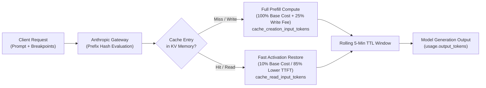

> **Key Takeaway:** Configuring prompt caching breakpoints via `cache_control: {"type": "ephemeral"}` cuts input token costs by 90% and reduces time-to-first-token latency by up to 85% across long prompt prefixes in Claude Messages API pipelines.

High-throughput AI agent architectures spend significant computing budgets reprocessing static instructions, tool definitions, and retrieval-augmented generation (RAG) context. When multi-turn workflows repeatedly transmit the same 5,000-token system specification, traditional model endpoints recalculate attention keys and values on every single turn. This creates unnecessary latency spikes and increases API expenditure.

Anthropic prompt caching solves this bottleneck. By marking static prefix boundaries with explicit cache breakpoints, you instruct the Claude inference cluster to store compiled prefix activations in accelerator memory. Subsequent requests sharing that exact prefix bypass redundant prefill compute, reducing time-to-first-token (TTFT) by up to 85% and cutting cached token costs by 90%.

This guide details the technical mechanics of cache breakpoints, placement rules across system prompts and tool schemas, minimum token thresholds, SDK implementations across Python and TypeScript, and automated verification probes.

Companion code repository: [ZeroLabs Claude Recipes Monorepo](https://github.com/zeroshotstudio/zerolabs-recipes/tree/main/recipes/claude/07-configure-prompt-caching-breakpoints).

## Contents

- [How Does Claude Prompt Caching Work?](#how-does-claude-prompt-caching-work)
- [What Are the Hard Breakpoint Constraints?](#what-are-the-hard-breakpoint-constraints)
- [How Do Breakpoints Compare Across Architectures?](#how-do-breakpoints-compare-across-architectures)
- [Where Should You Place Cache Breakpoints?](#where-should-you-place-cache-breakpoints)
- [How to Implement Breakpoints in Python](#how-to-implement-breakpoints-in-python)
- [How to Implement Breakpoints in TypeScript](#how-to-implement-breakpoints-in-typescript)
- [How to Inspect Cache Usage in Raw cURL Payloads](#how-to-inspect-cache-usage-in-raw-curl-payloads)
- [How to Verify Cache Reads and Creation Metrics](#how-to-verify-cache-reads-and-creation-metrics)
- [What Are Common Production Failure Modes?](#what-are-common-production-failure-modes)
- [FAQ](#faq)

## How Does Claude Prompt Caching Work?

Prompt caching stores the compiled attention key-value (KV) states of prompt prefixes in high-bandwidth memory across Anthropic inference nodes. When a request arrives, the gateway calculates a cryptographic hash over the sequence of content blocks up to designated cache breakpoints. If an entry matches an existing hash in memory, the model loads the precomputed KV tensors rather than recomputing them from scratch.



Every cache hit refreshes a 5-minute rolling time-to-live (TTL) window. As long as requests continue to arrive within 5 minutes of each other, the cached prefix remains warm in accelerator memory.

## What Are the Hard Breakpoint Constraints?

Production architectures must adhere to three foundational constraints enforced by the Anthropic Messages API:

> **The hard rule:** A single request supports a maximum of 4 explicit cache breakpoints. Furthermore, prompt caching activates only when the prompt prefix meets the model minimum token threshold: 1,024 tokens for Claude 3.5 Sonnet and Claude 3 Opus, or 2,048 tokens for Claude 3.5 Haiku. Payloads below these thresholds process as standard uncached tokens.

Beyond token minimums and breakpoint caps, cache consistency depends on strict prefix matching. Any modification to a content block invalidates all downstream breakpoints:

1. **Deterministic Character Ordering:** Even a single whitespace change or modified timestamp in an early system block changes the prefix hash, forcing a complete cache write.
2. **Sequential Dependency:** Breakpoint 2 requires an identical match on Breakpoint 1. You cannot hit Breakpoint 2 if Breakpoint 1 suffered an invalidation.
3. **Model Specificity:** Caches do not share state across different model identifiers. A cache created on `claude-3-5-sonnet-20241022` provides zero cache hits for `claude-3-5-haiku-20241022`.

## How Do Breakpoints Compare Across Architectures?

Understanding the operational differences between caching configurations enables teams to structure multi-turn pipelines effectively:

| Architectural Configuration | Breakpoint Target | Minimum Prefix Size | Economic & Latency Impact |
| :--- | :--- | :--- | :--- |
| **Static System Instruction** | `system` text block | 1,024 tokens (Sonnet/Opus) | 90% savings on recurring system prompts; stabilizes sub-agent base context. |
| **Large Tool Registry** | Final entry in `tools` array | 1,024 tokens (Sonnet/Opus) | Eliminates overhead from enterprise schema definitions containing 20+ tool specifications. |
| **Document / RAG Knowledge** | Static context in `messages[0]` | 1,024 tokens (Sonnet/Opus) | Reduces multi-turn Q&A latency on 20k to 100k token reference manuals from 12s down to 2.1s. |
| **Multi-Turn Chat History** | Penultimate assistant turn | 1,024 tokens cumulative | Keeps long conversational threads responsive by rolling the breakpoint forward every turn. |

## Where Should You Place Cache Breakpoints?

Because each request is capped at four breakpoints, deliberate placement determines your effective cache hit ratio:

1. **System Prompt Level:** Place `cache_control: {"type": "ephemeral"}` on your core operational prompt. If your system prompt consists of static policy plus dynamic variables (like the current UTC timestamp), split the prompt into two blocks: place the static instructions first with a cache breakpoint, and put dynamic variables in a second uncached block.
2. **Tools Definition Array:** When supplying extensive tool sets, mark the final tool object in your list with `cache_control`. This bundles all preceding tools into the cached prefix.
3. **Static Reference Corpus:** When implementing document search or code review tools, place the static reference files in the first `user` message with a cache breakpoint.
4. **Conversation Anchor Turn:** In long conversational sessions, place the fourth breakpoint on the assistant message before the latest user query.

For an in-depth breakdown of multi-modal message formats and turn alternation, see our guide on [How to Structure Messages API Requests and Roles](https://labs.zeroshot.studio/resources/how-to-structure-messages-api-requests-and-roles).

## How to Implement Breakpoints in Python

The official Anthropic Python SDK provides first-class support for prompt caching. Breakpoints are defined by attaching `{"type": "ephemeral"}` to content blocks or tool definitions.

```python
import os
import sys
import anthropic

# Initialize the official Anthropic client
client = anthropic.Anthropic(api_key=os.environ["ANTHROPIC_API_KEY"])

# Long system instructions exceeding the 1,024 token minimum
ENTERPRISE_SYSTEM_SPEC = (
    "You are the ZeroLabs Production Orchestrator. Maintain high availability, "
    "enforce strict role-based access control, validate payload schemas, "
    "and log immutable audit records across distributed agent nodes.\n"
) * 50  # Multiplied to satisfy token threshold

response = client.messages.create(
    model="claude-3-5-sonnet-20241022",
    max_tokens=300,
    system=[
        {
            "type": "text",
            "text": ENTERPRISE_SYSTEM_SPEC,
            "cache_control": {"type": "ephemeral"},
        }
    ],
    tools=[
        {
            "name": "query_service_telemetry",
            "description": "Fetch latency and CPU saturation metrics for a service cluster.",
            "input_schema": {
                "type": "object",
                "properties": {
                    "cluster_name": {"type": "string"},
                    "window_minutes": {"type": "integer", "default": 15},
                },
                "required": ["cluster_name"],
            },
            # Cache all tools by marking the last definition
            "cache_control": {"type": "ephemeral"},
        }
    ],
    messages=[
        {
            "role": "user",
            "content": "Verify operational status for cluster prod-us-east-1.",
        }
    ],
)

# Inspect cache allocation metrics
usage = response.usage
print(f"Message ID: {response.id}")
print(f"Base Input Tokens: {usage.input_tokens}")
print(f"Cache Creation Tokens: {getattr(usage, 'cache_creation_input_tokens', 0)}")
print(f"Cache Read Tokens: {getattr(usage, 'cache_read_input_tokens', 0)}")
print(f"Output Tokens: {usage.output_tokens}")
```

On the initial execution, `cache_creation_input_tokens` reflects the compiled prefix. On subsequent executions within 5 minutes, `cache_creation_input_tokens` drops to 0, while `cache_read_input_tokens` captures the full prefix volume at a 90% discount.

## How to Implement Breakpoints in TypeScript

In TypeScript applications, use `@anthropic-ai/sdk`. Explicit typing guarantees correct parameter placement across message blocks:

```typescript
import Anthropic from '@anthropic-ai/sdk';

const client = new Anthropic({
  apiKey: process.env.ANTHROPIC_API_KEY,
});

// Static reference text satisfying minimum token size (>1,024 tokens)
const TECHNICAL_DOCUMENTATION = `
ZeroLabs Architecture Core Guidelines:
All services must expose health check probes on port 8080.
Rate limits are enforced at the API gateway layer using sliding window algorithms.
Database mutations require distributed transactions with two-phase commit verification.
`.repeat(60);

async function runCachedQuery(): Promise<void> {
  const response = await client.messages.create({
    model: 'claude-3-5-sonnet-20241022',
    max_tokens: 200,
    system: [
      {
        type: 'text',
        text: TECHNICAL_DOCUMENTATION,
        cache_control: { type: 'ephemeral' },
      },
    ],
    messages: [
      {
        role: 'user',
        content: 'What port must health check probes expose?',
      },
    ],
  });

  const usage = response.usage as typeof response.usage & {
    cache_creation_input_tokens?: number;
    cache_read_input_tokens?: number;
  };

  console.log(`Response ID: ${response.id}`);
  console.log(`Uncached Input: ${usage.input_tokens}`);
  console.log(`Cache Creation: ${usage.cache_creation_input_tokens ?? 0}`);
  console.log(`Cache Read:     ${usage.cache_read_input_tokens ?? 0}`);
  console.log(`Output Tokens:  ${usage.output_tokens}`);
}

runCachedQuery().catch(console.error);
```

For streaming implementations where responses emit Server-Sent Events, review [How to Implement Server-Sent Event Streaming with Claude](https://labs.zeroshot.studio/resources/how-to-implement-server-sent-event-streaming-with-claude) to capture usage deltas in streaming blocks.

## How to Inspect Cache Usage in Raw cURL Payloads

Raw HTTP requests require sending `cache_control` inside content block arrays. Note that the top-level `system` field must be an array of objects rather than a raw string when applying cache breakpoints:

```bash
curl https://api.anthropic.com/v1/messages \
  -H "x-api-key: ${ANTHROPIC_API_KEY}" \
  -H "anthropic-version: 2023-06-01" \
  -H "content-type: application/json" \
  -d '{
    "model": "claude-3-5-sonnet-20241022",
    "max_tokens": 150,
    "system": [
      {
        "type": "text",
        "text": "'"${LONG_SYSTEM_PROMPT}"'",
        "cache_control": {"type": "ephemeral"}
      }
    ],
    "messages": [
      {
        "role": "user",
        "content": "Extract the primary architecture principles."
      }
    ]
  }'
```

The response returns a structured `usage` block containing token breakdowns:

```json
{
  "id": "msg_01Lp9j7XzKq1FvQn4eL8yWbZ",
  "type": "message",
  "role": "assistant",
  "content": [
    {
      "type": "text",
      "text": "The primary architecture principles focus on high availability, role-based access, and schema validation."
    }
  ],
  "model": "claude-3-5-sonnet-20241022",
  "stop_reason": "end_turn",
  "stop_sequence": null,
  "usage": {
    "input_tokens": 14,
    "cache_creation_input_tokens": 1842,
    "cache_read_input_tokens": 0,
    "output_tokens": 32
  }
}
```

When repeating this request within 5 minutes, the usage object updates:

```json
{
  "usage": {
    "input_tokens": 14,
    "cache_creation_input_tokens": 0,
    "cache_read_input_tokens": 1842,
    "output_tokens": 28
  }
}
```

## How to Verify Cache Reads and Creation Metrics

Production monitoring pipelines should assert cache hit rates directly from telemetry headers or usage bodies. We encapsulate this into an automated verification probe:

```bash
#!/usr/bin/env bash
set -euo pipefail

RESP=$(curl -s https://api.anthropic.com/v1/messages \
  -H "x-api-key: ${ANTHROPIC_API_KEY}" \
  -H "anthropic-version: 2023-06-01" \
  -H "content-type: application/json" \
  -d @payload.json)

READ_TOKENS=$(echo "${RESP}" | python3 -c "import sys, json; print(json.load(sys.stdin).get('usage', {}).get('cache_read_input_tokens', 0))")

if [ "${READ_TOKENS}" -gt 0 ]; then
  echo "CACHE HIT: ${READ_TOKENS} tokens read from accelerator memory."
else
  echo "CACHE MISS: Check token threshold or prefix matching."
fi
```

To integrate error-handling and generation cutoff detection into these pipelines, refer to our companion recipe on [How to Handle Stop Reasons and Max Token Truncation](https://labs.zeroshot.studio/resources/how-to-handle-stop-reasons-and-max-token-truncation).

## What Are Common Production Failure Modes?

When engineering caching pipelines, avoid these four common architectural pitfalls:

1. **Dynamic Data Leaks in Early System Blocks:** Injecting timestamps, request IDs, or non-deterministic session state into the first system block invalidates the entire cache tree on every call. Always isolate dynamic parameters into un-cached trailing blocks.
2. **Sub-Threshold Payloads:** Passing 600 tokens to Claude 3.5 Sonnet with `cache_control` silently fails to cache. The API processes the request without returning an error, but `cache_creation_input_tokens` remains 0. Verify that prefixes meet the 1,024 or 2,048 token requirement.
3. **Over-Allocating Breakpoints:** Supplying 5 or more `cache_control` objects in a single payload triggers an HTTP 400 validation error from the API gateway.
4. **Cache Eviction from Idleness:** The 5-minute TTL operates on a rolling basis. In low-traffic services with calls spaced 10 minutes apart, every turn results in a cache miss and re-creation fee. For low-frequency workflows, evaluate whether cache creation fees exceed standard input token processing costs.

For environment setup guidelines and API credential best practices, consult [How to Manage Anthropic API Keys & Env Variables](https://labs.zeroshot.studio/resources/how-to-manage-anthropic-api-keys-and-environment-variables).

## FAQ

### What are the minimum token requirements for prompt caching to activate?
Claude 3.5 Sonnet and Claude 3 Opus require a minimum prefix length of 1,024 tokens. Claude 3.5 Haiku requires a minimum prefix length of 2,048 tokens. Payloads smaller than these thresholds process as standard uncached tokens without throwing an error.

### How much does prompt caching cost compared to regular input tokens?
Writing to the cache costs 25% more than the base input token price during initial creation (`cache_creation_input_tokens`). Subsequent reads from the cache (`cache_read_input_tokens`) receive a 90% discount off the base input token price. If a cached prefix is read at least twice within its TTL, it delivers net financial savings.

### What is the time-to-live duration for a cached prompt?
The cache has a rolling time-to-live (TTL) of 5 minutes. Every time an incoming request successfully reads from the cache, the 5-minute timer resets for that specific cached prefix.

### Can I set more than four cache breakpoints in one request?
No. The Anthropic Messages API enforces a strict limit of 4 cache breakpoints per request. Placing more than 4 `cache_control` blocks in a single payload causes an HTTP 400 Bad Request error.
