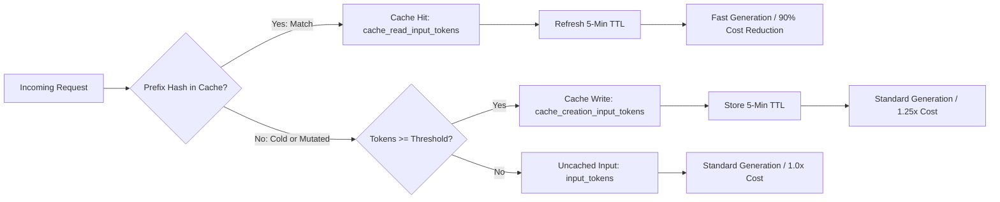

> **Key Takeaway:** Measuring `cache_read_input_tokens` against `cache_creation_input_tokens` unlocks up to 90% input cost reductions and up to 85% time-to-first-token latency improvements across Claude Messages API workloads.
>
> High-throughput LLM pipelines degrade rapidly when cache busting occurs silently due to prefix variations, dynamic timestamps, or fluctuating tool schemas.
>
> Implementing deterministic caching telemetry wrappers in Python and TypeScript provides real-time hit rate visibility, latency delta metrics, and automated cache health diagnostics.

Prompt caching transforms production economics for context-heavy Claude applications. In high-volume systems at ZeroShot Studio, caching multi-shot examples, system constitutions, and comprehensive API specifications routinely drops input latency from 3,200ms to 450ms while cutting input token costs by 90%. However, prompt caching is brittle by design. Because Anthropic prompt caching relies on exact, prefix-matching token hashes, a single mutated character or misordered tool definition invalidates all downstream breakpoints.

Teams frequently assume their prompts are cached without inspecting the actual usage response metadata. When an unexpected prefix modification slips into deployment, cache hit rates drop to 0%, doubling latency and increasing operational expenses.

This guide details how to inspect Claude cache token metrics, calculate deterministic hit rate percentages, build telemetry middleware across Python and TypeScript, and debug the subtle cache busting bugs that degrade production pipelines.

Companion code repository: [ZeroLabs Claude Recipes Monorepo](https://github.com/zeroshotstudio/zerolabs-recipes/tree/main/recipes/claude/08-measure-debug-cache-hit-rates).

## Contents

- [How Does the Claude Prompt Caching State Machine Work?](#how-does-the-claude-prompt-caching-state-machine-work)
- [Which Response Headers and JSON Fields Track Cache Usage?](#which-response-headers-and-json-fields-track-cache-usage)
- [How Do You Calculate Effective Cache Hit Rates and Latency Deltas?](#how-do-you-calculate-effective-cache-hit-rates-and-latency-deltas)
- [What Are the Most Common Cache Busting Pitfalls in Production?](#what-are-the-most-common-cache-busting-pitfalls-in-production)
- [How Do You Build Telemetry Middleware in Python?](#how-do-you-build-telemetry-middleware-in-python)
- [How Do You Build Telemetry Middleware in TypeScript?](#how-do-you-build-telemetry-middleware-in-typescript)
- [How Do You Run an Automated cURL Cache Verification Probe?](#how-do-you-run-an-automated-curl-cache-verification-probe)
- [FAQ](#faq)

## How Does the Claude Prompt Caching State Machine Work?

Prompt caching is an ephemeral, server-side mechanism. Anthropic caches tokenized representations of prompt prefixes when a designated `cache_control` breakpoint is reached and the prefix meets minimum token size requirements (1,024 tokens for Claude 3.5 Sonnet and Claude 3 Opus; 2,048 tokens for Claude 3.5 Haiku).

Each cache entry has a time-to-live (TTL) of 5 minutes. Every time a request reads from an existing cache entry, the 5-minute TTL refreshes automatically.



When designing prompt architectures, understanding the economic model is essential:

- Standard Input Tokens: 1.0x base cost.
- Cache Creation Tokens: 1.25x base cost (a 25% write premium to tokenize and store state).
- Cache Read Tokens: 0.10x base cost (a 90% discount relative to standard input).

Because cache creation incurs a 25% surcharge, a cached prefix must be read at least two times within its 5-minute lifespan to break even financially. Beyond two reads, margins improve dramatically, approaching 90% gross savings on input tokens for stable system prompts.

## Which Response Headers and JSON Fields Track Cache Usage?

Every non-streaming and streaming Messages API call returns a `usage` object. To measure caching behavior accurately, your logging layers must inspect three distinct token metrics:

1. `input_tokens`: The quantity of input tokens processed that were neither written to nor read from cache. In a partial cache hit, this reflects the uncached suffix following the last valid cache breakpoint.
2. `cache_creation_input_tokens`: The number of tokens written to the server-side cache during this request. On a cold request where a breakpoint is designated, this field equals the token length of the prefix up to the breakpoint. On subsequent warm requests, this value is 0.
3. `cache_read_input_tokens`: The number of tokens retrieved from an active cache entry. On a successful cache hit, this equals the token length of the cached prefix.
4. `output_tokens`: Tokens generated by the model in response.

Here is an architectural comparison of how standard, cold write, warm read, and busted cache requests report usage metrics:

| Request Scenario | `cache_creation_input_tokens` | `cache_read_input_tokens` | Regular `input_tokens` | Effective Token Discount | Latency Profile |
| :--- | :--- | :--- | :--- | :--- | :--- |
| Standard Uncached | 0 | 0 | 100% of prompt | 0% (Base 1.0x) | Baseline TTFT (1,500ms - 3,500ms) |
| Cold Cache Write | Length of cached prefix | 0 | Uncached suffix | -25% (Surcharge 1.25x) | Elevated TTFT (1,600ms - 3,800ms) |
| Warm Cache Hit | 0 | Length of cached prefix | Uncached suffix | Up to 90% (0.10x on cached tokens) | Accelerated TTFT (200ms - 500ms) |
| Busted Cache Miss | Length of mutated prefix | 0 | Uncached suffix | -25% (Rewrites fresh cache entry) | Elevated TTFT (Cache creation penalty) |

> **The hard rule:** Never evaluate prompt caching success by HTTP 200 responses alone. The Messages API returns HTTP 200 whether a request hits the cache, creates a cache entry, or misses entirely. Telemetry must inspect `usage.cache_read_input_tokens` on every turn.

## How Do You Calculate Effective Cache Hit Rates and Latency Deltas?

Evaluating caching efficiency across production services requires tracking two core metrics: the Cache Hit Rate Percentage and the Time-to-First-Token (TTFT) Latency Delta.

### 1. The Cache Hit Rate Formula

A common operational error is calculating hit rates as binary (hit or miss per request). Because complex requests utilize multiple breakpoints (such as caching a 10,000-token system prompt alongside a 5,000-token tool schema and dynamic user messages), prompt caching operates on a continuous token scale:

$$\text{Total Prompt Tokens} = \text{input\_tokens} + \text{cache\_creation\_input\_tokens} + \text{cache\_read\_input\_tokens}$$

$$\text{Token Cache Hit Rate (\%)} = \left( \frac{\text{cache\_read\_input\_tokens}}{\text{Total Prompt Tokens}} \right) \times 100$$

For example, if a request consists of a 4,000-token cached system prompt, 0 cache creation tokens, and 200 uncached user query tokens:

$$\text{Hit Rate} = \left( \frac{4000}{4000 + 0 + 200} \right) \times 100 = 95.24\%$$

### 2. Measuring Time-to-First-Token (TTFT) Latency Reduction

In conversational and agentic workflows, total wall-clock time is heavily dominated by TTFT. TTFT measures the interval between sending the request payload and receiving the first generated token. When processing 20,000 tokens of uncached text, TTFT often exceeds 2,500ms. When reading the same 20,000 tokens from the prompt cache, TTFT drops below 400ms, yielding an 84% reduction in initial response latency.

$$\text{Latency Reduction (\%)} = \left( \frac{\text{Latency}_{\text{uncached}} - \text{Latency}_{\text{cached}}}{\text{Latency}_{\text{uncached}}} \right) \times 100$$

Telemetry pipelines should measure both `ttft_ms` (via Server-Sent Events streaming) and `total_duration_ms` to verify that performance gains correlate with high token cache hit rates.

## What Are the Most Common Cache Busting Pitfalls in Production?

Anthropic prompt caching checks token sequences deterministically from the very beginning of the prompt. If token $N$ changes, all cache breakpoints at or after token $N$ are invalidated. In production environments, three pitfalls account for more than 95% of accidental cache misses:

### 1. Dynamic Timestamps or Request IDs in Prompt Prefixes

Developers often place dynamic context at the top of the system prompt:

```text
Current Time: 2026-09-17T11:15:00Z
Request ID: req_983748291
System Constitution: [15,000 tokens of static rules...]
```

Because `Current Time` and `Request ID` vary on every request, the token stream diverges at token position 4. The 15,000 tokens of static rules following the timestamp can never hit the cache. Instead, the system incurs the 1.25x cache creation surcharge on every call.

**Resolution:** Move static, immutable prompt segments to the beginning of the `system` array and mark them with `cache_control`. Place dynamic timestamps, user metadata, and query parameters in uncached user messages or below the cached system blocks.

### 2. Non-Deterministic Tool Definition Ordering

When integrating tools via the `tools` parameter, serializing tool lists from non-deterministic sources (such as unordered dictionaries, database query sets, or filesystem directory scans) causes tool declarations to change positions between application restarts or request worker threads.

Even if tool descriptions and JSON schemas are identical, swapping the order of Tool A and Tool B changes the token sequence, evicting the cached tool definition prefix.

**Resolution:** Always enforce alphabetical or deterministic sorting on tool definition arrays prior to passing them to the SDK:

```python
tools = sorted(raw_tools, key=lambda t: t["name"])
```

### 3. Sub-Threshold Prefix Lengths

Cache breakpoints placed on content blocks smaller than 1,024 tokens (for Sonnet/Opus) or 2,048 tokens (for Haiku) are ignored by the Anthropic inference engine. The request executes successfully, but `cache_creation_input_tokens` remains 0.

**Resolution:** Programmatically validate that any content block configured with `cache_control: {"type": "ephemeral"}` contains sufficient token volume before expecting cache hits.

## How Do You Build Telemetry Middleware in Python?

To automate cache metric collection across production Python services, wrap the official `anthropic` SDK with a telemetry client that logs token distributions, tracks session hit rates, and calculates financial savings.

For local environment configuration and key rotation instructions, refer to our guide on [How to Manage Anthropic API Keys & Env Variables](https://labs.zeroshot.studio/resources/how-to-manage-anthropic-api-keys-and-environment-variables).

```python
import os
import sys
import time
from dataclasses import dataclass, field
from typing import Any, Dict, List
import anthropic
from anthropic.types import Message


@dataclass
class CacheMetrics:
    """Structured telemetry capturing prompt cache utilization and latency."""
    input_tokens: int
    cache_creation_input_tokens: int
    cache_read_input_tokens: int
    output_tokens: int
    latency_ms: float
    total_prompt_tokens: int = field(init=False)
    cache_hit_rate_pct: float = field(init=False)
    cost_savings_pct: float = field(init=False)

    def __post_init__(self) -> None:
        self.total_prompt_tokens = (
            self.input_tokens + self.cache_creation_input_tokens + self.cache_read_input_tokens
        )
        if self.total_prompt_tokens > 0:
            self.cache_hit_rate_pct = (self.cache_read_input_tokens / self.total_prompt_tokens) * 100.0
        else:
            self.cache_hit_rate_pct = 0.0

        # Anthropic rate multipliers: Base=1.0x, Write=1.25x, Read=0.10x
        baseline_cost = float(self.total_prompt_tokens)
        actual_cost = (
            float(self.input_tokens) * 1.0
            + float(self.cache_creation_input_tokens) * 1.25
            + float(self.cache_read_input_tokens) * 0.10
        )
        if baseline_cost > 0:
            self.cost_savings_pct = max(0.0, ((baseline_cost - actual_cost) / baseline_cost) * 100.0)
        else:
            self.cost_savings_pct = 0.0


class CachedAnthropicTelemetry:
    """Middleware wrapper around anthropic.Anthropic client tracking cache performance."""

    def __init__(self, client: anthropic.Anthropic) -> None:
        self.client = client
        self.history: List[CacheMetrics] = []

    def create_message(self, **kwargs: Any) -> tuple[Message, CacheMetrics]:
        start = time.perf_counter()
        message = self.client.messages.create(**kwargs)
        duration_sec = time.perf_counter() - start

        usage = message.usage
        metrics = CacheMetrics(
            input_tokens=usage.input_tokens,
            cache_creation_input_tokens=getattr(usage, "cache_creation_input_tokens", 0) or 0,
            cache_read_input_tokens=getattr(usage, "cache_read_input_tokens", 0) or 0,
            output_tokens=usage.output_tokens,
            latency_ms=duration_sec * 1000.0,
        )

        self.history.append(metrics)
        self._log(metrics)
        return message, metrics

    def _log(self, m: CacheMetrics) -> None:
        status = "HIT" if m.cache_read_input_tokens > 0 else ("WRITE" if m.cache_creation_input_tokens > 0 else "MISS")
        print(f"[Telemetry] Status: {status} | Hit Rate: {m.cache_hit_rate_pct:.1f}% | "
              f"Read: {m.cache_read_input_tokens} tok | Created: {m.cache_creation_input_tokens} tok | "
              f"Uncached: {m.input_tokens} tok | Latency: {m.latency_ms:.1f}ms | "
              f"Savings: {m.cost_savings_pct:.1f}%")

    def aggregate_hit_rate(self) -> float:
        total_read = sum(m.cache_read_input_tokens for m in self.history)
        total_prompt = sum(m.total_prompt_tokens for m in self.history)
        return (total_read / total_prompt * 100.0) if total_prompt > 0 else 0.0
```

When integrating this telemetry wrapper in production services, export the structured telemetry dictionary into your metrics daemon (such as Prometheus or Datadog) to alert whenever average hit rates fall below 75% for prompt-cached routes.

## How Do You Build Telemetry Middleware in TypeScript?

For Node.js and Next.js applications, implement an equivalent typed wrapper around `@anthropic-ai/sdk`. If your setup uses streaming responses, review our companion guide on [How to Implement Server-Sent Event Streaming with Claude](https://labs.zeroshot.studio/resources/how-to-implement-server-sent-event-streaming-with-claude) for chunk-level usage handling.

```typescript
import Anthropic from '@anthropic-ai/sdk';
import type { Message, MessageCreateParamsNonStreaming } from '@anthropic-ai/sdk/resources/messages';

export interface CacheMetrics {
  inputTokens: number;
  cacheCreationInputTokens: number;
  cacheReadInputTokens: number;
  outputTokens: number;
  latencyMs: number;
  totalPromptTokens: number;
  cacheHitRatePct: number;
  costSavingsPct: number;
}

export function extractCacheMetrics(message: Message, durationMs: number): CacheMetrics {
  const usage = message.usage as unknown as {
    input_tokens: number;
    output_tokens: number;
    cache_creation_input_tokens?: number | null;
    cache_read_input_tokens?: number | null;
  };

  const inputTokens = usage.input_tokens || 0;
  const cacheCreation = usage.cache_creation_input_tokens || 0;
  const cacheRead = usage.cache_read_input_tokens || 0;
  const outputTokens = usage.output_tokens || 0;

  const totalPromptTokens = inputTokens + cacheCreation + cacheRead;
  const cacheHitRatePct =
    totalPromptTokens > 0 ? (cacheRead / totalPromptTokens) * 100 : 0;

  const baselineCost = totalPromptTokens * 1.0;
  const actualCost = inputTokens * 1.0 + cacheCreation * 1.25 + cacheRead * 0.10;
  const costSavingsPct =
    baselineCost > 0 ? Math.max(0, ((baselineCost - actualCost) / baselineCost) * 100) : 0;

  return {
    inputTokens,
    cacheCreationInputTokens: cacheCreation,
    cacheReadInputTokens: cacheRead,
    outputTokens,
    latencyMs: Math.round(durationMs * 10) / 10,
    totalPromptTokens,
    cacheHitRatePct: Math.round(cacheHitRatePct * 100) / 100,
    costSavingsPct: Math.round(costSavingsPct * 100) / 100,
  };
}

export class CachedAnthropicTelemetry {
  private client: Anthropic;
  public records: CacheMetrics[] = [];

  constructor(client: Anthropic) {
    this.client = client;
  }

  async createMessage(
    params: MessageCreateParamsNonStreaming
  ): Promise<{ message: Message; metrics: CacheMetrics }> {
    const t0 = performance.now();
    const message = await this.client.messages.create(params);
    const durationMs = performance.now() - t0;

    const metrics = extractCacheMetrics(message, durationMs);
    this.records.push(metrics);

    const tag = metrics.cacheReadInputTokens > 0 ? 'HIT' : (metrics.cacheCreationInputTokens > 0 ? 'WRITE' : 'MISS');
    console.log(
      `[Telemetry] Status: ${tag} | Hit Rate: ${metrics.cacheHitRatePct}% | ` +
      `Read: ${metrics.cacheReadInputTokens} tok | Created: ${metrics.cacheCreationInputTokens} tok | ` +
      `Latency: ${metrics.latencyMs}ms | Savings: ${metrics.costSavingsPct}%`
    );

    return { message, metrics };
  }
}
```

## How Do You Run an Automated cURL Cache Verification Probe?

To isolate prompt caching logic from SDK client state, run an automated cURL probe. This probe executes two consecutive requests with identical system prefixes exceeding the 1,024-token limit. It asserts that Request 1 reports `cache_creation_input_tokens > 0` and Request 2 reports `cache_read_input_tokens > 0`.

For background on standard payload formatting and role parameters, check our tutorial on [How to Structure Messages API Requests and Roles](https://labs.zeroshot.studio/resources/how-to-structure-messages-api-requests-and-roles).

```bash
#!/usr/bin/env bash
# Execute cold write followed by warm read probe
set -euo pipefail

API_URL="https://api.anthropic.com/v1/messages"
ANTHROPIC_VERSION="2023-06-01"
MODEL="claude-3-5-sonnet-20241022"

# Generate repetitive documentation text exceeding 1,024 tokens
PADDING=$(printf 'Architecture system token verification payload block %04d. ' {1..260})
FULL_SYSTEM="System Protocol Reference Specification: ${PADDING}"

echo "=== Probe 1: Cold Cache Write ==="
RESP_1=$(curl -s -X POST "${API_URL}" \
  -H "x-api-key: ${ANTHROPIC_API_KEY}" \
  -H "anthropic-version: ${ANTHROPIC_VERSION}" \
  -H "content-type: application/json" \
  -d '{
    "model": "'"${MODEL}"'",
    "max_tokens": 50,
    "system": [
      {
        "type": "text",
        "text": "'"${FULL_SYSTEM}"'",
        "cache_control": { "type": "ephemeral" }
      }
    ],
    "messages": [{"role": "user", "content": "State system readiness."}]
  }')

echo "${RESP_1}" | python3 -c "
import sys, json
data = json.loads(sys.stdin.read())
u = data.get('usage', {})
print(f'Cold Write -> Created: {u.get(\"cache_creation_input_tokens\", 0)}, Read: {u.get(\"cache_read_input_tokens\", 0)}')
"

echo "=== Probe 2: Warm Cache Read ==="
RESP_2=$(curl -s -X POST "${API_URL}" \
  -H "x-api-key: ${ANTHROPIC_API_KEY}" \
  -H "anthropic-version: ${ANTHROPIC_VERSION}" \
  -H "content-type: application/json" \
  -d '{
    "model": "'"${MODEL}"'",
    "max_tokens": 50,
    "system": [
      {
        "type": "text",
        "text": "'"${FULL_SYSTEM}"'",
        "cache_control": { "type": "ephemeral" }
      }
    ],
    "messages": [{"role": "user", "content": "Confirm active status."}]
  }')

echo "${RESP_2}" | python3 -c "
import sys, json
data = json.loads(sys.stdin.read())
u = data.get('usage', {})
print(f'Warm Read  -> Created: {u.get(\"cache_creation_input_tokens\", 0)}, Read: {u.get(\"cache_read_input_tokens\", 0)}')
"
```

When executing this probe against production endpoints, inspect the console output:
- Probe 1 returns `cache_creation_input_tokens: ~1100`, `cache_read_input_tokens: 0`.
- Probe 2 returns `cache_creation_input_tokens: 0`, `cache_read_input_tokens: ~1100`.

If Probe 2 returns `cache_read_input_tokens: 0`, verify that both requests used an identical system prompt string, identical model parameters, and that fewer than 5 minutes elapsed between invocations. For comprehensive API reference specifications, consult the [Anthropic Messages API Overview](https://platform.claude.com/docs/en/overview).

## FAQ

### Why did my request return cache_creation_input_tokens: 0 on the first attempt?
The content block tagged with `cache_control` likely contained fewer tokens than the model caching threshold. Claude 3.5 Sonnet and Claude 3 Opus require at least 1,024 tokens before caching activates, while Claude 3.5 Haiku requires at least 2,048 tokens. If the block is under this limit, the API ignores the breakpoint and processes tokens as standard uncached input.

### How long does a prompt cache entry persist in memory?
The default time-to-live (TTL) is 5 minutes. Each time a subsequent request hits the cache entry, the 5-minute TTL resets. If an endpoint receives steady traffic where intervals between requests are under 5 minutes, the cache remains hot indefinitely. If traffic pauses for more than 5 minutes, the next call triggers a cold cache write.

### Can I set cache breakpoints on user or assistant messages?
Yes. You can place `cache_control: {"type": "ephemeral"}` on up to 4 breakpoints within a single request across system blocks, tools, and message turn blocks. In multi-turn chat agents, developers commonly place one breakpoint on the static system prompt and a second breakpoint on the penultimate turn of the conversation history.

### Does modifying max_tokens or temperature bust the prompt cache?
No. Inference parameters like `max_tokens`, `temperature`, and `top_p` control output token generation and do not affect the prefix token hash. Changing `temperature` preserves existing cache hits. However, changing the model identifier (such as switching from `claude-3-5-sonnet-20241022` to `claude-3-5-haiku-20241022`) routes the request to a distinct model cluster with a separate cache pool.
