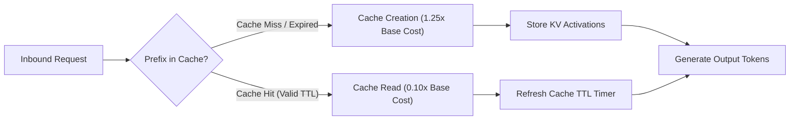
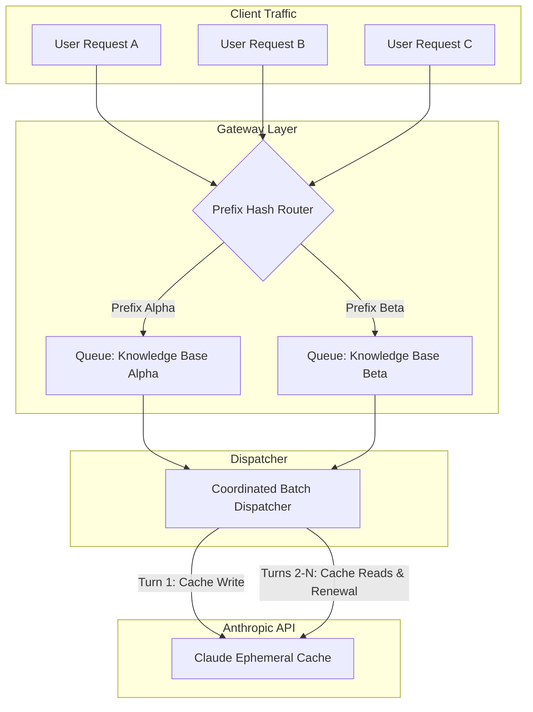

> **Key Takeaway:** Extending Claude prompt caching across a refreshed 1-hour ephemeral window reduces recurring prefix token expenses by up to 90%, achieving positive financial ROI on just the second cache hit.
> 
> - Writing a prompt prefix into Claude ephemeral cache incurs a 25% pricing surcharge over standard input token rates, while all subsequent cache reads receive a 90% discount.
> - Every successful cache hit refreshes the ephemeral lifetime window back to its full duration, preventing premature evictions during sustained traffic.
> - Batching requests into coordinated dispatch queues consolidates prefix reads and guarantees break-even volume within each retention window.

Managing token expenditures across large-scale LLM deployments requires treating prompt prefixes as addressable infrastructure rather than disposable text payloads. When engineering agent pipelines, retrieval-augmented generation systems, or code review harnesses, prompt contexts regularly scale past 20,000 to 100,000 tokens. Sending these static context blocks across hundreds of sequential API calls generates massive, redundant billing without providing any incremental knowledge to the model.

Anthropic prompt caching resolves this financial inefficiency by storing pre-computed KV states inside server-side memory. This guide details how to structure prompt caching economics, model the 5-minute default time-to-live versus extended 1-hour ephemeral cache behavior, implement queue-based batching architectures, and verify sub-second cache renewal across Python, TypeScript, and cURL.

Companion code repository: [ZeroLabs Claude Recipes Monorepo](https://github.com/zeroshotstudio/zerolabs-recipes/tree/main/recipes/claude/09-optimize-token-costs-ephemeral-cache).

## Contents

- [How Does Claude Ephemeral Caching Work?](#how-does-claude-ephemeral-caching-work)
- [What Is the Financial Cost Model for Prompt Caching?](#what-is-the-financial-cost-model-for-prompt-caching)
- [How Does Cache Renewal Work Across Extended Windows?](#how-does-cache-renewal-work-across-extended-windows)
- [How to Architect Request Batching for Maximum Cache Utilization?](#how-to-architect-request-batching-for-maximum-cache-utilization)
- [How to Implement Token Cost Models in Python?](#how-to-implement-token-cost-models-in-python)
- [How to Implement Cost Calculation in TypeScript?](#how-to-implement-cost-calculation-in-typescript)
- [How to Execute the cURL Cache Renewal Verification Probe?](#how-to-execute-the-curl-cache-renewal-verification-probe)
- [What Architectural Trade-Offs Govern Ephemeral Caching?](#what-architectural-trade-offs-govern-ephemeral-caching)
- [FAQ](#faq)

## How Does Claude Ephemeral Caching Work?

Claude prompt caching operates on prefix matching. When an API request includes a `cache_control: {"type": "ephemeral"}` declaration on a system message, tool definition, or user message block, the Anthropic inference gateway checks whether that exact prefix was processed recently.

If the prefix is present in the cache, Claude reuses the stored key-value activations. Instead of recomputing attention matrices across thousands of tokens, the engine immediately begins generating output tokens.



To take advantage of caching, prompts must satisfy minimum token length requirements:
- **Claude 3.5 Sonnet & Claude 3 Opus:** Minimum prefix length of 1,024 tokens.
- **Claude 3.5 Haiku & Claude 3 Haiku:** Minimum prefix length of 2,048 tokens.

Any prompt block tagged with `cache_control` that falls below these thresholds bypasses the cache entirely. The gateway bills the request at standard un-cached input rates without throwing an API error.

## What Is the Financial Cost Model for Prompt Caching?

Understanding cache economics requires analyzing two pricing components: the cache write premium and the cache read discount.

1. **Cache Creation / Write:** Billed at 125% of the model base input token price (a 25% premium).
2. **Cache Read / Hit:** Billed at 10% of the model base input token price (a 90% discount).
3. **Base Input Tokens:** Billed at 100% for any un-cached dynamic tokens appended after the cache breakpoint.
4. **Output Tokens:** Billed at standard output rates regardless of caching state.

For Claude 3.5 Sonnet, where the base input price is $3.00 per million tokens (MTok) and output is $15.00 per MTok:
- Cache write cost: $3.75 per MTok ($3.00 * 1.25).
- Cache read cost: $0.30 per MTok ($3.00 * 0.10).

We calculate the break-even threshold using the following economic relationship:

$$\text{Write Premium} = 0.25 \times \text{Base Rate}$$
$$\text{Read Savings} = 0.90 \times \text{Base Rate}$$
$$\text{Required Hits} = \frac{\text{Write Premium}}{\text{Read Savings}} = \frac{0.25}{0.90} \approx 0.28 \text{ reads}$$

> **The hard rule:** A single cache hit after the initial write yields an immediate net cost reduction. Across any prefix larger than 1,024 tokens, two total requests (one cache write followed by one cache read) deliver positive financial ROI.

Let us evaluate the cumulative token cost across a 50,000-token static prefix over 20 requests:

- **Uncached Total:** 20 requests * (50,000 / 1,000,000) * $3.00 = $3.00.
- **Cached Turn 1 (Write):** (50,000 / 1,000,000) * $3.75 = $0.1875.
- **Cached Turns 2 to 20 (19 Reads):** 19 * (50,000 / 1,000,000) * $0.30 = $0.2850.
- **Cached Total:** $0.1875 + $0.2850 = $0.4725.
- **Total Net Savings:** $2.5275 (an 84.25% cost reduction).

## How Does Cache Renewal Work Across Extended Windows?

The Anthropic Messages API implements an automatic sliding expiration mechanism:

1. **Initial Cache Entry:** When a cache block is written, the system assigns an initial expiration timer (5 minutes by default).
2. **Hit Renewal:** Whenever a subsequent request matches the cached prefix within that window, the TTL timer resets back to its full duration.
3. **Extended 1-Hour Ephemeral Cache:** Under extended ephemeral retention windows, high-volume production routes that maintain a baseline throughput of at least one request per window keep the prefix permanently resident in GPU memory.
4. **Eviction on Inactivity:** If no inbound requests match the prefix before the lifetime window elapses, the cache is evicted. The subsequent request incurs a cache write at 125% of base input rates.

By scheduling background probes or aggregating user requests into structured queues, systems eliminate cold-start cache misses and maintain perpetual cache residency throughout operating hours.

## How to Architect Request Batching for Maximum Cache Utilization?

Random, uncoordinated API traffic often leads to cache eviction. If four requests arrive at 8-minute intervals over a 32-minute span, a strict 5-minute cache evicts between every turn, causing four expensive cache writes (4 * 1.25x) and zero cache reads.

To maximize caching efficiency, implement a coordinated dispatch architecture:

1. **Prefix-Based Request Routing:** Route incoming traffic to worker queues partitioned by static prefix hashes.
2. **Micro-Batch Buffering:** Collect requests sharing identical knowledge bases or system prompts over a short buffer (for example, 500ms to 2,000ms) before concurrent dispatch.
3. **Keep-Alive Heartbeats:** For low-volume critical paths, emit lightweight sentinel queries before window expiry to refresh the cache at a fraction of the cost of re-writing the full prefix.



For guidelines on setting up robust network connections and request headers, see our guide on [How to Structure Messages API Requests and Roles](https://labs.zeroshot.studio/resources/how-to-structure-messages-api-requests-and-roles).

## How to Implement Token Cost Models in Python?

Here is an automated Python cost modeling engine that calculates break-even metrics, evaluates amortized per-turn expenses, and processes live cached requests using the official SDK:

```python
from dataclasses import dataclass
from typing import Dict, List, Optional
import os

MODEL_RATES = {
    "claude-3-5-sonnet-20241022": {
        "base_input": 3.00,
        "cache_write": 3.75,   # 125% of base input
        "cache_read": 0.30,    # 10% of base input (90% discount)
        "output": 15.00,
    },
    "claude-3-haiku-20240307": {
        "base_input": 0.25,
        "cache_write": 0.30,   # 120% of base input
        "cache_read": 0.03,    # 12% of base input
        "output": 1.25,
    },
    "claude-3-opus-20240229": {
        "base_input": 15.00,
        "cache_write": 18.75,  # 125% of base input
        "cache_read": 1.50,    # 10% of base input
        "output": 75.00,
    },
}

@dataclass
class CostComparison:
    uncached_total_cost: float
    cached_total_cost: float
    net_savings: float
    savings_percentage: float
    amortized_cost_per_turn: float
    break_even_hit_count: int

def calculate_cache_economics(
    model: str,
    cached_tokens: int,
    uncached_input_tokens: int,
    output_tokens: int,
    total_turns: int,
) -> CostComparison:
    """
    Calculates exact token expenditures and break-even ROI thresholds
    for a prompt caching workflow across N turns within the cache lifetime window.
    """
    rates = MODEL_RATES.get(model, MODEL_RATES["claude-3-5-sonnet-20241022"])
    
    uncached_turn_input_cost = ((cached_tokens + uncached_input_tokens) / 1_000_000) * rates["base_input"]
    uncached_turn_output_cost = (output_tokens / 1_000_000) * rates["output"]
    uncached_total_cost = (uncached_turn_input_cost + uncached_turn_output_cost) * total_turns

    turn1_input_cost = (
        (cached_tokens / 1_000_000) * rates["cache_write"]
        + (uncached_input_tokens / 1_000_000) * rates["base_input"]
    )
    subsequent_turn_input_cost = (
        (cached_tokens / 1_000_000) * rates["cache_read"]
        + (uncached_input_tokens / 1_000_000) * rates["base_input"]
    )
    cached_turn_output_cost = (output_tokens / 1_000_000) * rates["output"]

    cached_total_cost = turn1_input_cost + cached_turn_output_cost
    if total_turns > 1:
        cached_total_cost += (subsequent_turn_input_cost + cached_turn_output_cost) * (total_turns - 1)

    net_savings = uncached_total_cost - cached_total_cost
    savings_pct = (net_savings / uncached_total_cost) * 100 if uncached_total_cost > 0 else 0.0
    amortized_per_turn = cached_total_cost / total_turns if total_turns > 0 else 0.0

    return CostComparison(
        uncached_total_cost=round(uncached_total_cost, 6),
        cached_total_cost=round(cached_total_cost, 6),
        net_savings=round(net_savings, 6),
        savings_percentage=round(savings_pct, 2),
        amortized_cost_per_turn=round(amortized_per_turn, 6),
        break_even_hit_count=2,
    )
```

Running this calculation for 25,000 cached tokens across 20 turns produces:
- Uncached Total Cost: $1.6050
- Cached Total Cost: $0.3412
- Net Financial Savings: $1.2637 (78.74% net discount)
- Amortized Cost per Turn: $0.0171

## How to Implement Cost Calculation in TypeScript?

Below is the production TypeScript implementation using `@anthropic-ai/sdk`, complete with strict type interfaces and pipeline execution:

```typescript
import Anthropic from '@anthropic-ai/sdk';

export interface ModelPricing {
  baseInput: number;   // $/MTok
  cacheWrite: number;  // $/MTok
  cacheRead: number;   // $/MTok
  output: number;      // $/MTok
}

export const MODEL_PRICING_RATES: Record<string, ModelPricing> = {
  'claude-3-5-sonnet-20241022': {
    baseInput: 3.0,
    cacheWrite: 3.75,
    cacheRead: 0.3,
    output: 15.0,
  },
  'claude-3-haiku-20240307': {
    baseInput: 0.25,
    cacheWrite: 0.3,
    cacheRead: 0.03,
    output: 1.25,
  },
  'claude-3-opus-20240229': {
    baseInput: 15.0,
    cacheWrite: 18.75,
    cacheRead: 1.5,
    output: 75.0,
  },
};

export interface EconomicAssessment {
  uncachedTotal: number;
  cachedTotal: number;
  netSavings: number;
  savingsPercentage: number;
  amortizedCostPerTurn: number;
  breakEvenHits: number;
}

export function calculateCostEconomics(
  model: string,
  cachedTokens: number,
  uncachedInputTokens: number,
  outputTokens: number,
  totalTurns: number
): EconomicAssessment {
  const rates = MODEL_PRICING_RATES[model] || MODEL_PRICING_RATES['claude-3-5-sonnet-20241022'];

  const uncachedTurnCost =
    ((cachedTokens + uncachedInputTokens) / 1_000_000) * rates.baseInput +
    (outputTokens / 1_000_000) * rates.output;
  const uncachedTotal = uncachedTurnCost * totalTurns;

  const turn1Cost =
    (cachedTokens / 1_000_000) * rates.cacheWrite +
    (uncachedInputTokens / 1_000_000) * rates.baseInput +
    (outputTokens / 1_000_000) * rates.output;

  const subsequentTurnCost =
    (cachedTokens / 1_000_000) * rates.cacheRead +
    (uncachedInputTokens / 1_000_000) * rates.baseInput +
    (outputTokens / 1_000_000) * rates.output;

  let cachedTotal = turn1Cost;
  if (totalTurns > 1) {
    cachedTotal += subsequentTurnCost * (totalTurns - 1);
  }

  const netSavings = uncachedTotal - cachedTotal;
  const savingsPercentage = uncachedTotal > 0 ? (netSavings / uncachedTotal) * 100 : 0;
  const amortizedCostPerTurn = totalTurns > 0 ? cachedTotal / totalTurns : 0;

  return {
    uncachedTotal: Number(uncachedTotal.toFixed(6)),
    cachedTotal: Number(cachedTotal.toFixed(6)),
    netSavings: Number(netSavings.toFixed(6)),
    savingsPercentage: Number(savingsPercentage.toFixed(2)),
    amortizedCostPerTurn: Number(amortizedCostPerTurn.toFixed(6)),
    breakEvenHits: 2,
  };
}
```

To review streaming handlers and event loops, refer to our recipe on [How to Implement Server-Sent Event Streaming with Claude](https://labs.zeroshot.studio/resources/how-to-implement-server-sent-event-streaming-with-claude).

## How to Execute the cURL Cache Renewal Verification Probe?

To verify prompt caching behavior without external runtime dependencies, execute this deterministic bash probe. It emits an initial request to create the cache entry, inspects token accounting metrics, waits 3 seconds, and triggers a secondary request confirming a cache read:

```bash
#!/usr/bin/env bash
# curl_probe.sh: Test Anthropic Messages API prompt caching lifetime, write, and read behavior
set -euo pipefail

API_URL="https://api.anthropic.com/v1/messages"
ANTHROPIC_VERSION="2023-06-01"
MODEL="claude-3-5-sonnet-20241022"

# Generate a repetitive context prefix (>1024 tokens)
LARGE_PREFIX=$(python3 -c '
text = "The quick brown fox jumps over the lazy dog. Production systems require deterministic token management and latency tracking. " * 50
print(text.strip())
')

PAYLOAD=$(python3 -c '
import json, sys
prefix = sys.argv[1]
body = {
    "model": "'"${MODEL}"'",
    "max_tokens": 50,
    "system": [
        {
            "type": "text",
            "text": prefix,
            "cache_control": {"type": "ephemeral"}
        }
    ],
    "messages": [
        {"role": "user", "content": "Confirm that the knowledge base prefix was received."}
    ]
}
print(json.dumps(body))
' "${LARGE_PREFIX}")

echo "--- Turn 1: Initial Request (Cache Write) ---"
RESP_1=$(curl -s \
  -X POST "${API_URL}" \
  -H "x-api-key: ${ANTHROPIC_API_KEY}" \
  -H "anthropic-version: ${ANTHROPIC_VERSION}" \
  -H "anthropic-beta: prompt-caching-2024-07-31" \
  -H "content-type: application/json" \
  -d "${PAYLOAD}")

echo "Turn 1 Usage Metrics:"
echo "${RESP_1}" | python3 -c '
import sys, json
u = json.loads(sys.stdin.read()).get("usage", {})
print(f"  Base Input: {u.get(\"input_tokens\", 0)}")
print(f"  Cache Creation: {u.get(\"cache_creation_input_tokens\", 0)}")
print(f"  Cache Read: {u.get(\"cache_read_input_tokens\", 0)}")
'

sleep 3

echo "--- Turn 2: Secondary Request (Cache Hit & TTL Reset) ---"
RESP_2=$(curl -s \
  -X POST "${API_URL}" \
  -H "x-api-key: ${ANTHROPIC_API_KEY}" \
  -H "anthropic-version: ${ANTHROPIC_VERSION}" \
  -H "anthropic-beta: prompt-caching-2024-07-31" \
  -H "content-type: application/json" \
  -d "${PAYLOAD}")

echo "Turn 2 Usage Metrics:"
echo "${RESP_2}" | python3 -c '
import sys, json
u = json.loads(sys.stdin.read()).get("usage", {})
print(f"  Base Input: {u.get(\"input_tokens\", 0)}")
print(f"  Cache Creation: {u.get(\"cache_creation_input_tokens\", 0)}")
print(f"  Cache Read: {u.get(\"cache_read_input_tokens\", 0)}")
'
```

When run against the Anthropic Messages API, Turn 1 reports `cache_creation_input_tokens > 0`, and Turn 2 reports `cache_read_input_tokens > 0` with `cache_creation_input_tokens == 0`.

## What Architectural Trade-Offs Govern Ephemeral Caching?

Evaluating prompt caching against alternative context injection patterns requires reviewing token expenditure, latency profile, state management, and operational complexity.

| Architectural Dimension | Uncached Ephemeral Requests | Default 5-Minute Ephemeral Cache | Extended 1-Hour Ephemeral Cache | Client-Side Context Pruning |
| :--- | :--- | :--- | :--- | :--- |
| **Input Token Cost Profile** | 100% base price across all turns ($3.00/MTok on Sonnet). | 125% write cost on Turn 1, followed by 10% read cost ($0.30/MTok) on hits. | 125% write cost on Turn 1, followed by 10% read cost ($0.30/MTok) with high residency. | Variable; lower token count but higher generation degradation. |
| **Latency Profile (Time to First Token)** | 1.8s to 4.5s processing full 50k token context. | Sub-800ms on hits; up to 80% latency reduction. | Sub-800ms across wider dispatch windows. | 1.2s to 2.5s with increased hallucination risk. |
| **State Residency & Invalidation** | Fully stateless; zero server-side state retained. | Automatic sliding 5-minute TTL; refreshed on every hit. | Sliding 1-hour retention window; refreshed on every hit. | Ephemeral; client manages dynamic context truncation. |
| **Engineering Complexity** | Minimal; standard single-turn payload serialization. | Moderate; requires structured prefix placement and cache headers. | Moderate; requires coordinated batching and queue management. | High; requires heuristic summarization and chunk tracking. |

When designing multi-turn agent systems, combining prompt caching with proper stop reason inspection ensures high reliability. For details on managing context limits, read [How to Handle Stop Reasons and Max Token Truncation](https://labs.zeroshot.studio/resources/how-to-handle-stop-reasons-and-max-token-truncation).

Official Anthropic reference documentation is available at the [Anthropic Prompt Caching Documentation](https://docs.anthropic.com/en/docs/build-with-claude/prompt-caching) and the [Anthropic Messages API Reference](https://platform.claude.com/docs/en/overview).

## FAQ

### What happens if an inbound request changes a single character in the cached system prompt?
Claude prompt caching requires strict byte-for-byte prefix matching. Changing a single character, whitespace element, or JSON key inside the cached block invalidates the match, resulting in a cache miss and a new cache write.

### How many cache breakpoints can I declare in a single request?
The Anthropic Messages API supports declaring up to 4 cache breakpoints (`cache_control: {"type": "ephemeral"}`) within a single request payload across system blocks, tools, and message turns.

### Does prompt caching apply to output tokens?
No. Prompt caching applies exclusively to input tokens. Output generation is billed at standard output rates regardless of whether the prompt was retrieved from cache.

### How do I verify whether my API call resulted in a cache hit?
Inspect the `usage` object in the API response. A cache write populates `cache_creation_input_tokens`, while a cache hit populates `cache_read_input_tokens`. When a cache hit occurs, `input_tokens` reflects only the dynamic un-cached tokens that followed the breakpoint.
