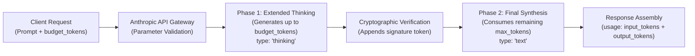

> **Key Takeaway:** Extended thinking in Claude 3.7+ enables deep chain-of-thought reasoning via `thinking: {"type": "enabled", "budget_tokens": N}`, requiring a minimum budget of 1,024 tokens, a strictly higher `max_tokens` limit, and locked sampling parameters (`temperature=1`).

Frontier language models excel at immediate pattern synthesis, but complex software architecture, multi-stage refactoring, mathematical proofs, and security audits require deliberate deliberation. When evaluating mission-critical systems, standard single-pass generation can miss subtle edge cases, race conditions, or latent security regressions.

Anthropic extended thinking bridges this gap by decoupling internal reasoning steps from visible response output. By enabling a dedicated reasoning phase, engineers grant Claude inference capacity to plan, hypothesize, test alternate solutions, and correct errors internally before generating final text.

This technical guide covers the parameters that govern thinking mode in the Claude Messages API, boundary rules for `budget_tokens` and `max_tokens`, sampling restrictions, official Python and TypeScript implementations, and verification pipelines.

Companion code repository: [ZeroLabs Claude Recipes Monorepo](https://github.com/zeroshotstudio/zerolabs-recipes/tree/main/recipes/claude/10-configure-thinking-budget-and-effort).

## Contents

- [How Does Extended Thinking Operate in Claude 3.7+?](#how-does-extended-thinking-operate-in-claude-37)
- [What Are the Hard Parameter Constraints?](#what-are-the-hard-parameter-constraints)
- [How Do Reasoning Budgets Compare Across Workloads?](#how-do-reasoning-budgets-compare-across-workloads)
- [How Do Thinking and Sampling Parameters Interact?](#how-do-thinking-and-sampling-parameters-interact)
- [How to Implement Thinking Budgets in Python](#how-to-implement-thinking-budgets-in-python)
- [How to Implement Thinking Budgets in TypeScript](#how-to-implement-thinking-budgets-in-typescript)
- [How to Parse Thinking Blocks in Raw cURL Responses](#how-to-parse-thinking-blocks-in-raw-curl-responses)
- [How to Monitor Thinking Output Tokens and Latency](#how-to-monitor-thinking-output-tokens-and-latency)
- [What Are Common Production Failure Modes?](#what-are-common-production-failure-modes)
- [FAQ](#faq)

## How Does Extended Thinking Operate in Claude 3.7+?

When extended thinking is enabled, Claude divides token generation into two sequential phases. In the first phase, the model produces internal reasoning tokens formatted as a `thinking` block. This scratchpad allows the model to decompose difficult objectives, evaluate multiple hypotheses, and verify constraints without exposing preliminary intermediate logic directly in the user answer. In the second phase, the model produces standard `text` blocks containing the polished final answer.



The `thinking` block is returned alongside an opaque cryptographic signature. When passing multi-turn conversations back to the API, client applications must return both the `thinking` content and its corresponding `signature` block unchanged to preserve context integrity.

## What Are the Hard Parameter Constraints?

Production engineering teams configuring extended thinking must respect four strict constraints enforced by the Anthropic Messages API:

> **The hard rule:** When extended thinking is enabled, `budget_tokens` must be an integer of at least 1,024 tokens, and `max_tokens` must be strictly greater than `budget_tokens`. Furthermore, temperature must equal 1.0 or be omitted entirely; passing any custom value for `temperature`, `top_p`, or `top_k` results in an immediate HTTP 400 Bad Request error.

These constraints ensure predictable decoding behavior during open-ended reasoning loops:

1. **Minimum Floor of 1,024 Tokens:** Setting `budget_tokens` below 1,024 fails validation. The model requires sufficient scratchpad volume to construct meaningful reasoning graphs.
2. **Strict Inequality on Max Tokens:** If `max_tokens <= budget_tokens`, the API rejects the payload. The budget represents a ceiling for internal reasoning, while `max_tokens` represents the global ceiling across both thinking tokens and visible output text.
3. **Soft Budget Target vs Hard Limit:** Claude treats `budget_tokens` as a target guidance parameter. The model may conclude thinking earlier if it reaches a conclusive answer, or occasionally exceed the target slightly when completing a reasoning thought, provided total generation does not breach `max_tokens`.
4. **Output Token Billing:** All generated tokens, both internal thinking tokens and visible answer text, count toward `usage.output_tokens` and bill at standard model output token rates.

For guidance on managing total token output and handling truncation events, see our tutorial on [How to Handle Stop Reasons and Max Token Truncation](https://labs.zeroshot.studio/resources/how-to-handle-stop-reasons-and-max-token-truncation).

## How Do Reasoning Budgets Compare Across Workloads?

Selecting the optimal thinking budget requires balancing solution accuracy, response latency, and cost per request:

| Workload Category | Recommended Budget | Minimum `max_tokens` | Latency and Quality Profile |
| :--- | :--- | :--- | :--- |
| **Simple Extraction & Routing** | Disabled (`null`) | 512 to 1,024 tokens | Sub-second latency (0.3s to 0.8s); zero overhead; optimal for deterministic classification tasks. |
| **Targeted Code Refactoring** | 1,024 to 2,048 tokens | 4,096 tokens | 2.5s to 5.0s TTFT; model maps AST changes and detects variable scope collisions before refactoring. |
| **Distributed Systems Design** | 2,048 to 4,096 tokens | 8,192 tokens | 6.0s to 12.0s TTFT; model balances network partition modes, consensus trade-offs, and fault tolerance. |
| **Formal Logic & Formal Proofs** | 8,192 to 16,384 tokens | 24,576 tokens | 15.0s to 35.0s TTFT; deep state exploration across complex edge cases and invariant checks. |

## How Do Thinking and Sampling Parameters Interact?

Standard language generation workflows frequently tweak `temperature` (e.g., 0.2 for deterministic code, 0.8 for creative writing) or narrow candidate distributions via `top_p` and `top_k`. Extended thinking alters this paradigm.

Reasoning models rely on natural entropy distribution during step-by-step search. Artificially cooling the model via low temperatures collapses exploratory branching, leading to repetitive loops and degenerative reasoning deadlocks.

Consequently, Anthropic disallows non-default sampling parameters when thinking is active:

- **Temperature:** Must be 1.0 or omitted.
- **Top P:** Must be 1.0 or omitted.
- **Top K:** Must remain disabled or default.

If an application specifies `temperature: 0.2` alongside `"thinking": {"type": "enabled", "budget_tokens": 2048}`, the API immediately rejects the request with an HTTP 400 error payload: `thinking cannot be used with temperature, top_p, or top_k`.

To review core request schemas and role definitions, consult our guide on [How to Structure Messages API Requests and Roles](https://labs.zeroshot.studio/resources/how-to-structure-messages-api-requests-and-roles).

## How to Implement Thinking Budgets in Python

The official Anthropic Python SDK provides structured types for passing thinking configuration and extracting reasoning traces from assistant responses.

```python
import os
import sys
import anthropic

client = anthropic.Anthropic(api_key=os.environ["ANTHROPIC_API_KEY"])

BUDGET_TOKENS = 2048
MAX_TOKENS = 4096

# temperature, top_p, and top_k are omitted to adhere to API rules
response = client.messages.create(
    model="claude-3-7-sonnet-20250219",
    max_tokens=MAX_TOKENS,
    thinking={
        "type": "enabled",
        "budget_tokens": BUDGET_TOKENS,
    },
    messages=[
        {
            "role": "user",
            "content": (
                "Design a distributed rate-limiter using Redis and token bucket algorithm. "
                "Address clock drift between distributed app instances and Redis cluster."
            ),
        }
    ],
)

for block in response.content:
    if block.type == "thinking":
        print(f"--- Thought Process ({len(block.thinking)} chars) ---")
        print(block.thinking[:400] + "...\n")
    elif block.type == "text":
        print("--- Final Answer ---")
        print(block.text)

print(f"Total Output Tokens (Thinking + Text): {response.usage.output_tokens}")
```

In multi-turn chat applications, ensure that both `thinking` and `text` blocks returned by the model are included in subsequent request payloads:

```python
# Preserving thinking blocks in multi-turn history
messages = [
    {"role": "user", "content": "Initial complex prompt"},
    {"role": "assistant", "content": response.content},
    {"role": "user", "content": "Can you refine step 2?"},
]
```

## How to Implement Thinking Budgets in TypeScript

The official `@anthropic-ai/sdk` npm package exports typed definitions for `ThinkingConfigParam` and content block unions.

```typescript
import Anthropic from '@anthropic-ai/sdk';
import type { ThinkingBlock, TextBlock } from '@anthropic-ai/sdk/resources/messages';

const client = new Anthropic({
  apiKey: process.env.ANTHROPIC_API_KEY,
});

async function main() {
  const budgetTokens = 2048;
  const maxTokens = 4096;

  const response = await client.messages.create({
    model: 'claude-3-7-sonnet-20250219',
    max_tokens: maxTokens,
    thinking: {
      type: 'enabled',
      budget_tokens: budgetTokens,
    },
    messages: [
      {
        role: 'user',
        content:
          'Audit a proposed cryptographic handshake for replay vulnerabilities. ' +
          'Assume network adversaries can reorder packets with up to 120s jitter.',
      },
    ],
  });

  for (const block of response.content) {
    if (block.type === 'thinking') {
      const thinking = block as ThinkingBlock;
      console.log(`[Thinking Block Signature: ${thinking.signature?.slice(0, 16)}...]`);
      console.log(thinking.thinking.slice(0, 300) + '...\n');
    } else if (block.type === 'text') {
      const text = block as TextBlock;
      console.log('[Final Synthesized Answer]');
      console.log(text.text);
    }
  }

  console.log(`Usage: ${response.usage.input_tokens} in, ${response.usage.output_tokens} out`);
}

main().catch(console.error);
```

For streaming implementations with server-sent events, see our reference on [How to Implement Server-Sent Event Streaming with Claude](https://labs.zeroshot.studio/resources/how-to-implement-server-sent-event-streaming-with-claude).

## How to Parse Thinking Blocks in Raw cURL Responses

When interacting directly with the HTTP Messages API endpoint, pass the `thinking` object at the root level alongside `messages` and `max_tokens`:

```bash
curl -s -X POST "https://api.anthropic.com/v1/messages" \
  -H "x-api-key: ${ANTHROPIC_API_KEY}" \
  -H "anthropic-version: 2023-06-01" \
  -H "content-type: application/json" \
  -d '{
    "model": "claude-3-7-sonnet-20250219",
    "max_tokens": 4096,
    "thinking": {
      "type": "enabled",
      "budget_tokens": 2048
    },
    "messages": [
      {
        "role": "user",
        "content": "Verify if the set of 32-bit floating point operations forms an abelian group."
      }
    ]
  }'
```

The gateway returns a JSON response containing differentiated content blocks:

```json
{
  "id": "msg_01F9g8xKm32aP8qZ",
  "type": "message",
  "role": "assistant",
  "model": "claude-3-7-sonnet-20250219",
  "content": [
    {
      "type": "thinking",
      "thinking": "Let's review the axioms of an abelian group: closure, associativity, identity element, inverse element, commutativity...\nChecking associativity for floating point addition: (a + b) + c vs a + (b + c). Floating point rounding causes failure of associativity...",
      "signature": "Ev4BCkYICBI..."
    },
    {
      "type": "text",
      "text": "No, 32-bit floating point operations do not form an abelian group under addition. Specifically, floating point addition violates associativity due to roundoff error."
    }
  ],
  "stop_reason": "end_turn",
  "stop_sequence": null,
  "usage": {
    "input_tokens": 28,
    "output_tokens": 1420
  }
}
```

Notice that `usage.output_tokens` reports the aggregate count (1,420 tokens), encompassing both the thinking scratchpad steps and the final answer.

## How to Monitor Thinking Output Tokens and Latency

Production gateways should measure the ratio of thinking tokens to final text tokens to track operational efficiency. While the root `usage` object gives total output tokens, parsing the content array provides precise visibility:

```bash
#!/usr/bin/env bash
set -euo pipefail

RESPONSE=$(curl -s -X POST "https://api.anthropic.com/v1/messages" \
  -H "x-api-key: ${ANTHROPIC_API_KEY}" \
  -H "anthropic-version: 2023-06-01" \
  -H "content-type: application/json" \
  -d @payload.json)

python3 -c "
import sys, json

data = json.loads('''${RESPONSE}''')
blocks = data.get('content', [])
thinking = [b for b in blocks if b.get('type') == 'thinking']
text = [b for b in blocks if b.get('type') == 'text']

total_output = data.get('usage', {}).get('output_tokens', 0)
print(f'Total Billed Output Tokens: {total_output}')
print(f'Thinking Blocks: {len(thinking)} | Text Blocks: {len(text)}')
if thinking:
    approx_chars = len(thinking[0].get('thinking', ''))
    print(f'Approximate Thinking Characters: {approx_chars}')
"
```

Tracking these metrics across production workloads allows teams to tune `budget_tokens` downwards for tasks where 1,024 tokens yield identical accuracy compared to 4,096 tokens, saving both latency and output token expenditure.

## What Are Common Production Failure Modes?

When engineering thinking-enabled workflows, watch for five recurring failure modes:

1. **Allocating Inadequate `max_tokens` Headroom:** If you set `budget_tokens: 2048` and `max_tokens: 2049`, Claude may exhaust almost all available tokens during the thinking phase. The request will truncate with `stop_reason: "max_tokens"` before completing the final visible answer, returning empty or truncated text. Always allocate at least 1,000 to 2,000 tokens of headroom above the budget.
2. **Sub-1,024 Budget Values:** Passing `budget_tokens: 500` triggers an immediate HTTP 400 validation error from the API gateway. If a task does not require at least 1,024 reasoning tokens, disable extended thinking completely.
3. **Passing Non-Default Temperature:** Retaining legacy client configuration with `temperature: 0.0` or `0.7` will reject requests when thinking is enabled. Ensure client abstractions strip sampling parameters when activating thinking mode.
4. **Stripping Signatures in Multi-Turn Loops:** Discarding the opaque `signature` attribute when feeding assistant turns back into `messages` causes subsequent request failures or context invalidation. Treat `thinking` blocks as immutable data units.
5. **Streaming Buffer Under-runs:** When streaming thinking blocks over SSE, thinking tokens arrive first. If your client UI expects immediate visible text, users may observe a multi-second delay before the first `text` chunk appears. Display a dedicated "Reasoning..." status indicator during `thinking` delta events.

For security recommendations and key management standards across distributed fleets, review [How to Manage Anthropic API Keys & Env Variables](https://labs.zeroshot.studio/resources/how-to-manage-anthropic-api-keys-and-environment-variables).

## FAQ

### What is the minimum thinking budget supported by the API?
The minimum budget is 1,024 tokens. Passing any integer value below 1,024 returns an HTTP 400 Bad Request error. If your query does not require extensive reasoning, omit the `thinking` parameter to run standard generation.

### Why must max_tokens be greater than budget_tokens?
The `budget_tokens` parameter specifies the ceiling for internal reasoning tokens, while `max_tokens` governs the combined total of internal thinking tokens plus final synthesized answer tokens. If `max_tokens` is equal to or less than `budget_tokens`, there would be insufficient capacity to output the actual answer.

### Can I set temperature to 0 when extended thinking is enabled?
No. When extended thinking is enabled, `temperature` must be 1.0 or omitted entirely. Specifying lower temperatures collapses the entropy needed for branching reasoning exploration and triggers an HTTP 400 API error.

### Are thinking tokens billed at a different rate than regular output tokens?
No. All tokens generated during extended thinking are billed at the standard output token price for the selected model. They appear in `usage.output_tokens` alongside visible text tokens.
