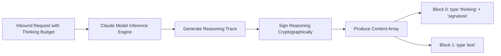
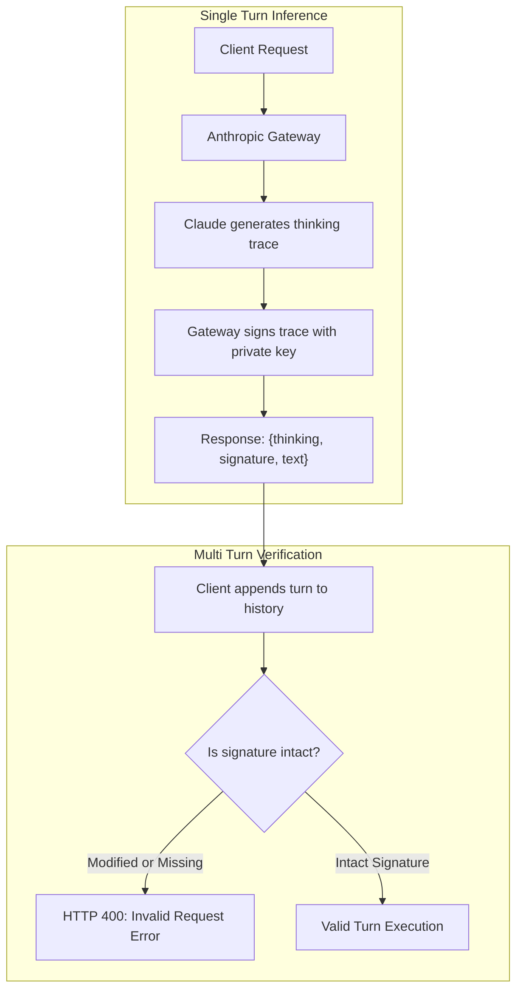

> **Key Takeaway:** Extended thinking in Claude models outputs explicit `thinking` content blocks alongside cryptographic thought signatures that must remain intact when passing assistant turns back into multi-turn conversations.
> 
> - When thinking is enabled, the Messages API populates the response `content` array with dedicated `type: "thinking"` blocks prior to visible `type: "text"` blocks.
> - Each thinking block carries a server-signed `signature` string that cryptographically authenticates the reasoning trace and prevents client-side prompt manipulation.
> - Mutating, omitting, or truncating thinking blocks when appending assistant turns into subsequent conversation turns triggers an invalid request error from the Anthropic API gateway.

Managing reasoning traces across complex agent workflows requires understanding the distinction between internal deliberation and external generation. With models like Claude 3.7 Sonnet, the Anthropic Messages API introduces extended thinking, allowing the model to allocate thousands of tokens to internal reasoning before emitting its final visible output. Rather than burying this process in raw strings, the API formalizes reasoning as discrete, structured objects within the response payload.

Every reasoning block includes a raw thinking text trace and an Anthropic-signed cryptographic thought signature. This guide details how to extract and isolate reasoning traces, parse content block arrays, verify cryptographic signatures, and maintain strict conversational state across multi-turn reasoning sessions in Python, TypeScript, and executable cURL.

Companion code repository: [ZeroLabs Claude Recipes Monorepo](https://github.com/zeroshotstudio/zerolabs-recipes/tree/main/recipes/claude/11-extract-reasoning-traces-and-signatures).

## Contents

- [How Does Extended Thinking Structure Response Content Blocks?](#how-does-extended-thinking-structure-response-content-blocks)
- [What Is a Thought Signature and Why Is It Required?](#what-is-a-thought-signature-and-why-is-it-required)
- [How to Parse Thinking Blocks from Visible Output in Python?](#how-to-parse-thinking-blocks-from-visible-output-in-python)
- [How to Maintain Thought Signatures Across Multi-Turn Conversations in TypeScript?](#how-to-maintain-thought-signatures-across-multi-turn-conversations-in-typescript)
- [How to Execute the cURL Extended Thinking Probe?](#how-to-execute-the-curl-extended-thinking-probe)
- [What Architectural Trade-Offs Govern Reasoning Trace Persistence?](#what-architectural-trade-offs-govern-reasoning-trace-persistence)
- [FAQ](#faq)

## How Does Extended Thinking Structure Response Content Blocks?

When calling the Anthropic Messages API with extended thinking enabled, you specify a `thinking` configuration object containing `type: "enabled"` and a `budget_tokens` parameter. In standard generation without thinking, Claude returns a single content block containing visible text:

```json
{
  "content": [
    {
      "type": "text",
      "text": "The final answer is 42."
    }
  ]
}
```

When extended thinking is enabled, the API partitions the response into sequential content blocks. The model places one or more `thinking` blocks at the start of the `content` list, followed by the final `text` blocks:

```json
{
  "id": "msg_01ABcDeFgHiJkLmNoPqRsTuV",
  "type": "message",
  "role": "assistant",
  "model": "claude-3-7-sonnet-20250219",
  "content": [
    {
      "type": "thinking",
      "thinking": "The user is asking for the sum of three consecutive integers that equal 126. Let the integers be x, x+1, x+2. 3x + 3 = 126, so 3x = 123, which yields x = 41. Let me verify: 41 + 42 + 43 = 126.",
      "signature": "Ev4BCkUKCQgBGB8iAwoDCiB4Q92yKmLz7N8..."
    },
    {
      "type": "text",
      "text": "The three consecutive integers are 41, 42, and 43."
    }
  ],
  "stop_reason": "end_turn",
  "usage": {
    "input_tokens": 42,
    "output_tokens": 128
  }
}
```



Key structural invariants to track during parsing:
- **Block Order:** Thinking blocks always precede text blocks in the content array.
- **Thinking Field:** The reasoning stream is exposed as raw markdown or pseudocode within the `thinking` string property.
- **Signature Field:** Every thinking block includes an opaque, base64-encoded `signature` string generated by Anthropic.
- **Token Accounting:** The `usage.output_tokens` count accounts for both thinking tokens and final text tokens. A budget of 2,048 thinking tokens plus a 150-token response results in approximately 2,198 billable output tokens.

## What Is a Thought Signature and Why Is It Required?

A thought signature is a cryptographic MAC (Message Authentication Code) generated by Anthropic inference nodes. It authenticates that the accompanying `thinking` string was generated verbatim by the model during that exact inference run.



Thought signatures solve three critical security and operational challenges:
1. **Preventing Reasoning Forgery:** In multi-turn conversations where thinking is enabled, downstream turns depend on prior reasoning context. Without cryptographic signatures, a malicious client could inject synthetic reasoning steps to mislead the model into violating safety policies or logical boundaries.
2. **Context Integrity Verification:** The signature validates that the thinking block has not been tampered with, truncated, or modified in transit between client and server.
3. **Stateful Rehydration:** Claude can safely rely on its prior internal deductions during turn 2 without having to re-verify the authenticity of the prompt history.

> **The hard rule:** When appending an assistant message containing thinking blocks back into the `messages` array for subsequent turns, you must preserve the entire thinking block, including its `signature` property. If you delete the thinking block or mutate its text while keeping thinking enabled, the API gateway will return an HTTP 400 error.

For details on managing foundational message structures, see our guide on [How to Structure Messages API Requests and Roles](https://labs.zeroshot.studio/resources/how-to-structure-messages-api-requests-and-roles).

## How to Parse Thinking Blocks from Visible Output in Python?

In production Python applications, separating reasoning traces from user-facing text ensures that internal logic can be logged into telemetry systems (such as OpenTelemetry, Datadog, or PostgreSQL) without leaking internal chain-of-thought to end users.

The following production script defines a parser that isolates thinking blocks, verifies signature presence, and builds conversation payloads for follow-up turns:

```python
#!/usr/bin/env python3
"""
Python SDK reasoning trace extractor and thought signature validator.
"""

from dataclasses import dataclass
from typing import Any, Dict, List
import os

@dataclass
class ParsedThinkingResponse:
    thinking_traces: List[Dict[str, str]]
    visible_texts: List[str]
    serialized_assistant_message: Dict[str, Any]
    total_thinking_characters: int
    has_valid_signatures: bool

def extract_reasoning_traces(content_blocks: List[Any]) -> ParsedThinkingResponse:
    """
    Separates thinking content blocks from text blocks and preserves
    cryptographic signatures for conversational round-trips.
    """
    thinking_traces: List[Dict[str, str]] = []
    visible_texts: List[str] = []
    serialized_blocks: List[Dict[str, Any]] = []
    all_signed = True

    for block in content_blocks:
        # Support both Anthropic SDK object attributes and dictionary payloads
        block_type = getattr(block, "type", None) or (block.get("type") if isinstance(block, dict) else None)
        
        if block_type == "thinking":
            thought = getattr(block, "thinking", None) or (block.get("thinking", "") if isinstance(block, dict) else "")
            sig = getattr(block, "signature", None) or (block.get("signature", "") if isinstance(block, dict) else "")
            
            thinking_traces.append({"thinking": thought, "signature": sig})
            serialized_blocks.append({
                "type": "thinking",
                "thinking": thought,
                "signature": sig,
            })
            if not sig:
                all_signed = False
                
        elif block_type == "text":
            text_val = getattr(block, "text", None) or (block.get("text", "") if isinstance(block, dict) else "")
            visible_texts.append(text_val)
            serialized_blocks.append({"type": "text", "text": text_val})

    char_count = sum(len(t["thinking"]) for t in thinking_traces)

    return ParsedThinkingResponse(
        thinking_traces=thinking_traces,
        visible_texts=visible_texts,
        serialized_assistant_message={"role": "assistant", "content": serialized_blocks},
        total_thinking_characters=char_count,
        has_valid_signatures=all_signed and len(thinking_traces) > 0,
    )

def execute_reasoning_turn(client, history: List[Dict[str, Any]], model: str = "claude-3-7-sonnet-20250219"):
    """
    Executes an inference call with 2,048 thinking budget tokens.
    """
    response = client.messages.create(
        model=model,
        max_tokens=4096,
        thinking={"type": "enabled", "budget_tokens": 2048},
        messages=history,
    )
    return extract_reasoning_traces(response.content)

if __name__ == "__main__":
    # Mock validation demonstrating structure parsing
    mock_content = [
        {
            "type": "thinking",
            "thinking": "Step 1: Compute GCD of 48 and 18 using Euclidean algorithm. 48 mod 18 = 12. 18 mod 12 = 6. 12 mod 6 = 0. GCD is 6.",
            "signature": "Ev4BCkUKCQgBGB8iAwoDCiB4Q92yKmLz7N8..."
        },
        {
            "type": "text",
            "text": "The greatest common divisor of 48 and 18 is 6."
        }
    ]
    parsed = extract_reasoning_traces(mock_content)
    print(f"Extracted {len(parsed.thinking_traces)} thinking block(s).")
    print(f"Cryptographic signatures verified: {parsed.has_valid_signatures}")
    print(f"Visible Answer: {parsed.visible_texts[0]}")
```

When streaming responses via Server-Sent Events, thinking blocks emit as `content_block_start` with `type: "thinking"`, followed by `thinking_delta` events. To learn more about handling event streaming, review [How to Implement Server-Sent Event Streaming with Claude](https://labs.zeroshot.studio/resources/how-to-implement-server-sent-event-streaming-with-claude).

## How to Maintain Thought Signatures Across Multi-Turn Conversations in TypeScript?

When using TypeScript, maintaining strict typings for assistant turns prevents payload corruption. If your application strips unknown properties when sanitizing database models, you risk dropping the `signature` field, which breaks multi-turn continuity.

The following TypeScript implementation establishes robust interfaces for thinking blocks and provides multi-turn history accumulation:

```typescript
import Anthropic from '@anthropic-ai/sdk';

export interface ThinkingContentBlock {
  type: 'thinking';
  thinking: string;
  signature: string;
}

export interface TextContentBlock {
  type: 'text';
  text: string;
}

export type AssistantBlock = ThinkingContentBlock | TextContentBlock;

export interface AssistantTurn {
  role: 'assistant';
  content: AssistantBlock[];
}

export interface UserTurn {
  role: 'user';
  content: string;
}

export type ConversationMessage = AssistantTurn | UserTurn;

export interface ExtractedReasoning {
  thinkingBlocks: ThinkingContentBlock[];
  visibleText: string;
  assistantTurn: AssistantTurn;
  hasValidSignatures: boolean;
}

/**
 * Extracts thinking traces and ensures cryptographic signatures remain intact.
 */
export function extractReasoningBlocks(
  blocks: Array<{ type: string; [key: string]: any }>
): ExtractedReasoning {
  const thinkingBlocks: ThinkingContentBlock[] = [];
  const textPieces: string[] = [];
  const serializedBlocks: AssistantBlock[] = [];
  let signaturesPresent = true;

  for (const block of blocks) {
    if (block.type === 'thinking') {
      const tb: ThinkingContentBlock = {
        type: 'thinking',
        thinking: typeof block.thinking === 'string' ? block.thinking : '',
        signature: typeof block.signature === 'string' ? block.signature : '',
      };
      thinkingBlocks.push(tb);
      serializedBlocks.push(tb);
      if (!tb.signature) {
        signaturesPresent = false;
      }
    } else if (block.type === 'text') {
      const txt: TextContentBlock = {
        type: 'text',
        text: typeof block.text === 'string' ? block.text : '',
      };
      textPieces.push(txt.text);
      serializedBlocks.push(txt);
    }
  }

  return {
    thinkingBlocks,
    visibleText: textPieces.join('\n'),
    assistantTurn: {
      role: 'assistant',
      content: serializedBlocks,
    },
    hasValidSignatures: signaturesPresent && thinkingBlocks.length > 0,
  };
}

/**
 * Appends the assistant turn and follow-up user query into the conversation history.
 */
export function appendMultiTurn(
  history: ConversationMessage[],
  assistantResult: ExtractedReasoning,
  nextQuery: string
): ConversationMessage[] {
  return [
    ...history,
    assistantResult.assistantTurn,
    { role: 'user', content: nextQuery },
  ];
}
```

In multi-turn sessions, always ensure your storage layer persists the `signature` column alongside the raw thinking trace.

## How to Execute the cURL Extended Thinking Probe?

To verify how the Anthropic API formats thinking blocks and signatures over HTTP, use this executable cURL probe. It triggers an initial inference request with a 2,048-token thinking budget, parses the resulting blocks, and replays the conversation in a second turn with signatures preserved:

```bash
#!/usr/bin/env bash
# curl_probe.sh: Test Anthropic Messages API extended thinking blocks and signatures
set -euo pipefail

API_URL="https://api.anthropic.com/v1/messages"
ANTHROPIC_VERSION="2023-06-01"
MODEL="claude-3-7-sonnet-20250219"
THINKING_BUDGET=2048

if [[ -z "${ANTHROPIC_API_KEY:-}" ]]; then
  echo "ERROR: ANTHROPIC_API_KEY is not set." >&2
  exit 1
fi

echo "--- Turn 1: Emitting Request with Thinking Enabled ---"
PAYLOAD_1=$(python3 -c '
import json
body = {
    "model": "'"${MODEL}"'",
    "max_tokens": 4096,
    "thinking": {"type": "enabled", "budget_tokens": int("'"${THINKING_BUDGET}"'")},
    "messages": [
        {"role": "user", "content": "Three boxes contain either apples, oranges, or both. All three boxes are labeled incorrectly. You pick one fruit from Box labeled Apples and Oranges and see an Apple. Deduce the contents of all three boxes."}
    ]
}
print(json.dumps(body))
')

RESP_1=$(curl -s \
  -X POST "${API_URL}" \
  -H "x-api-key: ${ANTHROPIC_API_KEY}" \
  -H "anthropic-version: ${ANTHROPIC_VERSION}" \
  -H "content-type: application/json" \
  -d "${PAYLOAD_1}")

# Inspect content blocks and save serialized structure
python3 -c '
import sys, json
data = json.loads(sys.stdin.read())
content = data.get("content", [])
for idx, b in enumerate(content):
    b_type = b.get("type")
    print(f"Block {idx}: type={b_type}")
    if b_type == "thinking":
        sig = b.get("signature", "")
        print(f"  Thinking Trace: {b.get(\"thinking\", \"\")[:80]}...")
        print(f"  Thought Signature: {sig[:28]}... (length: {len(sig)})")
    elif b_type == "text":
        print(f"  Text Output: {b.get(\"text\", \"\")[:80]}...")

with open("/tmp/turn1_content.json", "w") as f:
    json.dump(content, f)
' <<< "${RESP_1}"

echo ""
echo "--- Turn 2: Follow-up Request with Intact Thought Signatures ---"
PAYLOAD_2=$(python3 -c '
import json
with open("/tmp/turn1_content.json") as f:
    turn1_content = json.load(f)

body = {
    "model": "'"${MODEL}"'",
    "max_tokens": 4096,
    "thinking": {"type": "enabled", "budget_tokens": int("'"${THINKING_BUDGET}"'")},
    "messages": [
        {"role": "user", "content": "Three boxes contain either apples, oranges, or both. All three boxes are labeled incorrectly. You pick one fruit from Box labeled Apples and Oranges and see an Apple. Deduce the contents of all three boxes."},
        {"role": "assistant", "content": turn1_content},
        {"role": "user", "content": "Confirm the minimum number of fruit draws needed in this scenario."}
    ]
}
print(json.dumps(body))
')

RESP_2=$(curl -s \
  -X POST "${API_URL}" \
  -H "x-api-key: ${ANTHROPIC_API_KEY}" \
  -H "anthropic-version: ${ANTHROPIC_VERSION}" \
  -H "content-type: application/json" \
  -d "${PAYLOAD_2}")

python3 -c '
import sys, json
data = json.loads(sys.stdin.read())
for b in data.get("content", []):
    if b.get("type") == "text":
        print("Turn 2 Answer:", b.get("text").strip())
' <<< "${RESP_2}"
```

This probe demonstrates that preserving the `turn1_content` array without modifying the signature string allows the second turn to complete successfully.

## What Architectural Trade-Offs Govern Reasoning Trace Persistence?

Architects must evaluate how reasoning traces and thought signatures are handled in persistent storage and client-facing APIs.

| Architectural Pattern | Complete Persistence (Trace + Signature) | Truncated Persistence (Text Only) | Redacted Thinking (Signature Preserved) | Client-Side Direct Reflection |
| :--- | :--- | :--- | :--- | :--- |
| **Multi-Turn Continuity** | 100% compliant; subsequent turns continue with thinking enabled without error. | Fails if thinking remains enabled on subsequent turns; triggers HTTP 400. | Valid if gateway supports opaque signature tokens without full trace. | High risk of prompt injection and accidental signature corruption. |
| **Storage Overhead** | High; thinking blocks can consume 2,000 to 16,000 extra tokens per turn. | Minimal; stores only visible text responses (typically 150 to 500 tokens). | Moderate; stores signatures and compressed trace representations. | Minimal server storage; transfers memory overhead to frontend clients. |
| **Auditability & Observability** | Complete visibility into model logic, intermediate deductions, and safety paths. | Zero reasoning visibility; cannot debug why a model reached an invalid answer. | Partial visibility; allows signature validation without trace inspection. | Uncontrolled; allows end users to inspect internal model reflections. |
| **Security Risk Profile** | Low; internal traces stay strictly within backend logging systems. | Low; zero trace exposure to external users or unauthorized consumers. | Low; internal model reasoning remains hidden from clients. | High; reveals prompt structure, internal system instructions, and logic. |

When managing token budgets and session lengths across extended interactions, monitoring stop reasons and truncation is critical. For guidance on handling context overflows, consult [How to Handle Stop Reasons and Max Token Truncation](https://labs.zeroshot.studio/resources/how-to-handle-stop-reasons-and-max-token-truncation).

For additional reference specifications, refer to the [Anthropic Extended Thinking Overview](https://docs.anthropic.com/en/docs/build-with-claude/extended-thinking) and the [Anthropic Messages API Reference](https://platform.claude.com/docs/en/overview).

## FAQ

### What happens if I modify the thinking text before sending it in Turn 2?
If you modify even a single character inside the `thinking` string, the cryptographic signature check will fail. The Anthropic API gateway will reject the payload with an invalid request error because the signature does not match the content.

### Can I strip thinking blocks if I do not need thinking in Turn 2?
Yes. If you disable thinking in subsequent turns by omitting the `thinking` parameter or setting it to disabled, you can pass an assistant message containing only the `text` content blocks. However, if thinking remains enabled, all prior assistant turns in the conversation must include their intact thinking blocks and signatures.

### What is the minimum thinking budget required by Claude?
The minimum thinking budget is 1,024 tokens. Setting a budget below 1,024 tokens will cause the Messages API to return a validation error. You can specify higher budgets (such as 2,048, 4,096, or 16,000 tokens) up to the model maximum output limit.

### Are thinking tokens billed at standard output rates?
Yes. Tokens generated within `thinking` blocks are billed at the standard output token price for the specified model. You can track total token usage by inspecting the `usage.output_tokens` field in the API response.
