> **Key Takeaway:** Extended thinking in Claude Messages API emits discrete Server-Sent Events where `content_block_start` with `type: "thinking"` precedes `text` blocks, enabling frontends to stream reasoning into collapsible accordions before rendering final answers.

Frontier reasoning models execute internal inference steps to evaluate hypotheses, verify logic, and synthesize complex multi-step solutions. In interactive conversational applications, streaming these internal reasoning tokens directly into the visible response window degrades user experience. Raw thinking tokens flood the chat viewport, obscuring final answers and creating visual friction for end users.

To maintain responsive, transparent user interfaces, modern frontend architectures decouple the thinking stream from visible text generation. The Anthropic Messages API exposes extended thinking as separate content blocks within its Server-Sent Events (SSE) protocol. By tracking content block indices and event types, frontend message handlers route thinking deltas into collapsible accordion components while reserving the main viewport for final answers.

This guide details the SSE event lifecycle for thinking blocks, UI state machines for collapsible accordions, handling `thinking_delta` and `signature_delta` events, full client implementations across Python and TypeScript, raw cURL streaming probes, and production error-handling strategies.

Companion code repository: [ZeroLabs Claude Recipes Monorepo](https://github.com/zeroshotstudio/zerolabs-recipes/tree/main/recipes/claude/12-stream-thinking-blocks-to-ui).

## Contents

- [How Does Extended Thinking Stream Over SSE?](#how-does-extended-thinking-stream-over-sse)
- [What Are the Hard Rules for Thinking Streaming?](#what-are-the-hard-rules-for-thinking-streaming)
- [How Do Thinking and Text Streams Compare Across UI States?](#how-do-thinking-and-text-streams-compare-across-ui-states)
- [How to Design a Thinking Accordion State Machine?](#how-to-design-a-thinking-accordion-state-machine)
- [How to Implement Async Thinking Streaming in Python?](#how-to-implement-async-thinking-streaming-in-python)
- [How to Implement UI Thinking Streams in TypeScript?](#how-to-implement-ui-thinking-streams-in-typescript)
- [How to Inspect Raw Thinking Events with cURL?](#how-to-inspect-raw-thinking-events-with-curl)
- [How to Handle Signatures and Multi-Turn History?](#how-to-handle-signatures-and-multi-turn-history)
- [What Are Common Production Failure Modes?](#what-are-common-production-failure-modes)
- [FAQ](#faq)

## How Does Extended Thinking Stream Over SSE?

When extended thinking is enabled on Claude 3.7 Sonnet, the Anthropic Messages API structures the streaming response into sequential content blocks. Rather than interleaving thinking and output text within a single string buffer, the inference cluster emits thinking tokens inside a dedicated thinking content block (typically at block index 0) before opening a text content block (typically at block index 1).

```mermaid
flowchart LR
    A["Client Request\n(thinking.type: 'enabled'\nbudget_tokens: 2048)"] --> B["Anthropic Gateway\n(SSE Connection Opened)"]
    B --> C["Block 0: content_block_start\n(type: 'thinking')\nUI: Expand Accordion"]
    C --> D["Block 0: content_block_delta\n(type: 'thinking_delta')\nUI: Append to Accordion"]
    D --> E["Block 0: content_block_delta\n(type: 'signature_delta')\nUI: Store Signature"]
    E --> F["Block 0: content_block_stop\nUI: Collapse Accordion"]
    F --> G["Block 1: content_block_start\n(type: 'text')\nUI: Initialize Answer View"]
    G --> H["Block 1: content_block_delta\n(type: 'text_delta')\nUI: Stream Answer Text"]
    H --> I["Block 1: content_block_stop\n+ message_delta (Usage)"]
```



The streaming sequence proceeds through distinct event types:

1. **`message_start`**: Emits the initial message container, specifying model identifier and input token counts.
2. **`content_block_start` (index 0)**: Declares `content_block: {"type": "thinking", "thinking": ""}`. The client UI recognizes that reasoning has commenced and initializes the accordion component in an expanded or pulsing state.
3. **`content_block_delta` (index 0, `thinking_delta`)**: Emits incremental reasoning tokens inside `delta: {"type": "thinking_delta", "thinking": "..."}`. The client appends these tokens exclusively to the thinking buffer.
4. **`content_block_delta` (index 0, `signature_delta`)**: Emits `delta: {"type": "signature_delta", "signature": "..."}` containing an encrypted cryptographic token that validates model integrity.
5. **`content_block_stop` (index 0)**: Signals completion of the reasoning phase. The client computes elapsed reasoning duration and collapses the thinking accordion.
6. **`content_block_start` (index 1)**: Declares `content_block: {"type": "text", "text": ""}`. The client transitions to the answer rendering phase.
7. **`content_block_delta` (index 1, `text_delta`)**: Emits standard text tokens inside `delta: {"type": "text_delta", "text": "..."}` for primary viewport rendering.
8. **`content_block_stop` (index 1)**: Concludes the primary answer block.
9. **`message_delta` & `message_stop`**: Emits final execution metadata, including `stop_reason` and cumulative output tokens billed across both thinking and text.

For background on standard SSE streaming payloads and connection error handling, consult our foundation guide on [How to Implement Server-Sent Event Streaming with Claude](https://labs.zeroshot.studio/resources/how-to-implement-server-sent-event-streaming-with-claude).

## What Are the Hard Rules for Thinking Streaming?

Building robust user interfaces around extended thinking requires adherence to key operational constraints:

> **The hard rule:** Thinking blocks must precede text blocks in the response stream, and thinking budget tokens must be set to a minimum of 1,024 tokens. Furthermore, parameter `max_tokens` must strictly exceed `budget_tokens`. Passing `max_tokens <= budget_tokens` triggers an HTTP 400 Bad Request error from the API gateway.

Beyond token validation, client applications must observe four engineering imperatives:

1. **Strict Buffer Separation:** Client event loops must route `thinking_delta` and `text_delta` payloads to independent state containers. Never concatenate thinking deltas onto the visible chat message string.
2. **Signature Preservation:** The cryptographic signature emitted via `signature_delta` must be preserved in state if your application passes assistant messages back into subsequent conversational turns. Removing or altering signatures invalidates multi-turn context.
3. **Token Billing Accounting:** All tokens generated during thinking (`thinking_delta`) count against `usage.output_tokens` and are billed at standard output token pricing ($15.00 per million tokens on Claude 3.7 Sonnet). A request with a 2,048 token thinking budget and 500 tokens of text incurs billing for up to 2,548 output tokens.
4. **Forbidden Sampling Modifiers:** When thinking is enabled, you cannot set `temperature`, `top_p`, or `top_k` values. Attempting to override temperature produces an immediate API validation rejection.

For turn alternation and request structure specifics, review [How to Structure Messages API Requests and Roles](https://labs.zeroshot.studio/resources/how-to-structure-messages-api-requests-and-roles).

## How Do Thinking and Text Streams Compare Across UI States?

Managing user perception during long reasoning phases requires distinct visual states. The table below contrasts how client frontends handle each streaming phase:

| Stream Phase | API Event Signature | Client UI State | Visual Behavior & Interaction |
| :--- | :--- | :--- | :--- |
| **Reasoning Phase** | `content_block_delta` (`thinking_delta`) | `uiState = "thinking"` | Collapsible accordion expanded; displays streaming monospace reasoning text and animated stopwatch counter. |
| **Signature Phase** | `content_block_delta` (`signature_delta`) | `uiState = "validating"` | Accordion displays "Reasoning verified"; captures encrypted token silently into component memory. |
| **Transition Phase** | `content_block_stop` & `content_block_start` | `uiState = "transition"` | Accordion collapses smoothly; status indicator displays "Thought for 3.4 seconds"; cursor focuses on answer view. |
| **Answering Phase** | `content_block_delta` (`text_delta`) | `uiState = "answering"` | Main chat bubble renders markdown text via streaming typewriter effect; accordion remains collapsed but clickable. |

## How to Design a Thinking Accordion State Machine?

A resilient web client represents stream progress through a finite state machine. This design prevents UI flickering, race conditions, and out-of-order text rendering.

```
       [IDLE]
         |
         | (content_block_start: type="thinking")
         v
    [THINKING] <--- (content_block_delta: thinking_delta)
         |
         | (content_block_delta: signature_delta)
         v
    [VERIFYING]
         |
         | (content_block_stop: index=0)
         v
   [COLLAPSED]
         |
         | (content_block_start: type="text")
         v
    [ANSWERING] <--- (content_block_delta: text_delta)
         |
         | (message_stop)
         v
    [COMPLETED]
```

When implementing the UI accordion:

- **Expanded by Default During Generation:** Keep the accordion expanded while thinking tokens stream so power users can inspect reasoning in real time.
- **Collapsing on Completion:** When `content_block_stop` fires for the thinking block, collapse the accordion automatically to make room for incoming text.
- **Elapsed Duration Badge:** Compute `Date.now() - startTime` to render a human-readable duration badge (e.g., "Thought for 4.2s").
- **Manual Toggle:** Allow users to expand or collapse the accordion at any time after completion without disrupting active text rendering.

## How to Implement Async Thinking Streaming in Python?

The official Anthropic Python SDK provides an asynchronous streaming interface via `client.messages.stream()`. The implementation below intercepts thinking deltas, measures elapsed reasoning time, and isolates output streams:

```python
import asyncio
import os
import sys
import time
from typing import Optional
import anthropic

class ThinkingStreamManager:
    """Tracks state transitions across thinking and answer blocks."""

    def __init__(self) -> None:
        self.thinking_buffer: str = ""
        self.signature_buffer: str = ""
        self.text_buffer: str = ""
        self.current_block: Optional[str] = None
        self.thinking_start: Optional[float] = None
        self.thinking_duration_ms: float = 0.0

    def on_block_start(self, block_type: str) -> None:
        self.current_block = block_type
        if block_type == "thinking":
            self.thinking_start = time.perf_counter()
            print("\n[UI: ACCORDION OPENED] Reasoning stream initiated...")
        elif block_type == "text":
            print("\n[UI: ACCORDION COLLAPSED] Answer streaming initiated...\n")

    def on_thinking_delta(self, delta_text: str) -> None:
        self.thinking_buffer += delta_text
        sys.stdout.write(f"\r[Thinking: {len(self.thinking_buffer)} chars streamed]")
        sys.stdout.flush()

    def on_signature_delta(self, signature: str) -> None:
        self.signature_buffer += signature

    def on_text_delta(self, delta_text: str) -> None:
        self.text_buffer += delta_text
        sys.stdout.write(delta_text)
        sys.stdout.flush()

    def on_block_stop(self) -> None:
        if self.current_block == "thinking" and self.thinking_start:
            self.thinking_duration_ms = (time.perf_counter() - self.thinking_start) * 1000
            print(f"\n[UI: REASONING FINALIZED] Elapsed: {self.thinking_duration_ms:.1f}ms")
        self.current_block = None


async def stream_thinking_pipeline(prompt: str, budget: int = 2048) -> None:
    client = anthropic.AsyncAnthropic(api_key=os.environ["ANTHROPIC_API_KEY"])
    manager = ThinkingStreamManager()

    async with client.messages.stream(
        model="claude-3-7-sonnet-20250219",
        max_tokens=4096,
        thinking={"type": "enabled", "budget_tokens": budget},
        messages=[{"role": "user", "content": prompt}],
    ) as stream:
        async for event in stream:
            if event.type == "content_block_start":
                manager.on_block_start(event.content_block.type)
            elif event.type == "content_block_delta":
                dtype = event.delta.type
                if dtype == "thinking_delta":
                    manager.on_thinking_delta(event.delta.thinking)
                elif dtype == "signature_delta":
                    manager.on_signature_delta(event.delta.signature)
                elif dtype == "text_delta":
                    manager.on_text_delta(event.delta.text)
            elif event.type == "content_block_stop":
                manager.on_block_stop()

    print(f"\nTotal thinking tokens buffered: {len(manager.thinking_buffer)} characters")
    print(f"Total answer tokens buffered: {len(manager.text_buffer)} characters")


if __name__ == "__main__":
    asyncio.run(stream_thinking_pipeline("Derive the optimal cache eviction policy for 100k key items."))
```

## How to Implement UI Thinking Streams in TypeScript?

In frontend web clients (built with React, Next.js, or Vue), state updates must trigger component re-renders. The TypeScript implementation below structures state updates for a reactive accordion:

```typescript
import Anthropic from '@anthropic-ai/sdk';

export interface UIThinkingState {
  status: 'idle' | 'thinking' | 'answering' | 'completed';
  thinkingText: string;
  signature: string;
  answerText: string;
  thinkingDurationMs: number;
  isExpanded: boolean;
}

export async function streamThinkingToClient(
  prompt: string,
  onUpdate: (state: UIThinkingState) => void
): Promise<UIThinkingState> {
  const anthropic = new Anthropic({
    apiKey: process.env.ANTHROPIC_API_KEY,
  });

  const state: UIThinkingState = {
    status: 'idle',
    thinkingText: '',
    signature: '',
    answerText: '',
    thinkingDurationMs: 0,
    isExpanded: true,
  };

  let thinkingStart = 0;

  const stream = await anthropic.messages.create({
    model: 'claude-3-7-sonnet-20250219',
    max_tokens: 4096,
    thinking: {
      type: 'enabled',
      budget_tokens: 2048,
    },
    stream: true,
    messages: [{ role: 'user', content: prompt }],
  });

  for await (const event of stream) {
    switch (event.type) {
      case 'content_block_start':
        if (event.content_block.type === 'thinking') {
          state.status = 'thinking';
          state.isExpanded = true;
          thinkingStart = Date.now();
        } else if (event.content_block.type === 'text') {
          state.status = 'answering';
          state.isExpanded = false; // Auto-collapse accordion when answer begins
        }
        onUpdate({ ...state });
        break;

      case 'content_block_delta':
        if (event.delta.type === 'thinking_delta') {
          state.thinkingText += event.delta.thinking;
        } else if (event.delta.type === 'signature_delta') {
          state.signature += event.delta.signature;
        } else if (event.delta.type === 'text_delta') {
          state.answerText += event.delta.text;
        }
        onUpdate({ ...state });
        break;

      case 'content_block_stop':
        if (state.status === 'thinking') {
          state.thinkingDurationMs = Date.now() - thinkingStart;
        }
        onUpdate({ ...state });
        break;

      case 'message_stop':
        state.status = 'completed';
        onUpdate({ ...state });
        break;
    }
  }

  return state;
}
```

## How to Inspect Raw Thinking Events with cURL?

You can observe raw SSE thinking events using `curl` with the unbuffered flag (`-N`):

```bash
curl -s -N https://api.anthropic.com/v1/messages \
  -H "x-api-key: ${ANTHROPIC_API_KEY}" \
  -H "anthropic-version: 2023-06-01" \
  -H "content-type: application/json" \
  -d '{
    "model": "claude-3-7-sonnet-20250219",
    "max_tokens": 4096,
    "thinking": {
      "type": "enabled",
      "budget_tokens": 2048
    },
    "stream": true,
    "messages": [
      {
        "role": "user",
        "content": "Verify if 32,767 is a prime number."
      }
    ]
  }'
```

The raw event output begins with the initialization of block 0 as a thinking block:

```http
event: message_start
data: {"type":"message_start","message":{"id":"msg_01AB...","type":"message","role":"assistant","content":[],"model":"claude-3-7-sonnet-20250219","stop_reason":null,"stop_sequence":null,"usage":{"input_tokens":25,"output_tokens":1}}}

event: content_block_start
data: {"type":"content_block_start","index":0,"content_block":{"type":"thinking","thinking":""}}

event: content_block_delta
data: {"type":"content_block_delta","index":0,"delta":{"type":"thinking_delta","thinking":"Let's evaluate whether 32,767 is a prime number."}}

event: content_block_delta
data: {"type":"content_block_delta","index":0,"delta":{"type":"thinking_delta","thinking":" Recall that 32,767 = 2^15 - 1. We know that 2^ab - 1 is divisible by 2^a - 1."}}

event: content_block_delta
data: {"type":"content_block_delta","index":0,"delta":{"type":"signature_delta","signature":"Ev8BAgMA...=="}}

event: content_block_stop
data: {"type":"content_block_stop","index":0}

event: content_block_start
data: {"type":"content_block_start","index":1,"content_block":{"type":"text","text":""}}

event: content_block_delta
data: {"type":"content_block_delta","index":1,"delta":{"type":"text_delta","text":"32,767 is not a prime number. It is a composite number factored as 7 × 31 × 151."}}

event: content_block_stop
data: {"type":"content_block_stop","index":1}

event: message_delta
data: {"type":"message_delta","delta":{"stop_reason":"end_turn","stop_sequence":null},"usage":{"output_tokens":682}}

event: message_stop
data: {"type":"message_stop"}
```

Notice how `signature_delta` arrives at the end of block 0 right before `content_block_stop`.

## How to Handle Signatures and Multi-Turn History?

When persisting conversation history in multi-turn dialogues, thinking blocks require special handling:

1. **Retaining Signatures:** When sending previous assistant turns back to Claude in multi-turn chats, you must include the complete thinking block with its valid `signature`. Modifying the thinking text or omitting the signature causes an API validation error.
2. **Stripping Thinking for Storage Economy:** If your application does not need Claude to recall its exact chain of reasoning in subsequent turns, you can strip thinking blocks entirely from your conversation database, storing only the visible `text` content block as the assistant turn.
3. **Redacted Thinking Blocks:** In enterprise environments where safety filters redact intermediate thinking, the API emits `type: "redacted_thinking"` content blocks with encrypted payloads. Your UI should render these as "Thinking processed securely" without attempting string parsing.

To understand output token limits and cutoff reasons during extended generation, see [How to Handle Stop Reasons and Max Token Truncation](https://labs.zeroshot.studio/resources/how-to-handle-stop-reasons-and-max-token-truncation).

## What Are Common Production Failure Modes?

When engineering thinking stream pipelines, protect your application against these four architectural pitfalls:

1. **Max Tokens Budget Inversion (`max_tokens <= budget_tokens`):** Developers often configure `max_tokens: 2048` and `budget_tokens: 2048`. The API requires headroom for final answer generation; `max_tokens` must always be larger than `budget_tokens`. Always allocate at least 1,024 tokens of output headroom above your thinking budget.
2. **Buffer Bleed:** Appending all `content_block_delta` payloads to a single message string renders raw chain-of-thought analysis directly into the user interface. Always switch on `delta.type` or `event.index`.
3. **Missing Minimum Budget:** Setting `budget_tokens` below 1,024 tokens causes an immediate HTTP 400 validation failure. Claude requires a minimum 1,024 token thinking allocation.
4. **Unsupported Temperature Parameters:** Specifying `temperature: 0.7` alongside `thinking.type: "enabled"` triggers an API error. Thinking models enforce deterministic sampling internally. Remove all sampling parameters when enabling extended thinking.

To configure API keys and deployment environments securely, consult [How to Manage Anthropic API Keys & Env Variables](https://labs.zeroshot.studio/resources/how-to-manage-anthropic-api-keys-and-environment-variables).

## FAQ

### What is the minimum thinking budget allowed by Claude Messages API?
The minimum thinking budget is 1,024 tokens. Setting `budget_tokens` to any value lower than 1,024 returns an HTTP 400 Bad Request error.

### Why must max_tokens be greater than thinking budget_tokens?
The `budget_tokens` parameter specifies the maximum number of tokens allocated for internal reasoning, while `max_tokens` caps the total response (thinking tokens plus text output tokens). If `max_tokens` is equal to or less than `budget_tokens`, there would be no token headroom remaining to generate the actual user-facing answer.

### Are thinking tokens billed at the same rate as standard output tokens?
Yes. All tokens generated within the thinking block are billed at the standard output token rate for the selected model. For Claude 3.7 Sonnet, both thinking tokens and final text tokens are billed at $15.00 per million output tokens.

### Can users interact with the thinking accordion while text is still streaming?
Yes. By decoupling UI accordion state from the main text stream, users can click to expand, collapse, or scroll through the thinking logs without blocking or disrupting the real-time typewriter rendering of the final answer.
