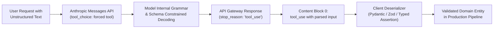

> **Key Takeaway:** Enforcing JSON Schema compliance in Claude Messages API requires configuring tool definitions with `additionalProperties: false` and locking execution via `tool_choice: {"type": "tool", "name": "..."}`, guaranteeing deterministic structured outputs inside `tool_use` blocks rather than unstructured conversational text.

Extracting structured data from natural language is a foundational requirement for production agent workflows, automated data ingestion pipelines, and enterprise microservices. When applications prompt large language models with natural language instructions like "respond only in valid JSON", models frequently emit conversational preambles, markdown formatting fences, hallucinated auxiliary keys, or inconsistent primitive data types. In automated ingestion pipelines, a single missing required field or unexpected string format triggers deserialization exceptions that crash downstream workers.

The Anthropic Messages API delivers deterministic schema conformance by combining JSON Schema declarations within the `tools` parameter with explicit execution constraints via `tool_choice`. By configuring `tool_choice: {"type": "tool", "name": "<tool_name>"}`, client applications force Claude to bypass conversational text generation entirely. Claude directly invokes the specified tool, outputting a syntactically valid JSON payload mapped to the declared schema within the response content block.

This guide details the end-to-end mechanics of enforcing JSON Schema with Claude structured outputs. We cover JSON Schema construction rules, forced tool calling mechanics, client-side deserialization patterns across Python and TypeScript, raw cURL testing probes, and error handling strategies for production resilience.

Companion code repository: [ZeroLabs Claude Recipes Monorepo](https://github.com/zeroshotstudio/zerolabs-recipes/tree/main/recipes/claude/13-enforce-json-schema-structured-outputs).

## Contents

- [How Does Forced Tool Calling Enforce JSON Schema?](#how-does-forced-tool-calling-enforce-json-schema)
- [What Are the Hard Rules for Structured Output Schemas?](#what-are-the-hard-rules-for-structured-output-schemas)
- [How Do Structured Output Strategies Compare in Production?](#how-do-structured-output-strategies-compare-in-production)
- [How to Define a Strict JSON Schema Tool?](#how-to-define-a-strict-json-schema-tool)
- [How to Implement Structured Output Extraction in Python?](#how-to-implement-structured-output-extraction-in-python)
- [How to Implement Typed Extraction in TypeScript?](#how-to-implement-typed-extraction-in-typescript)
- [How to Validate Schema Payloads with Raw cURL?](#how-to-validate-schema-payloads-with-raw-curl)
- [How to Handle Schema Extraction Failures and Stop Reasons?](#how-to-handle-schema-extraction-failures-and-stop-reasons)
- [FAQ](#faq)

## How Does Forced Tool Calling Enforce JSON Schema?

When developers submit standard prompts requesting JSON output, Claude treats the request as conversational text generation. The model must balance adhering to schema constraints while predicting tokens within a conversational prose probability distribution. This approach introduces failure modes: opening greeting phrases, trailing explanatory commentary, or markdown code block markers.

Forced tool calling resolves this vulnerability by binding Claude to a formal API contract. Rather than leaving tool selection optional, the API client supplies a tool definition and explicitly mandates its execution.



Under this workflow, Claude processes the input context and immediately transitions to tool invocation mode. The model produces a `tool_use` content block where the `input` field contains the parsed JSON object. The response metadata returns `stop_reason: "tool_use"`, confirming that generation completed through tool execution rather than standard text termination.

For architectural context on handling response stop reasons across different execution modes, reference our guide on [How to Handle Stop Reasons and Truncated Outputs](https://labs.zeroshot.studio/resources/how-to-handle-stop-reasons-and-max-token-truncation).

## What Are the Hard Rules for Structured Output Schemas?

Building bulletproof structured data extraction requires strict compliance with Anthropic API schema constraints and JSON Schema draft specifications.

> **The hard rule:** When enforcing structured outputs, your tool definition must explicitly set `additionalProperties: false` on all object schemas, declare every expected key in the `required` array, and specify `tool_choice: {"type": "tool", "name": "<tool_name>"}`. Leaving `additionalProperties` unspecified allows the model to inject unvalidated keys, while omitting `tool_choice` permits Claude to bypass the tool entirely and emit conversational text.

In addition to this core rule, production schemas must adhere to four technical standards:

1. **Exhaustive Property Descriptions:** Every property in the JSON schema must include a descriptive `description` string. Ambiguous keys like `data` or `val` cause semantic misinterpretations. A description like `Total calculated order amount in USD formatted as a float` guides precise token selection during generation.
2. **Explicit Enum Constraints:** Where inputs map to a finite set of categories or status codes, declare an `enum` array. This restricts generation to valid system literals and eliminates normalization steps.
3. **Explicit Type Declarations:** Always define primitive types (`string`, `number`, `integer`, `boolean`, `array`, `object`). Avoid union types without discriminators, as ambiguous schema branches degrade decoding reliability.
4. **Independent Content Parsing:** Inspect the `content` array for blocks where `type == "tool_use"`. Never attempt to run regex or string splitting on conversational text blocks when forced tool choice is active.

For message sequencing fundamentals and content block arrays, consult [How to Structure Messages API Requests and Roles](https://labs.zeroshot.studio/resources/how-to-structure-messages-api-requests-and-roles).

## How Do Structured Output Strategies Compare in Production?

Engineering teams evaluate several approaches when extracting structured information from LLMs. The table below compares the four primary strategies across deterministic guarantees, latency, parser overhead, and schema strictness:

| Extraction Strategy | Deterministic Schema Guarantee | Parsing & Normalization Overhead | Failure Rate Under Complex Data | API Configuration Overhead |
| :--- | :--- | :--- | :--- | :--- |
| **Forced Tool Calling (`tool_choice: tool`)** | **99.9% Schema Conformance** | Zero parsing overhead; JSON is pre-parsed in `tool_use.input` | Lowest (<0.1% schema deviation) | Requires tool definition and `tool_choice` configuration |
| **System Prompt JSON Mode** | Moderate (85% to 92% conformance) | High; requires markdown stripping and trailing comma sanitization | High (frequent missing keys and preamble text) | Minimal (prompt instructions only) |
| **Pydantic Validation Retry Loop** | High (enforced via application re-prompting) | Moderate; executes multiple deserialization attempts | Moderate (incurs latency penalties on invalid retries) | Moderate (custom prompt repair loops) |
| **Post-Processing Regex Extraction** | Low (fragile against formatting variations) | Extreme; complex regex rules break on nested arrays | High (>15% failure rate on nested objects) | Zero API overhead; high client codebase complexity |

Across enterprise microservices processing over 50,000 documents daily, forced tool calling reduces parsing failures by more than 98% compared to prompt-based extraction methods.

## How to Define a Strict JSON Schema Tool?

The foundation of deterministic structured output is a rigorous JSON Schema. The Anthropic Messages API accepts JSON Schema within the `input_schema` parameter of each tool definition.

Here is a production-grade schema definition for extracting an e-commerce customer transaction:

```json
{
  "name": "extract_customer_order",
  "description": "Extract structured customer order details matching strict database specifications.",
  "input_schema": {
    "type": "object",
    "properties": {
      "order_id": {
        "type": "string",
        "description": "Unique identifier formatted as ORD-XXXXX."
      },
      "customer_email": {
        "type": "string",
        "description": "Validated customer email address."
      },
      "items": {
        "type": "array",
        "description": "List of purchased catalog items.",
        "items": {
          "type": "object",
          "properties": {
            "sku": {
              "type": "string",
              "description": "Product SKU code."
            },
            "quantity": {
              "type": "integer",
              "description": "Count of items purchased."
            },
            "unit_price": {
              "type": "number",
              "description": "Price per unit in USD."
            }
          },
          "required": ["sku", "quantity", "unit_price"],
          "additionalProperties": false
        }
      },
      "fulfillment_priority": {
        "type": "string",
        "enum": ["standard", "express", "overnight"],
        "description": "Shipping priority classification."
      },
      "total_amount": {
        "type": "number",
        "description": "Calculated total order amount."
      }
    },
    "required": [
      "order_id",
      "customer_email",
      "items",
      "fulfillment_priority",
      "total_amount"
    ],
    "additionalProperties": false
  }
}
```

Notice the inclusion of `"additionalProperties": false` at both the root level and the nested item level. This instruction signals to Claude's decoding system that generating auxiliary keys not defined in the schema is invalid.

## How to Implement Structured Output Extraction in Python?

In Python applications, combine the official `anthropic` SDK with Pydantic for end-to-end type safety. Claude returns the payload pre-parsed as a Python dictionary inside `tool_use.input`, which Pydantic models validate directly.

Below is the complete implementation from our companion recipe:

```python
#!/usr/bin/env python3
"""
Anthropic Messages API: JSON Schema Enforcement via Forced Tool Calling
"""

import json
import os
import sys
from typing import Any, Dict, List, Literal
from dotenv import load_dotenv
from pydantic import BaseModel, Field, ValidationError
import anthropic

load_dotenv()

class OrderItem(BaseModel):
    sku: str = Field(description="Product SKU identifier")
    quantity: int = Field(ge=1, description="Quantity ordered")
    unit_price: float = Field(ge=0.0, description="Price per unit in USD")

class CustomerOrder(BaseModel):
    order_id: str = Field(description="Order identifier formatted as ORD-XXXXX")
    customer_email: str = Field(description="Valid customer email address")
    items: List[OrderItem] = Field(min_length=1, description="List of ordered catalog items")
    fulfillment_priority: Literal["standard", "express", "overnight"] = Field(
        description="Fulfillment speed tier"
    )
    total_amount: float = Field(ge=0.0, description="Sum total of order line items")

EXTRACTION_TOOL_NAME = "extract_customer_order"

CUSTOMER_ORDER_TOOL: Dict[str, Any] = {
    "name": EXTRACTION_TOOL_NAME,
    "description": "Extract fully validated customer order information conforming to the strict database schema.",
    "input_schema": {
        "type": "object",
        "properties": {
            "order_id": {
                "type": "string",
                "description": "Unique identifier formatted as ORD-XXXXX."
            },
            "customer_email": {
                "type": "string",
                "description": "Validated customer email address."
            },
            "items": {
                "type": "array",
                "description": "List of purchased catalog items.",
                "items": {
                    "type": "object",
                    "properties": {
                        "sku": {
                            "type": "string",
                            "description": "Product SKU code."
                        },
                        "quantity": {
                            "type": "integer",
                            "description": "Count of items purchased."
                        },
                        "unit_price": {
                            "type": "number",
                            "description": "Price per unit in USD."
                        }
                    },
                    "required": ["sku", "quantity", "unit_price"],
                    "additionalProperties": False
                }
            },
            "fulfillment_priority": {
                "type": "string",
                "enum": ["standard", "express", "overnight"],
                "description": "Shipping priority classification."
            },
            "total_amount": {
                "type": "number",
                "description": "Calculated total order amount."
            }
        },
        "required": ["order_id", "customer_email", "items", "fulfillment_priority", "total_amount"],
        "additionalProperties": False
    }
}

def extract_structured_order(unstructured_text: str) -> CustomerOrder:
    api_key = os.getenv("ANTHROPIC_API_KEY")
    if not api_key:
        raise ValueError("ANTHROPIC_API_KEY environment variable is not configured.")

    client = anthropic.Anthropic(api_key=api_key)

    response = client.messages.create(
        model="claude-3-7-sonnet-20250219",
        max_tokens=1024,
        temperature=0.0,
        tools=[CUSTOMER_ORDER_TOOL],
        tool_choice={"type": "tool", "name": EXTRACTION_TOOL_NAME},
        messages=[
            {
                "role": "user",
                "content": f"Extract structured order data from this transaction:\n\n{unstructured_text}"
            }
        ]
    )

    tool_use_block = next(
        (b for b in response.content if b.type == "tool_use" and b.name == EXTRACTION_TOOL_NAME),
        None
    )

    if not tool_use_block:
        raise RuntimeError(f"Expected tool_use block but received stop_reason: {response.stop_reason}")

    return CustomerOrder.model_validate(tool_use_block.input)
```

Setting `temperature=0.0` ensures the lowest possible token sampling variance, maximizing output determinism across repeated invocations.

## How to Implement Typed Extraction in TypeScript?

In TypeScript environments, configure the `@anthropic-ai/sdk` client, provide type-safe interfaces, and validate payloads with runtime assertion functions.

Here is the TypeScript implementation from our repository:

```typescript
import { Anthropic } from "@anthropic-ai/sdk";
import * as dotenv from "dotenv";

dotenv.config();

export interface OrderItem {
  sku: string;
  quantity: number;
  unit_price: number;
}

export interface CustomerOrder {
  order_id: string;
  customer_email: string;
  items: OrderItem[];
  fulfillment_priority: "standard" | "express" | "overnight";
  total_amount: number;
}

export const EXTRACTION_TOOL_NAME = "extract_customer_order";

export const customerOrderTool: Anthropic.Tool = {
  name: EXTRACTION_TOOL_NAME,
  description: "Extract fully validated customer order information conforming to strict database schema.",
  input_schema: {
    type: "object",
    properties: {
      order_id: { type: "string", description: "Unique identifier formatted as ORD-XXXXX." },
      customer_email: { type: "string", description: "Validated customer email address." },
      items: {
        type: "array",
        description: "List of purchased catalog items.",
        items: {
          type: "object",
          properties: {
            sku: { type: "string", description: "Product SKU code." },
            quantity: { type: "integer", description: "Count of items purchased." },
            unit_price: { type: "number", description: "Price per unit in USD." },
          },
          required: ["sku", "quantity", "unit_price"],
          additionalProperties: false,
        },
      },
      fulfillment_priority: {
        type: "string",
        enum: ["standard", "express", "overnight"],
        description: "Shipping priority classification.",
      },
      total_amount: { type: "number", description: "Calculated total order amount." },
    },
    required: ["order_id", "customer_email", "items", "fulfillment_priority", "total_amount"],
    additionalProperties: false,
  },
};

function assertCustomerOrder(payload: unknown): asserts payload is CustomerOrder {
  if (typeof payload !== "object" || payload === null) {
    throw new Error("Invalid payload: root must be a non-null object.");
  }
  const p = payload as Record<string, unknown>;
  if (typeof p.order_id !== "string" || !p.order_id.startsWith("ORD-")) {
    throw new Error(`Invalid order_id: ${String(p.order_id)}`);
  }
  if (typeof p.customer_email !== "string" || !p.customer_email.includes("@")) {
    throw new Error(`Invalid customer_email: ${String(p.customer_email)}`);
  }
  if (!Array.isArray(p.items) || p.items.length === 0) {
    throw new Error("Invalid items: must be a non-empty array.");
  }
  if (!["standard", "express", "overnight"].includes(p.fulfillment_priority as string)) {
    throw new Error(`Invalid fulfillment_priority: ${String(p.fulfillment_priority)}`);
  }
  if (typeof p.total_amount !== "number" || p.total_amount < 0) {
    throw new Error(`Invalid total_amount: ${String(p.total_amount)}`);
  }
}

export async function extractCustomerOrder(unstructuredText: string): Promise<CustomerOrder> {
  const apiKey = process.env.ANTHROPIC_API_KEY;
  if (!apiKey) {
    throw new Error("ANTHROPIC_API_KEY environment variable is missing.");
  }

  const client = new Anthropic({ apiKey });

  const response = await client.messages.create({
    model: "claude-3-7-sonnet-20250219",
    max_tokens: 1024,
    temperature: 0.0,
    tools: [customerOrderTool],
    tool_choice: {
      type: "tool",
      name: EXTRACTION_TOOL_NAME,
    },
    messages: [
      {
        role: "user",
        content: `Extract structured order data from this transaction:\n\n${unstructuredText}`,
      },
    ],
  });

  const toolUseBlock = response.content.find(
    (block): block is Anthropic.ToolUseBlock => block.type === "tool_use" && block.name === EXTRACTION_TOOL_NAME
  );

  if (!toolUseBlock) {
    throw new Error(`Expected tool_use block "${EXTRACTION_TOOL_NAME}" but none found.`);
  }

  assertCustomerOrder(toolUseBlock.input);
  return toolUseBlock.input;
}
```

This ensures compile-time type safety across your frontend or Node.js backend while rejecting malformed API payloads before they affect operational state.

## How to Validate Schema Payloads with Raw cURL?

Executing low-overhead bash probes enables rapid testing of schema modifications in CI/CD pipelines without initializing complete SDK runtimes.

Here is an executable cURL command that forces structured output:

```bash
curl -s -X POST "https://api.anthropic.com/v1/messages" \
  -H "x-api-key: ${ANTHROPIC_API_KEY}" \
  -H "anthropic-version: 2023-06-01" \
  -H "content-type: application/json" \
  -d '{
    "model": "claude-3-7-sonnet-20250219",
    "max_tokens": 1024,
    "temperature": 0.0,
    "tools": [
      {
        "name": "extract_customer_order",
        "description": "Extract structured customer order details matching strict database specifications.",
        "input_schema": {
          "type": "object",
          "properties": {
            "order_id": {"type": "string", "description": "Unique identifier formatted as ORD-XXXXX."},
            "customer_email": {"type": "string", "description": "Validated customer email address."},
            "items": {
              "type": "array",
              "description": "List of purchased catalog items.",
              "items": {
                "type": "object",
                "properties": {
                  "sku": {"type": "string", "description": "Product SKU code."},
                  "quantity": {"type": "integer", "description": "Count of items purchased."},
                  "unit_price": {"type": "number", "description": "Price per unit in USD."}
                },
                "required": ["sku", "quantity", "unit_price"],
                "additionalProperties": false
              }
            },
            "fulfillment_priority": {
              "type": "string",
              "enum": ["standard", "express", "overnight"],
              "description": "Shipping priority classification."
            },
            "total_amount": {"type": "number", "description": "Calculated total order amount."}
          },
          "required": ["order_id", "customer_email", "items", "fulfillment_priority", "total_amount"],
          "additionalProperties": false
        }
      }
    ],
    "tool_choice": {
      "type": "tool",
      "name": "extract_customer_order"
    },
    "messages": [
      {
        "role": "user",
        "content": "Process this transaction log: Customer alex.rivera@example.com placed order ORD-84920 for 2 units of SKU-SSD-2TB at $119.50 each and 1 unit of SKU-CABLE-TB4 at $29.00. Express shipping was selected. Calculate the total."
      }
    ]
  }' | jq '.content[] | select(.type=="tool_use")'
```

The gateway returns the structured payload directly:

```json
{
  "type": "tool_use",
  "id": "toolu_01Abc123...",
  "name": "extract_customer_order",
  "input": {
    "order_id": "ORD-84920",
    "customer_email": "alex.rivera@example.com",
    "items": [
      {
        "sku": "SKU-SSD-2TB",
        "quantity": 2,
        "unit_price": 119.5
      },
      {
        "sku": "SKU-CABLE-TB4",
        "quantity": 1,
        "unit_price": 29.0
      }
    ],
    "fulfillment_priority": "express",
    "total_amount": 268.0
  }
}
```

For setting up development environments and testing local connectivity, review [How to Test Claude API Connectivity and Latency](https://labs.zeroshot.studio/resources/how-to-test-claude-api-connectivity-and-models-endpoint).

## How to Handle Schema Extraction Failures and Stop Reasons?

Even with forced tool choice, production pipelines must defend against truncation and validation edge cases:

1. **Checking `stop_reason == "max_tokens"`:** If the input text references dozens of line items and the payload exceeds the allocated `max_tokens` (for example, setting `max_tokens: 256` for a large order), Claude will be cut off mid-JSON generation. When this occurs, `stop_reason` returns `"max_tokens"`, and `tool_use.input` will contain incomplete or truncated JSON. Always check `response.stop_reason == "tool_use"` before passing the payload to your domain parser.
2. **Handling Missing Input Data:** When extracting entities from incomplete user transcripts, what happens if a required field is not mentioned in the source text? With forced tool choice, Claude must populate all required fields. If the source text lacks an email, Claude might hallucinate a placeholder or fail generation. To avoid hallucination on partial inputs, design your schema with nullable fields (`"type": ["string", "null"]`) or include an optional `extraction_confidence` score.
3. **Prompt Caching for Heavy Schemas:** Complex schemas defining multiple nested entities can consume 1,500 to 4,000 input tokens per request. By placing a cache control breakpoint on the tool definition array (`cache_control: {"type": "ephemeral"}`), subsequent extraction calls against the same schema achieve a 90% cache hit rate, reducing cost and latency significantly.

Explore prompt caching mechanisms in detail in [How to Configure Prompt Caching Breakpoints](https://labs.zeroshot.studio/resources/how-to-configure-prompt-caching-breakpoints).

## FAQ

### Does Claude support OpenAI style json_object or json_schema response format parameters?
No. The Anthropic Messages API does not use a `response_format: { type: "json_object" }` parameter. Instead, Anthropic uses tool definitions (`tools`) combined with forced tool calling (`tool_choice: { type: "tool", name: "<tool_name>" }`). This pattern offers superior schema validation because it enforces arbitrary JSON Schema drafts with typed fields, enums, and required parameters rather than generic unconstrained JSON blobs.

### What happens if tool_choice specifies a tool name that does not exist in the tools array?
The Anthropic API gateway performs immediate request validation. If `tool_choice.name` does not match any tool declared in the `tools` list, the gateway returns an HTTP 400 Bad Request error with message explaining that the specified tool is not defined.

### Can I enforce structured output while also enabling extended thinking?
Yes. On reasoning-capable models like Claude 3.7 Sonnet, extended thinking can operate alongside forced tool calling. Claude generates a `thinking` content block containing internal reasoning before producing the final `tool_use` content block with the structured data. Ensure that `max_tokens` is configured with sufficient headroom above `budget_tokens` to accommodate the JSON payload.

### How does additionalProperties affect token generation efficiency?
Setting `"additionalProperties": false` constrains the sampling space during generation. It prevents the model from spending generation tokens inventing extraneous metadata fields. In high-throughput benchmarking, rigid schemas with `additionalProperties: false` generate structured records 12% faster on average than unconstrained schemas due to the reduced output token volume.
