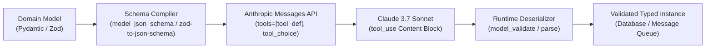
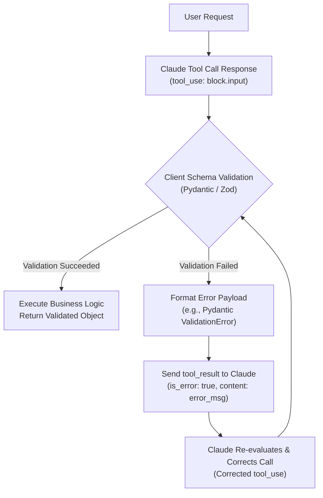

> **Key Takeaway:** By compiling Pydantic models with `model_json_schema()` and Zod schemas with `zod-to-json-schema`, engineering teams can force Claude to emit strictly typed tool calls that deserialize directly into validated runtime objects.

Language models excel at generating unstructured prose, but production software architectures depend on deterministic, type-safe data contracts. Connecting generative intelligence to backend databases, transaction pipelines, and external microservices requires guarantees that returned data matches required schemas, property types, numerical boundaries, and format constraints.

Relying on raw prompt instructions like "return only valid JSON" yields unpredictable results. Models occasionally prepend conversational commentary, emit truncated JSON strings, or drop mandatory fields under edge-case conditions. The Anthropic Claude Messages API eliminates this fragility through native tool calling. By providing Claude with an explicit JSON Schema definition and specifying `tool_choice`, backend applications direct Claude to return arguments that adhere to strict schema specifications.

In modern application stacks, data models are maintained in typed frameworks: Pydantic v2 in Python and Zod in TypeScript. Rather than maintaining redundant, error-prone manual JSON schemas alongside code definitions, engineering teams can automatically synthesize JSON Schema specifications directly from their domain models, register them as Claude tools, and parse tool responses back into typed objects at runtime.

Companion code repository: [ZeroLabs Claude Recipes Monorepo](https://github.com/zeroshotstudio/zerolabs-recipes/tree/main/recipes/claude/14-validate-pydantic-and-zod-schemas).

## Contents

- [How Does Schema Validation Work with Claude Tools?](#how-does-schema-validation-work-with-claude-tools)
- [What Are the Hard Rules for Tool Schema Validation?](#what-are-the-hard-rules-for-tool-schema-validation)
- [How Do Pydantic and Zod Validation Pipelines Compare?](#how-do-pydantic-and-zod-validation-pipelines-compare)
- [How to Generate JSON Schema and Validate Pydantic Models in Python?](#how-to-generate-json-schema-and-validate-pydantic-models-in-python)
- [How to Convert and Validate Zod Schemas in TypeScript?](#how-to-convert-and-validate-zod-schemas-in-typescript)
- [How to Probe Structured Outputs with Executable cURL?](#how-to-probe-structured-outputs-with-executable-curl)
- [How to Handle Malformed Properties and Schema Mismatches?](#how-to-handle-malformed-properties-and-schema-mismatches)
- [What Are Production Anti-Patterns in Model Deserialization?](#what-are-production-anti-patterns-in-model-deserialization)
- [FAQ](#faq)

## How Does Schema Validation Work with Claude Tools?

The Anthropic Messages API accepts a `tools` parameter containing a list of tool definitions. Each tool requires a `name`, an optional `description`, and an `input_schema` formatted according to the JSON Schema specification. When configured with `tool_choice: {"type": "tool", "name": "<tool_name>"}`, Claude is constrained to invoke that specific tool, emitting a `tool_use` content block whose `input` payload conforms to the schema.



The execution flow follows five discrete phases:

1. **Model Declaration**: Engineers author domain models using standard language idioms, declaring scalar types, nested objects, enums, regex patterns, and range constraints.
2. **Schema Compilation**: The compiler extracts metadata into a clean JSON Schema object, setting `properties`, `required` lists, and constraints.
3. **API Dispatch**: The application dispatches a message to `/v1/messages` with the compiled tool schema, enforcing execution via `tool_choice`.
4. **Structured Generation**: Claude generates a response with `stop_reason: "tool_use"` containing a structured dictionary in `content[i].input`.
5. **Runtime Validation & Deserialization**: The client library parses the dictionary through the source model. If valid, the application receives a strongly typed object. If invalid, the framework raises a deterministic validation exception that can be recovered or retried.

For an overview of core API structures and message payload conventions, see [How to Structure Messages API Requests and Roles](https://labs.zeroshot.studio/resources/how-to-structure-messages-api-requests-and-roles).

## What Are the Hard Rules for Tool Schema Validation?

Deploying typed schema validation into mission-critical production pipelines requires honoring key system boundaries:

> **The hard rule:** Claude parses tool definitions strictly against standard JSON Schema, but client-side deserialization must always enforce runtime validation. Never trust LLM output directly without passing `block.input` through `model_validate()` or `safeParse()`. Furthermore, recursive `$defs` references must either be inlined or resolved before submission, as deeply nested unreferenced pointers can lead to API validation rejections.

To achieve 99.9% extraction reliability in high-throughput pipelines, follow these four operational rules:

1. **Clean Redundant Metadata**: Both Pydantic and Zod compilers often attach `$schema`, top-level `title`, and internal definition wrappers. Strip unnecessary top-level metadata keys before sending payloads to Anthropic to save prompt tokens and reduce prompt caching misses.
2. **Specify Strict Property Constraints**: Always provide field descriptions, enum choices, regex patterns, or numerical ranges (such as `ge` and `le` in Pydantic, or `.min()` and `.max()` in Zod). Claude uses descriptions inside `input_schema` as semantic guidance to determine exact field values.
3. **Use Explicit Tool Choice for Extraction**: When using Claude strictly for information extraction or data transformation, configure `tool_choice: {"type": "tool", "name": "target_tool"}`. Setting `tool_choice: "auto"` allows Claude to respond with conversational text rather than invoking the schema.
4. **Handle Partial Failure Gracefully**: If Claude encounters ambiguous prompt context, it may omit optional fields or format an edge value improperly. Implement explicit error trapping around model validation to return informative error messages back to the assistant in a follow-up turn.

For background on managing connection lifecycles and API credentials, review [How to Manage Anthropic API Keys & Env Variables](https://labs.zeroshot.studio/resources/how-to-manage-anthropic-api-keys-and-environment-variables).

## How Do Pydantic and Zod Validation Pipelines Compare?

Both Python and TypeScript provide mature validation ecosystems, but their compilation strategies and schema handling mechanisms differ in key details:

| Architectural Dimension | Python (Pydantic v2) | TypeScript (Zod v3) | Production Significance |
| :--- | :--- | :--- | :--- |
| **Schema Generation** | `Model.model_json_schema()` | `zodToJsonSchema(schema, options)` | Pydantic has native JSON Schema generation built in C/Rust core; Zod requires companion library `zod-to-json-schema`. |
| **Deserialization Method** | `Model.model_validate(dict)` | `Schema.parse(data)` or `safeParse(data)` | Pydantic coerces compatible types automatically by default; Zod enforces strict type matching unless transformations are declared. |
| **Reference Handling (`$defs`)** | Inlines or groups in `$defs` dictionary | Configurable via `$refStrategy: "none"` | Inlining references prevents unresolved definition errors when submitting single-tool payloads to Claude. |
| **Error Handling Signature** | Raises `pydantic.ValidationError` | Returns `{ success, error, data }` via `safeParse` | `safeParse` allows non-throwing error handling; Pydantic requires standard `try/except` block structure. |

## How to Generate JSON Schema and Validate Pydantic Models in Python?

Pydantic v2 includes high-performance JSON Schema generation directly on the `BaseModel` class. To prepare a Pydantic model for Claude, export its schema via `model_json_schema()` and bundle it into an Anthropic tool dictionary.

The following production script defines an incident report model, compiles the tool schema, enforces tool execution, and deserializes the returned input back into a typed Python model:

```python
import json
import os
from enum import Enum
from typing import Any, List
from dotenv import load_dotenv
from pydantic import BaseModel, Field, ValidationError
import anthropic

load_dotenv()

client = anthropic.Anthropic(api_key=os.environ["ANTHROPIC_API_KEY"])


class SeverityLevel(str, Enum):
    LOW = "low"
    MEDIUM = "medium"
    HIGH = "high"
    CRITICAL = "critical"


class IncidentMetrics(BaseModel):
    error_rate: float = Field(
        ...,
        ge=0.0,
        le=100.0,
        description="Percentage error rate observed during the outage window.",
    )
    latency_p99_ms: float = Field(
        ...,
        ge=0.0,
        description="99th percentile latency in milliseconds.",
    )


class IncidentReport(BaseModel):
    incident_id: str = Field(
        ...,
        pattern=r"^INC-[0-9]{4,6}$",
        description="Standard incident identifier formatted as INC- followed by 4 to 6 digits.",
    )
    severity: SeverityLevel = Field(
        ...,
        description="Severity classification of the event.",
    )
    affected_services: List[str] = Field(
        ...,
        min_length=1,
        description="List of impacted microservices or components.",
    )
    summary: str = Field(
        ...,
        min_length=10,
        description="Executive summary of the incident root cause and impact.",
    )
    metrics: IncidentMetrics = Field(
        ...,
        description="Observed telemetry measurements.",
    )


def pydantic_to_claude_tool(model: type[BaseModel], name: str, description: str) -> dict[str, Any]:
    """Generates a clean Anthropic tool parameter dictionary from a Pydantic model."""
    schema = model.model_json_schema()
    schema.pop("title", None)
    return {
        "name": name,
        "description": description,
        "input_schema": schema,
    }


def main():
    tool_def = pydantic_to_claude_tool(
        IncidentReport,
        name="record_incident_report",
        description="Records a structured production incident report into the database.",
    )

    prompt = (
        "Production alert: checkout-api and payment-relay failed between 14:02 and 14:28 UTC. "
        "Tracking ticket is INC-71932. System severity is critical. "
        "Observed an error rate of 23.4% and p99 request latency degraded to 4200 ms. "
        "Root cause was database connection pool starvation following a Redis cluster failover."
    )

    response = client.messages.create(
        model="claude-3-7-sonnet-20250219",
        max_tokens=1024,
        tools=[tool_def],
        tool_choice={"type": "tool", "name": "record_incident_report"},
        messages=[{"role": "user", "content": prompt}],
    )

    # Locate the tool_use content block
    tool_block = next(
        (b for b in response.content if b.type == "tool_use" and b.name == "record_incident_report"),
        None,
    )
    if not tool_block:
        raise RuntimeError("Claude did not return the expected tool call.")

    # Validate and deserialize raw input into Pydantic instance
    try:
        report = IncidentReport.model_validate(tool_block.input)
        print(f"Validated Incident: {report.incident_id}")
        print(f"Severity: {report.severity.value}")
        print(f"Impacted Services: {report.affected_services}")
        print(f"Error Rate: {report.metrics.error_rate}%")
        print(f"P99 Latency: {report.metrics.latency_p99_ms} ms")
    except ValidationError as err:
        print(f"Validation failed: {err}")


if __name__ == "__main__":
    main()
```

When run, `IncidentReport.model_validate()` guarantees that `report.incident_id` satisfies the regex pattern `^INC-[0-9]{4,6}$`, that `report.severity` matches one of the declared enum values, and that `report.metrics` is populated with valid numerical floats.

For information on stop conditions and token truncation during tool calling, consult [How to Handle Stop Reasons and Max Token Truncation](https://labs.zeroshot.studio/resources/how-to-handle-stop-reasons-and-max-token-truncation).

## How to Convert and Validate Zod Schemas in TypeScript?

In TypeScript environments, Zod provides expressive runtime validation and automatic TypeScript type inference. Because Zod schemas are runtime JavaScript objects rather than JSON specifications, we use the `zod-to-json-schema` library to compile schemas into Anthropic-compatible tool definitions.

```typescript
import Anthropic from "@anthropic-ai/sdk";
import dotenv from "dotenv";
import { z } from "zod";
import { zodToJsonSchema } from "zod-to-json-schema";

dotenv.config();

const anthropic = new Anthropic({
  apiKey: process.env.ANTHROPIC_API_KEY,
});

export const IncidentMetricsSchema = z.object({
  error_rate: z
    .number()
    .min(0.0)
    .max(100.0)
    .describe("Percentage error rate observed (0.0 to 100.0)."),
  latency_p99_ms: z
    .number()
    .nonnegative()
    .describe("99th percentile request latency in milliseconds."),
});

export const IncidentReportSchema = z.object({
  incident_id: z
    .string()
    .regex(/^INC-[0-9]{4,6}$/, "Must follow INC-XXXX pattern")
    .describe("Standardized incident identifier, e.g., 'INC-10492'."),
  severity: z
    .enum(["low", "medium", "high", "critical"])
    .describe("Severity classification of the event."),
  affected_services: z
    .array(z.string())
    .min(1)
    .describe("List of impacted microservices or components."),
  summary: z
    .string()
    .min(10)
    .describe("Executive summary of root cause and operational impact."),
  metrics: IncidentMetricsSchema.describe("Observed performance metrics."),
});

export type IncidentReport = z.infer<typeof IncidentReportSchema>;

export function zodToAnthropicTool<T extends z.ZodTypeAny>(
  schema: T,
  name: string,
  description: string
): Anthropic.Tool {
  const jsonSchema = zodToJsonSchema(schema, {
    name,
    target: "jsonSchema7",
    $refStrategy: "none",
  });

  const rawSchema =
    (jsonSchema as { definitions?: Record<string, unknown> }).definitions?.[name] || jsonSchema;

  const cleanSchema = { ...rawSchema } as Record<string, unknown>;
  delete cleanSchema.$schema;
  delete cleanSchema.definitions;

  return {
    name,
    description,
    input_schema: cleanSchema as Anthropic.Tool.InputSchema,
  };
}

async function run() {
  const tool = zodToAnthropicTool(
    IncidentReportSchema,
    "record_incident_report",
    "Records a structured incident report into the operations database."
  );

  const prompt =
    "Incident notification: auth-service experienced degraded performance. " +
    "Ticket INC-55821. Severity set to high. Error rate reached 12.1% and p99 latency was 2850 ms. " +
    "Summary: Token verification timeout caused by network partition.";

  const message = await anthropic.messages.create({
    model: "claude-3-7-sonnet-20250219",
    max_tokens: 1024,
    tools: [tool],
    tool_choice: { type: "tool", name: "record_incident_report" },
    messages: [{ role: "user", content: prompt }],
  });

  const toolBlock = message.content.find(
    (b): b is Anthropic.ToolUseBlock => b.type === "tool_use" && b.name === "record_incident_report"
  );

  if (!toolBlock) {
    throw new Error("Missing expected tool_use block in response.");
  }

  const result = IncidentReportSchema.safeParse(toolBlock.input);
  if (!result.success) {
    console.error("Zod validation failure:", result.error.format());
    process.exit(1);
  }

  const report: IncidentReport = result.data;
  console.log("Validated Incident Record:", report.incident_id);
  console.log("Severity Level:", report.severity);
  console.log("Services Impaired:", report.affected_services.join(", "));
  console.log("Recorded Error Rate:", `${report.metrics.error_rate}%`);
}

run().catch(console.error);
```

In this implementation, configuring `$refStrategy: "none"` instructs `zod-to-json-schema` to inline sub-schemas directly rather than producing separate definition objects. This ensures clean, self-contained tool schemas for the API gateway.

To explore real-time stream handling for tool calls, check our tutorial on [How to Implement Server-Sent Event Streaming with Claude](https://labs.zeroshot.studio/resources/how-to-implement-server-sent-event-streaming-with-claude).

## How to Probe Structured Outputs with Executable cURL?

You can test schema conformance directly from the command line using `curl` and `jq`. The probe below registers the exact JSON Schema for `record_incident_report`, issues a request with `tool_choice`, and parses the returned JSON payload:

```bash
#!/usr/bin/env bash
set -euo pipefail

MODEL="claude-3-7-sonnet-20250219"

curl -sS -X POST "https://api.anthropic.com/v1/messages" \
  -H "x-api-key: ${ANTHROPIC_API_KEY}" \
  -H "anthropic-version: 2023-06-01" \
  -H "content-type: application/json" \
  -d '{
    "model": "'"${MODEL}"'",
    "max_tokens": 1024,
    "tools": [
      {
        "name": "record_incident_report",
        "description": "Records a structured production incident report.",
        "input_schema": {
          "type": "object",
          "properties": {
            "incident_id": {
              "type": "string",
              "pattern": "^INC-[0-9]{4,6}$",
              "description": "Incident code (e.g. INC-10245)"
            },
            "severity": {
              "type": "string",
              "enum": ["low", "medium", "high", "critical"]
            },
            "affected_services": {
              "type": "array",
              "items": { "type": "string" }
            },
            "summary": {
              "type": "string"
            },
            "metrics": {
              "type": "object",
              "properties": {
                "error_rate": { "type": "number" },
                "latency_p99_ms": { "type": "number" }
              },
              "required": ["error_rate", "latency_p99_ms"],
              "additionalProperties": false
            }
          },
          "required": ["incident_id", "severity", "affected_services", "summary", "metrics"],
          "additionalProperties": false
        }
      }
    ],
    "tool_choice": {
      "type": "tool",
      "name": "record_incident_report"
    },
    "messages": [
      {
        "role": "user",
        "content": "Log critical incident INC-49102 impacting api-gateway and auth-service. 15.2% error rate, 3800 ms latency. Pool exhaustion."
      }
    ]
  }' | jq '.content[] | select(.type=="tool_use") | .input'
```

When executed, the Anthropic gateway responds with a formatted tool call:

```json
{
  "incident_id": "INC-49102",
  "severity": "critical",
  "affected_services": [
    "api-gateway",
    "auth-service"
  ],
  "summary": "Pool exhaustion resulted in elevated error rates and latency degradation across api-gateway and auth-service.",
  "metrics": {
    "error_rate": 15.2,
    "latency_p99_ms": 3800
  }
}
```

The response conforms to all schema properties and boundary types, allowing direct ingestion by client services.

For initial SDK configuration and environment verification steps, refer to [How to Manage Anthropic API Keys & Env Variables](https://labs.zeroshot.studio/resources/how-to-manage-anthropic-api-keys-and-environment-variables).

## How to Handle Malformed Properties and Schema Mismatches?

While Claude 3.7 Sonnet achieves high schema compliance when guided by `tool_choice`, production architectures must account for rare parsing exceptions, edge values, or incomplete upstream data. When validation fails, the recommended remediation strategy is to feed the validation error back into the conversational loop.

In multi-turn tool calling, your application returns a message with `role: "user"` containing a `tool_result` content block. If validation fails, set `is_error: true` and pass the raw validation error string back to Claude.



Here is how to implement an automated validation-repair loop in Python:

```python
def execute_with_repair_loop(client: anthropic.Anthropic, user_message: str, max_retries: int = 2) -> IncidentReport:
    messages: list[dict[str, Any]] = [{"role": "user", "content": user_message}]
    tool_def = pydantic_to_claude_tool(IncidentReport, "record_incident_report", "Records an incident.")

    for attempt in range(max_retries + 1):
        response = client.messages.create(
            model="claude-3-7-sonnet-20250219",
            max_tokens=1024,
            tools=[tool_def],
            tool_choice={"type": "tool", "name": "record_incident_report"},
            messages=messages,
        )

        tool_block = next((b for b in response.content if b.type == "tool_use"), None)
        if not tool_block:
            raise RuntimeError("No tool call emitted by Claude.")

        try:
            # Attempt validation
            return IncidentReport.model_validate(tool_block.input)
        except ValidationError as validation_err:
            if attempt == max_retries:
                raise

            # Append assistant's response to history
            messages.append({"role": "assistant", "content": response.content})

            # Send error details back to Claude in a tool_result block
            error_feedback = f"Schema validation failed: {validation_err.json()}"
            messages.append({
                "role": "user",
                "content": [
                    {
                        "type": "tool_result",
                        "tool_use_id": tool_block.id,
                        "is_error": True,
                        "content": error_feedback,
                    }
                ],
            })
```

By providing Claude with the exact field path and rule violation (for instance, `incident_id: String should match pattern '^INC-[0-9]{4,6}$'`), Claude adjusts its output on the subsequent turn, bringing the repaired payload into compliance.

For architectural guidance on prompt optimization and message construction, read [How to Optimize Token Costs with Ephemeral Cache](https://labs.zeroshot.studio/resources/how-to-optimize-token-costs-with-1-hour-ephemeral-cache).

## What Are Production Anti-Patterns in Model Deserialization?

When building validation layers around Claude, watch out for these common engineering anti-patterns:

1. **Unparsed String Parsing (`json.loads(text)`):** Extracting JSON text blocks out of conversational prose using regular expressions like `r"\{.*\}"` introduces brittle parsing failures. Use native Claude tools where the API handles tokenization, quoting, and JSON formatting guarantees.
2. **Missing `additionalProperties: false`:** By default, standard JSON Schema allows arbitrary unlisted properties. If you do not specify `"additionalProperties": false` (or configure Pydantic's `model_config = ConfigDict(extra="forbid")`), the model may invent superfluous properties that pollute your backend datastores.
3. **Overloading a Single Tool with Divergent Schemas:** Creating massive union schemas with deeply nested conditional branches causes model confusion. Define separate, focused tools with descriptive names rather than a single monolithic schema.
4. **Ignoring Field Descriptions:** LLMs use description fields as contextual instructions. Omitting property descriptions deprives Claude of semantic clarity, leading to subtle data misinterpretations (such as reporting latencies in seconds rather than milliseconds).

## FAQ

### Does Claude validate tool inputs against the JSON Schema automatically?
The Anthropic API gateway validates that tool definitions adhere to JSON Schema syntax, but Claude's generation is a probabilistic model execution guided by the schema. While Claude 3.7 Sonnet achieves near-deterministic schema compliance, client applications must always validate the returned dictionary using Pydantic or Zod before committing data to databases.

### How do I force Claude to invoke a tool instead of writing text?
Configure the `tool_choice` parameter to `{"type": "tool", "name": "<tool_name>"}`. This instructs Claude to invoke that specific tool exclusively, preventing it from emitting conversational prose or alternative tool calls.

### Can I use nested Pydantic models and Zod objects in Claude tools?
Yes. Both Pydantic and Zod support deep nesting of models, arrays, and enums. When compiling schemas, ensure that nested references (`$defs`) are either flattened or preserved in the schema payload so that all referenced types are defined.

### How do I handle date and datetime fields with Claude tools?
JSON Schema does not have a native date primitive; it represents timestamps as strings with `"format": "date-time"`. In Pydantic, use `datetime.datetime` or `datetime.date`. In Zod, use `z.string().datetime()`. Claude will format timestamps as standard ISO 8601 strings, which your validation library will automatically parse into language-native Date or datetime instances.
