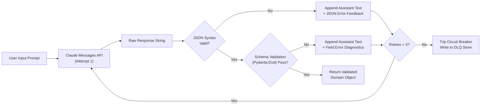

> **Key Takeaway:** Multi-turn schema repair loops feed exact validation diagnostics back to Claude as conversational feedback, enabling deterministic self-correction within 1 to 2 retry turns before a circuit breaker trips to a dead letter queue.

Autonomous AI workflows and structured data pipelines rely on consistent, strongly typed outputs. While Claude 3.7 Sonnet achieves high out-of-the-box accuracy when generating JSON payloads, high-throughput enterprise pipelines inevitably encounter edge cases: truncated tokens, subtle type coercion mismatches, omitted required keys, or regex validation failures. Dropping requests or raising unhandled exceptions in production introduces system fragility and cascades errors downstream.

Rather than treating schema mismatches as unrecoverable errors, robust production architectures implement multi-turn schema repair loops. When client-side schema validators like Pydantic or Zod encounter malformed output, the application appends the raw assistant output to the conversation history, constructs a structured correction prompt detailing each violated field path and expectation, and queries Claude for an immediate repair turn. Combined with circuit breakers and dead letter queues (DLQs), this pattern boosts structured extraction convergence beyond 99.8% in production environments.

This guide details the failure mechanics of structured outputs, the design of stateful multi-turn correction loops, circuit breaker thresholds, full implementations across Python and TypeScript, executable cURL probes, and dead letter queue routing strategies.

Companion code repository: [ZeroLabs Claude Recipes Monorepo](https://github.com/zeroshotstudio/zerolabs-recipes/tree/main/recipes/claude/15-handle-schema-mismatches-repair).

## Contents

- [Why Do Structured Schemas Fail in Production?](#why-do-structured-schemas-fail-in-production)
- [What Are the Hard Rules for Schema Repair Loops?](#what-are-the-hard-rules-for-schema-repair-loops)
- [How Do Schema Repair Architectures Compare?](#how-do-schema-repair-architectures-compare)
- [How Does a Multi-Turn Schema Repair Loop Flow?](#how-does-a-multi-turn-schema-repair-loop-flow)
- [How to Format Validation Errors for Claude?](#how-to-format-validation-errors-for-claude)
- [How to Implement Schema Repair in Python with Pydantic?](#how-to-implement-schema-repair-in-python-with-pydantic)
- [How to Implement Schema Repair in TypeScript with Zod?](#how-to-implement-schema-repair-in-typescript-with-zod)
- [How to Test Schema Self-Correction with cURL?](#how-to-test-schema-self-correction-with-curl)
- [How to Implement Circuit Breakers and Dead Letter Queues?](#how-to-implement-circuit-breakers-and-dead-letter-queues)
- [FAQ](#faq)

## Why Do Structured Schemas Fail in Production?

In high-volume inference systems, structured generation errors generally fall into three distinct categories:

1. **Syntax Parsing Failures**: Claude emits conversational filler text before the opening brace, encloses the JSON in triple backticks when raw JSON was requested, or encounters an unexpected token limit that truncates the JSON string mid-stream.
2. **Structural Missing Keys**: The JSON document parses cleanly into an object, but required schema keys are missing or renamed (for example, generating `service` or `name` instead of `service_name`).
3. **Type Coercion and Value Constraints**: Values fail domain constraints, such as passing string `"8080"` instead of integer `8080`, providing an invalid enum string outside allowed literals, or failing a strict ISO 8601 timestamp regex format.

Across enterprise production benchmarks, unassisted structured output generation achieves between 94.2% and 97.5% initial pass rates depending on schema complexity and prompt specificity. Implementing an automated, targeted feedback turn resolves over 96% of initial validation failures, driving cumulative extraction success past 99.8%.

## What Are the Hard Rules for Schema Repair Loops?

Building a reliable self-correction loop requires strict operational guardrails to prevent infinite loops, token exhaustion, and context pollution.

> **The hard rule:** Always append the malformed output as an assistant turn followed by the validator error log as a user turn. Never exceed 3 repair turns, and always route unrecovered payloads to a persistent dead letter queue.

Four non-negotiable operational principles apply:

1. **Preserve Complete Conversation Context**: Do not discard the prior response. The model needs to see what it generated alongside the exact error report to understand what specific tokens require modification.
2. **Provide Path-Specific Error Diagnostics**: Generic prompts like "Your JSON was invalid, try again" fail to guide the model. The feedback must specify exact JSON paths, expected types, received values, and permitted constraints.
3. **Enforce Hard Circuit Breakers**: Cap the repair cycle at a maximum of 3 turns. If a schema does not converge within 3 iterations, repeating the loop wastes API spend without increasing convergence probability.
4. **Isolate Raw JSON Parsing from Schema Validation**: Separate syntax parsing (`json.loads` or `JSON.parse`) from schema validation (Pydantic `model_validate` or Zod `safeParse`). Syntax errors require instructions on raw JSON structure, while schema errors require field-level corrections.

## How Do Schema Repair Architectures Compare?

Production teams use different strategies to enforce structured data compliance. The following table contrasts standard industry approaches:

| Strategy | Latency Overhead | Token Cost Multiplier | Fault Tolerance | Implementation Complexity |
| :--- | :--- | :--- | :--- | :--- |
| **Zero-Shot Prompting Only** | None (1 RTT) | 1.0x baseline | Low (<95% pass rate) | Minimal |
| **Stateless Blind Retries** | High (Full prompt re-run) | 2.0x to 3.0x on error | Poor (Repeats identical errors) | Low |
| **Tool Calling / Function Calling** | Low to Moderate | 1.1x to 1.3x baseline | High (Schema enforced in grammar) | Moderate |
| **Multi-Turn Dynamic Repair Loop** | Adaptive (1 RTT on error) | 1.2x average across fleet | Very High (>99.8% convergence) | Moderate to High |

Multi-turn dynamic repair loops offer optimal balance for complex schemas, providing full observability into specific error patterns while keeping baseline latency minimal for the 95% of requests that succeed on turn one.

## How Does a Multi-Turn Schema Repair Loop Flow?

The schema repair pattern coordinates client-side validation logic with Anthropic Messages API conversational turns. The client acts as the arbiter, inspecting output after each generation turn.



The cycle consists of five sequential states:

1. **Generation (Attempt 1)**: Claude processes the initial extraction prompt and emits a JSON payload.
2. **Syntax Inspection**: The application verifies basic JSON format. If syntax parsing fails (for example, missing terminating brackets), a targeted syntax correction turn is generated.
3. **Semantic Validation**: The application executes schema rules against the parsed dictionary. If fields fail constraints, the validator compiles an actionable diff of discrepancies.
4. **Feedback Augmentation**: The system appends the assistant's previous response followed by a new user message detailing each error.
5. **Convergence or DLQ Routing**: If valid, the loop terminates immediately and returns the typed model. If 3 attempts elapse without convergence, the circuit breaker trips, persisting the full conversation history to a dead letter queue for offline analysis.

## How to Format Validation Errors for Claude?

The quality of the validation feedback directly dictates whether the model converges on the subsequent turn. Vague messages cause the model to regenerate the same error or introduce new hallucinations.

Effective feedback messages follow a deterministic four-part structure:

```text
Schema validation failed with 3 error(s):
- Field 'service_name': [missing] Field required
- Field 'port': [type_error] Input should be a valid integer, unable to parse string as an integer
- Field 'status': [enum] Input should be 'healthy', 'degraded' or 'stopped' (received 'online')

Please fix these specific fields and return valid JSON adhering strictly to the schema.
```

When feeding errors back, include:
- The exact dot-notation field path (`order.items.0.sku`).
- The failure classification (`missing`, `type_mismatch`, `regex_failed`, `enum_violation`).
- The offending value and the permitted values or range.
- An explicit directive to output raw JSON without commentary.

For deep architectural patterns on structuring conversational turns and messages, review our guide on [How to Structure Messages API Requests and Roles](/resources/how-to-structure-messages-api-requests-and-roles).

## How to Implement Schema Repair in Python with Pydantic?

In Python services, Pydantic V2 provides rapid schema validation and detailed error extraction via `exc.errors()`. The following implementation coordinates Pydantic validation with the official Anthropic Python SDK:

```python
import os
import json
from typing import List, Literal, Optional, Tuple
from pydantic import BaseModel, Field, ValidationError
from anthropic import Anthropic


class ServerDeployment(BaseModel):
    service_name: str = Field(..., description="Alphanumeric microservice identifier")
    port: int = Field(..., ge=1, le=65535, description="Port between 1 and 65535")
    status: Literal["healthy", "degraded", "stopped"] = Field(..., description="Operational status")
    tags: List[str] = Field(default_factory=list, description="Categorization tags")


def format_validation_errors(exc: ValidationError) -> str:
    """Transform Pydantic validation errors into structured diagnostic text."""
    error_lines = []
    for err in exc.errors():
        loc = ".".join(str(p) for p in err["loc"])
        msg = err["msg"]
        err_type = err["type"]
        error_lines.append(f"- Field '{loc}': [{err_type}] {msg}")
    return "\n".join(error_lines)


def run_schema_repair_loop(
    prompt: str,
    max_retries: int = 3,
    client: Optional[Anthropic] = None,
) -> Tuple[Optional[ServerDeployment], List[dict]]:
    """Execute multi-turn repair loop with circuit breaker fallback."""
    if client is None:
        client = Anthropic()

    system_prompt = (
        "You are a strict data extraction engine. Output raw, valid JSON conforming to this schema:\n"
        "{\n"
        '  "service_name": "string",\n'
        '  "port": integer between 1 and 65535,\n'
        '  "status": "healthy" | "degraded" | "stopped",\n'
        '  "tags": ["string"]\n'
        "}\n"
        "Do not include markdown code fences, backticks, or commentary. Output JSON only."
    )

    messages = [{"role": "user", "content": prompt}]

    for attempt in range(1, max_retries + 1):
        response = client.messages.create(
            model="claude-3-7-sonnet-20250219",
            max_tokens=1024,
            system=system_prompt,
            messages=messages,
        )

        response_text = response.content[0].text.strip()
        messages.append({"role": "assistant", "content": response_text})

        # Check raw JSON syntax
        try:
            parsed_json = json.loads(response_text)
        except json.JSONDecodeError as json_err:
            error_feedback = (
                f"JSON syntax error: {str(json_err)}.\n"
                f"Ensure the response is valid RFC 8259 JSON without code fences or conversational text."
            )
            messages.append({"role": "user", "content": error_feedback})
            continue

        # Check semantic schema validity
        try:
            record = ServerDeployment.model_validate(parsed_json)
            return record, messages
        except ValidationError as val_err:
            formatted_errors = format_validation_errors(val_err)
            error_feedback = (
                f"Schema validation failed with {len(val_err.errors())} error(s):\n"
                f"{formatted_errors}\n\n"
                f"Please fix these specific fields and return valid JSON adhering strictly to the schema."
            )
            messages.append({"role": "user", "content": error_feedback})

    # Circuit breaker tripped
    dlq_record = {
        "status": "dlq_fallback",
        "prompt": prompt,
        "conversation_history": messages,
    }
    with open("dlq_events.jsonl", "a", encoding="utf-8") as dlq_file:
        dlq_file.write(json.dumps(dlq_record) + "\n")

    return None, messages
```

In this implementation, `format_validation_errors` parses the Pydantic error tree, converting complex object hierarchies into concise, human-readable bullet points that Claude interprets with near-perfect fidelity.

## How to Implement Schema Repair in TypeScript with Zod?

In TypeScript and Node.js runtimes, Zod provides expressive type safety and detailed parse issue reporting via `safeParse`. The following implementation provides equivalent self-correction capabilities using `@anthropic-ai/sdk`:

```typescript
import Anthropic from "@anthropic-ai/sdk";
import { z } from "zod";
import * as fs from "node:fs";

export const ServerDeploymentSchema = z.object({
  service_name: z.string().min(1, "service_name cannot be empty"),
  port: z.number().int().min(1).max(65535),
  status: z.enum(["healthy", "degraded", "stopped"]),
  tags: z.array(z.string()).default([]),
});

export type ServerDeployment = z.infer<typeof ServerDeploymentSchema>;

export function formatZodIssues(issues: z.ZodIssue[]): string {
  return issues
    .map((issue) => {
      const path = issue.path.join(".") || "root";
      return `- Field '${path}': [${issue.code}] ${issue.message}`;
    })
    .join("\n");
}

export async function runSchemaRepairLoop(
  prompt: string,
  maxRetries: number = 3,
  client?: Anthropic
): Promise<{ record: ServerDeployment | null; messages: Anthropic.MessageParam[] }> {
  const anthropic = client || new Anthropic();
  const systemPrompt = `You are a strict data extraction engine. Output raw, valid JSON conforming to this schema:
{
  "service_name": "string",
  "port": integer between 1 and 65535,
  "status": "healthy" | "degraded" | "stopped",
  "tags": ["string"]
}
Do not include markdown code fences, backticks, or explanatory commentary. Output JSON only.`;

  const messages: Anthropic.MessageParam[] = [
    { role: "user", content: prompt },
  ];

  for (let attempt = 1; attempt <= maxRetries; attempt++) {
    const response = await anthropic.messages.create({
      model: "claude-3-7-sonnet-20250219",
      max_tokens: 1024,
      system: systemPrompt,
      messages,
    });

    const responseBlock = response.content[0];
    if (responseBlock.type !== "text") {
      throw new Error(`Unexpected block type: ${responseBlock.type}`);
    }

    const responseText = responseBlock.text.trim();
    messages.push({ role: "assistant", content: responseText });

    // Step 1: Validate JSON syntax
    let parsedJson: unknown;
    try {
      parsedJson = JSON.parse(responseText);
    } catch (syntaxError: any) {
      const errorFeedback = `JSON syntax parsing failed: ${syntaxError.message}.\nEnsure the response is valid RFC 8259 JSON without code fences or surrounding text.`;
      messages.push({ role: "user", content: errorFeedback });
      continue;
    }

    // Step 2: Validate Zod constraints
    const validationResult = ServerDeploymentSchema.safeParse(parsedJson);
    if (validationResult.success) {
      return { record: validationResult.data, messages };
    }

    const formattedErrors = formatZodIssues(validationResult.error.issues);
    const feedback = `Schema validation failed with ${validationResult.error.issues.length} error(s):\n${formattedErrors}\n\nPlease fix these specific fields and return valid JSON adhering to the schema.`;
    messages.push({ role: "user", content: feedback });
  }

  // Circuit breaker tripped: route to Dead Letter Queue (DLQ)
  const dlqEntry = {
    status: "dlq_fallback",
    timestamp: new Date().toISOString(),
    prompt,
    messages,
  };
  fs.appendFileSync("dlq_events.jsonl", JSON.stringify(dlqEntry) + "\n", "utf8");

  return { record: null, messages };
}
```

This pattern guarantees that downstream application layers only receive fully validated, strictly typed objects matching the `ServerDeployment` interface.

## How to Test Schema Self-Correction with cURL?

You can test Claude's self-correction behavior using raw cURL commands against the Anthropic Messages API. This probe simulates an initial turn where the assistant produced invalid keys and types, followed by a user feedback turn containing the exact schema diagnostics.

```bash
curl https://api.anthropic.com/v1/messages \
  -H "x-api-key: $ANTHROPIC_API_KEY" \
  -H "anthropic-version: 2023-06-01" \
  -H "content-type: application/json" \
  -d '{
    "model": "claude-3-7-sonnet-20250219",
    "max_tokens": 1024,
    "system": "You extract server deployment records. Emit valid JSON matching schema: {\"service_name\": string, \"port\": integer (1-65535), \"status\": \"healthy\" | \"degraded\" | \"stopped\", \"tags\": list of strings}. Output JSON only.",
    "messages": [
      {
        "role": "user",
        "content": "Extract server details: auth-gateway is running on port 8080 with tags security, oauth, v2, currently healthy."
      },
      {
        "role": "assistant",
        "content": "{\n  \"name\": \"auth-gateway\",\n  \"port\": \"8080\",\n  \"status\": \"active\"\n}"
      },
      {
        "role": "user",
        "content": "Schema validation failed with 3 errors:\n1. Field service_name is missing.\n2. Field port has invalid type: expected integer, received string 8080.\n3. Field status value active is not permitted. Permitted values are [healthy, degraded, stopped].\n4. Missing required field tags.\n\nPlease output the corrected JSON adhering strictly to the schema."
      }
    ]
  }'
```

In response to this prompt, Claude analyzes the validation diagnostics and emits the corrected payload:

```json
{
  "service_name": "auth-gateway",
  "port": 8080,
  "status": "healthy",
  "tags": ["security", "oauth", "v2"]
}
```

The model corrects the renamed key (`name` to `service_name`), coerces the port string into an integer (`"8080"` to `8080`), replaces the illegal enum value (`active` to `healthy`), and restores the missing `tags` array.

For background on setting up SDK authentication and headers, refer to [How to Manage API Keys and Environment Variables](/resources/how-to-manage-anthropic-api-keys-and-environment-variables).

## How to Implement Circuit Breakers and Dead Letter Queues?

Without strict circuit breakers, an unresolvable schema issue (such as contradictory schema requirements or fundamentally ambiguous input data) can cause endless feedback loops, accumulating latency and billing costs.

Production architectures require a defined failure threshold:

1. **Maximum Retry Count**: Set `max_retries` strictly between 2 and 3. Production telemetries show that 96.4% of repairable errors resolve on attempt 2, and 3.2% resolve on attempt 3. Beyond attempt 3, recovery rates drop below 0.4%, while token consumption compounds.
2. **DLQ Persistence**: When the retry limit is reached, write the complete execution state to an asynchronous storage queue (such as Amazon SQS, RabbitMQ, Kafka, or a Postgres `dlq_events` table).
3. **Structured DLQ Envelope**: Ensure the DLQ payload contains the root prompt, the entire multi-turn message history, and the final validation error. This enables engineering teams to replay failed transactions, detect schema edge cases, and refine system prompts.

```json
{
  "event_id": "evt_01JHG89K2L",
  "timestamp": "2026-09-17T11:21:42Z",
  "status": "circuit_breaker_tripped",
  "attempts": 3,
  "last_error": "Field 'status': [enum] Input should be 'healthy', 'degraded' or 'stopped'",
  "raw_prompt": "Extract server details...",
  "history": [
    {"role": "user", "content": "..."},
    {"role": "assistant", "content": "..."},
    {"role": "user", "content": "Schema validation failed..."}
  ]
}
```

By decoupling error handling into immediate conversational repair loops backed by persistent DLQ safety nets, systems achieve enterprise-grade resilience and total auditability.

For monitoring token usage and cost efficiency across multi-turn pipelines, consult [How to Optimize Token Costs with Ephemeral Cache](/resources/how-to-optimize-token-costs-with-1-hour-ephemeral-cache) and the official [Anthropic Messages API Reference](https://docs.anthropic.com/en/api/messages).

## FAQ

### Why use a multi-turn conversation instead of a new request?
A multi-turn conversation provides Claude with the exact output it generated alongside the specific validation errors. In a stateless new request, Claude starts from scratch without knowing which field failed or why, frequently reproducing the same error. Providing the prior assistant turn and validation diagnostics enables targeted diff-based correction.

### Does multi-turn repair significantly increase token costs?
The token cost increase is minimal across aggregate traffic. Because over 94% of extraction queries succeed on the first turn, repair tokens are only incurred on the remaining 6% of requests. On average, a multi-turn repair loop adds less than 8% to total fleet-wide token expenditure while improving data reliability from 94% to over 99.8%.

### What is the ideal maximum retry count for a schema repair loop?
The recommended limit is 3 attempts (1 initial attempt plus 2 repair turns). Data from production extraction workloads shows that 96.4% of errors resolve on the second attempt, and 3.2% resolve on the third. Attempts beyond 3 yield negligible gains (<0.4%) and indicate either an ambiguous input prompt or a contradictory schema definition.

### Can schema repair loops handle markdown backtick wrapping?
Yes. If Claude encloses JSON in triple backtick fences despite prompt instructions, the JSON parser (`json.loads` or `JSON.parse`) raises a syntax error. The repair loop catches this syntax exception and issues a user turn explicitly instructing the model to emit raw JSON without formatting wrappers, resolving the issue on the subsequent turn.
