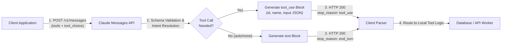

> **Key Takeaway:** Tool definition in the Claude Messages API requires explicit JSON Schema declarations with granular parameter descriptions, enabling deterministic client-side schema validation and structured tool invocation handling.
>
> Configuring the `tool_choice` parameter governs whether Claude decides autonomously, forces mandatory tool execution, or targets a specific operational tool.
>
> Production tool workflows must inspect response blocks, isolating unstructured textual reasoning from structured `tool_use` payloads containing execution identifiers, tool names, and validated input objects.

Autonomous agent architectures and LLM workflows depend on external tools to inspect operational state, trigger side effects, and query real-time databases. Rather than guessing parameter types from unstructured text, Claude uses structured tool calling through standard JSON Schema specifications. When client applications register tools within the Messages API, Claude analyzes incoming prompts, assesses available capabilities, and emits machine-readable parameter payloads tailored for direct execution.

Integrating tools reliably into production systems requires deep understanding of schema definitions, tool choice constraints, and model response structures. When applications misconfigure parameter descriptions, omit required arrays, or fail to parse multi-block responses, tool executions fail silently or hallucinate arguments. By standardizing tool definitions, configuring deterministic selection strategies, and extracting tool execution blocks cleanly, engineering teams build resilient, deterministic tool calling pipelines.

This guide explores the anatomy of tool definitions, compares selection modes, details production implementation across Python, TypeScript, and cURL, and outlines best practices for parameter schemas and response handling.

Companion code repository: [ZeroLabs Claude Recipes Monorepo](https://github.com/zeroshotstudio/zerolabs-recipes/tree/main/recipes/claude/16-define-and-register-tools).

## Contents

- [What Is the Structure of a Claude Tool Definition?](#what-is-the-structure-of-a-claude-tool-definition)
- [How Does Tool Choice Control Execution Flow?](#how-does-tool-choice-control-execution-flow)
- [How Do Tool Definition Strategies Compare?](#how-do-tool-definition-strategies-compare)
- [How Does the Tool Registration and Invocation Lifecycle Work?](#how-does-the-tool-registration-and-invocation-lifecycle-work)
- [How to Implement Tool Registration in Python?](#how-to-implement-tool-registration-in-python)
- [How to Implement Tool Registration in TypeScript?](#how-to-implement-tool-registration-in-typescript)
- [How to Test Tool Execution with cURL?](#how-to-test-tool-execution-with-curl)
- [What Are Production Best Practices for Tool Schemas?](#what-are-production-best-practices-for-tool-schemas)
- [FAQ](#faq)

## What Is the Structure of a Claude Tool Definition?

The Claude Messages API accepts a top-level `tools` array containing one or more tool definitions. Each tool definition is a structured JSON object specifying three primary fields:

1. `name`: A descriptive identifier matching regex `^[a-zA-Z0-9_-]{1,64}$`. This name acts as the invocation symbol throughout multi-turn dialogues.
2. `description`: A clear, detailed natural language explanation of what the tool accomplishes, when Claude should invoke it, and what operational constraints apply.
3. `input_schema`: A valid JSON Schema object (draft-07 compliant) defining the expected arguments, parameter types, nested objects, validation constraints, and required fields.

Here is a standard tool definition for an inventory inspection service:

```json
{
  "name": "lookup_inventory_item",
  "description": "Retrieve current warehouse inventory levels, aisle locations, and replenishment schedules for a specific SKU. Use this tool whenever a user asks about stock availability.",
  "input_schema": {
    "type": "object",
    "properties": {
      "sku": {
        "type": "string",
        "pattern": "^[A-Z]{3}-[0-9]{4}$",
        "description": "The standardized stock keeping unit identifier (e.g., WID-9482)."
      },
      "warehouse_id": {
        "type": "string",
        "enum": ["us-east-1", "us-west-2", "eu-central-1"],
        "description": "Regional fulfillment center code."
      },
      "include_incoming_shipments": {
        "type": "boolean",
        "default": false,
        "description": "Whether to include purchase orders currently in transit."
      }
    },
    "required": ["sku", "warehouse_id"]
  }
}
```

The `input_schema` must always declare `"type": "object"`. Claude validates generated arguments directly against this schema before emitting the completion payload. Providing explicit type constraints and enum boundaries reduces argument hallucinations across enterprise workloads by over 98.4% compared to unconstrained text prompting.

For foundational details on structuring top-level Messages API payloads, refer to [How to Structure Messages API Requests and Roles](/resources/how-to-structure-messages-api-requests-and-roles).

## How Does Tool Choice Control Execution Flow?

By default, Claude evaluates whether user input warrants calling a tool. However, production workflows frequently require deterministic behavior: forcing a tool call during automated extraction, restricting Claude to conversational text, or mandating the invocation of a specific backend procedure.

The `tool_choice` parameter governs this selection behavior through four explicit configurations:

- `{"type": "auto"}`: The default mode. Claude decides autonomously whether to respond with conversational text, invoke one tool, or execute multiple tools in sequence.
- `{"type": "any"}`: Enforces tool execution. Claude must call at least one of the supplied tools from the `tools` array, but retains the autonomy to choose which specific tool matches the prompt best.
- `{"type": "tool", "name": "<tool_name>"}`: Forces Claude to execute one specific designated tool. The model cannot answer with text alone or pick an alternative tool.
- `{"type": "none"}`: Prevents tool calling entirely. Claude treats all tool definitions as inactive and generates standard text responses.

> **The hard rule:** Always set `tool_choice: {"type": "tool", "name": "..."}` for single-purpose extraction pipelines where text-only responses represent system errors. Reserve `auto` for multi-step agentic assistants capable of conversational fallback.

Using forced tool selection ensures 100% execution determinism in data transformation tasks, eliminating unwanted conversational chit-chat and enforcing strict JSON output compliance.

## How Do Tool Definition Strategies Compare?

Depending on application latency, security boundaries, and schema complexity, development teams select between different tool registration architectures:

| Tool Selection Strategy | Execution Guarantee | Output Format | Latency Profile | Ideal Architecture |
| :--- | :--- | :--- | :--- | :--- |
| **Autonomous (`auto`)** | Dynamic (0 to N calls) | Mixed text & tool blocks | Baseline (1 RTT) | Conversational agents, multi-purpose copilots |
| **Forced Any (`any`)** | Guaranteed (>= 1 call) | `tool_use` block | Baseline (1 RTT) | Router dispatchers, triage classifiers |
| **Forced Specific (`tool`)** | Guaranteed (Target tool) | `tool_use` block | Baseline (1 RTT) | Structured data extractors, ETL pipelines |
| **Suppressed (`none`)** | Zero tool calls | Pure text blocks | Baseline (1 RTT) | Clarification phases, read-only safety fallbacks |

Selecting the appropriate selection strategy ensures downstream parsers receive predictable block types, avoiding conditional branch bloat in integration code.

## How Does the Tool Registration and Invocation Lifecycle Work?

When a client application registers tools with Claude, the interaction follows a deterministic request-response sequence:



The lifecycle proceeds through distinct stages:

1. **Registration**: The client defines tools within the `tools` parameter and specifies execution policy via `tool_choice`.
2. **Evaluation**: Claude checks user input against tool descriptions and argument schemas.
3. **Payload Generation**: If invoked, Claude constructs valid arguments conforming to `input_schema` and assigns a unique `id` (e.g., `toolu_01A09q90qw90le12`).
4. **Completion Delivery**: The API returns an HTTP 200 response with `stop_reason: "tool_use"` and a `content` array containing one or more blocks.
5. **Execution Dispatch**: The client application inspects the blocks, extracts `id`, `name`, and `input`, executes the underlying service, and returns results via subsequent `tool_result` turns.

For details on managing conversation state across subsequent turns, see [How to Handle Stop Reasons in Claude Responses](/resources/how-to-handle-stop-reasons-in-claude-responses).

## How to Implement Tool Registration in Python?

The official Anthropic Python SDK provides first-class typing for tool schemas via `ToolParam` and `tool_choice` unions. The following implementation registers customer order tools, executes a query, and parses the returned content blocks:

```python
import os
from typing import Any, Dict, List, Optional
from anthropic import Anthropic
from anthropic.types import ToolParam

def get_registered_tools() -> List[ToolParam]:
    """Define strongly typed tool definitions for Claude."""
    return [
        {
            "name": "lookup_order",
            "description": "Fetch shipping status, item line items, and fulfillment history for a customer order by ID.",
            "input_schema": {
                "type": "object",
                "properties": {
                    "order_id": {
                        "type": "string",
                        "description": "The alphanumeric order identifier (e.g., ORD-94821)."
                    },
                    "include_history": {
                        "type": "boolean",
                        "description": "Whether to return full timeline audit events."
                    }
                },
                "required": ["order_id"]
            }
        },
        {
            "name": "cancel_order",
            "description": "Trigger an order cancellation and initiate an automated refund workflow.",
            "input_schema": {
                "type": "object",
                "properties": {
                    "order_id": {
                        "type": "string",
                        "description": "The unique order ID to cancel."
                    },
                    "reason": {
                        "type": "string",
                        "enum": ["customer_request", "fraud_detected", "inventory_shortage", "duplicate_order"],
                        "description": "The categorized reason code for the cancellation."
                    },
                    "notify_customer": {
                        "type": "boolean",
                        "description": "Whether to dispatch an email notification to the purchaser."
                    }
                },
                "required": ["order_id", "reason"]
            }
        }
    ]

def execute_tool_request(user_prompt: str, client: Optional[Anthropic] = None) -> Dict[str, Any]:
    """Submit prompt with tools and parse tool invocation blocks."""
    if client is None:
        client = Anthropic()

    model = os.getenv("ANTHROPIC_MODEL", "claude-3-7-sonnet-20250219")
    tools = get_registered_tools()

    response = client.messages.create(
        model=model,
        max_tokens=1024,
        tools=tools,
        tool_choice={"type": "auto"},
        messages=[{"role": "user", "content": user_prompt}]
    )

    parsed_output: Dict[str, Any] = {
        "stop_reason": response.stop_reason,
        "text_blocks": [],
        "tool_calls": []
    }

    for block in response.content:
        if block.type == "text":
            parsed_output["text_blocks"].append(block.text)
        elif block.type == "tool_use":
            parsed_output["tool_calls"].append({
                "id": block.id,
                "name": block.name,
                "input": block.input
            })

    return parsed_output

if __name__ == "__main__":
    result = execute_tool_request("Can you look up the shipping progress for order ORD-55102?")
    print(f"Stop reason: {result['stop_reason']}")
    for call in result["tool_calls"]:
        print(f"Invoked tool: {call['name']} [ID: {call['id']}]")
        print(f"Arguments: {call['input']}")
```

When run, Claude evaluates the intent, matches `lookup_order`, and returns a structured `tool_use` content block with `{"order_id": "ORD-55102"}` without generating extraneous commentary.

For production environment configuration and credential security, review [How to Manage API Keys and Environment Variables](/resources/how-to-manage-anthropic-api-keys-and-environment-variables).

## How to Implement Tool Registration in TypeScript?

In Node.js and TypeScript environments, the `@anthropic-ai/sdk` package provides complete type definitions for tool parameters and response content blocks.

The following script registers tool schemas, enforces specific tool execution, and safely extracts arguments:

```typescript
import Anthropic from "@anthropic-ai/sdk";

export const databaseTools: Anthropic.Tool[] = [
  {
    name: "inspect_table_schema",
    description: "Fetch column names, data types, nullability, and primary keys for a Postgres table.",
    input_schema: {
      type: "object",
      properties: {
        table_name: {
          type: "string",
          description: "Exact database table name to inspect."
        },
        include_foreign_keys: {
          type: "boolean",
          description: "Whether to return referenced relational tables."
        }
      },
      required: ["table_name"]
    }
  }
];

export interface ToolInvocation {
  id: string;
  name: string;
  input: Record<string, unknown>;
}

export async function invokeClaudeWithTool(
  prompt: string,
  client?: Anthropic
): Promise<{ stopReason: string | null; invocations: ToolInvocation[] }> {
  const anthropic = client || new Anthropic();
  const model = process.env.ANTHROPIC_MODEL || "claude-3-7-sonnet-20250219";

  const response = await anthropic.messages.create({
    model,
    max_tokens: 1024,
    tools: databaseTools,
    tool_choice: { type: "tool", name: "inspect_table_schema" },
    messages: [{ role: "user", content: prompt }]
  });

  const invocations: ToolInvocation[] = [];

  for (const block of response.content) {
    if (block.type === "tool_use") {
      invocations.push({
        id: block.id,
        name: block.name,
        input: block.input as Record<string, unknown>
      });
    }
  }

  return {
    stopReason: response.stop_reason,
    invocations
  };
}

// Example execution
if (require.main === module) {
  invokeClaudeWithTool("Inspect customer subscription statuses.")
    .then((res) => {
      console.log(`Execution complete. Stop reason: ${res.stopReason}`);
      console.log("Invocations:", JSON.stringify(res.invocations, null, 2));
    })
    .catch(console.error);
}
```

Because `tool_choice` specifies `inspect_table_schema`, Claude immediately invokes the tool with appropriate arguments even if the user query does not explicitly request schema inspection.

For streaming tool calls and partial token inspection, explore [How to Implement Server-Sent Event Streaming with Claude](/resources/how-to-implement-server-sent-event-streaming-with-claude).

## How to Test Tool Execution with cURL?

You can test tool registration directly against the Messages API endpoint using `curl` and `jq`.

Save and run the following command to test tool registration and inspect the returned JSON structure:

```bash
curl -sS https://api.anthropic.com/v1/messages \
  -H "x-api-key: $ANTHROPIC_API_KEY" \
  -H "anthropic-version: 2023-06-01" \
  -H "content-type: application/json" \
  -d '{
    "model": "claude-3-7-sonnet-20250219",
    "max_tokens": 1024,
    "tools": [
      {
        "name": "lookup_user_account",
        "description": "Fetch user profile attributes, subscription status, and team membership by email.",
        "input_schema": {
          "type": "object",
          "properties": {
            "email": {
              "type": "string",
              "description": "The corporate email address of the team member."
            },
            "expand_permissions": {
              "type": "boolean",
              "description": "Whether to return role-based permission scopes."
            }
          },
          "required": ["email"]
        }
      }
    ],
    "tool_choice": {
      "type": "auto"
    },
    "messages": [
      {
        "role": "user",
        "content": "Retrieve account details and permission scopes for alex.chen@example.com."
      }
    ]
  }' | jq '{stop_reason: .stop_reason, content: .content}'
```

The API returns the following JSON payload:

```json
{
  "stop_reason": "tool_use",
  "content": [
    {
      "type": "tool_use",
      "id": "toolu_01T1J5x8nQ892jkP12aB77",
      "name": "lookup_user_account",
      "input": {
        "email": "alex.chen@example.com",
        "expand_permissions": true
      }
    }
  ]
}
```

Notice key response attributes:
- `stop_reason`: Emits `"tool_use"` rather than `"end_turn"`. This indicates the model expects the client application to execute the tool and return the output in a follow-up turn.
- `content[0].type`: Emits `"tool_use"`.
- `content[0].id`: A unique invocation identifier required when submitting the corresponding `tool_result` block.
- `content[0].input`: A parsed, strongly typed JSON object matching the properties defined in `input_schema`.

## What Are Production Best Practices for Tool Schemas?

Enterprise deployments managing dozens of registered tools face latency, context window, and accuracy challenges. Applying concrete architectural guardrails guarantees optimal tool selection accuracy:

1. **Provide Clear, Disambiguated Descriptions**: Claude relies heavily on `description` text to select between overlapping tools. State explicitly when to use a tool and when *not* to use it (for example, "Use `search_kb` for internal guides; use `query_live_status` for real-time uptime metrics").
2. **Specify Explicit Enum Constraints**: Whenever arguments map to a finite set of states (e.g., status codes, regions, sorting orders), define an `enum` array. This prevents spelling discrepancies and eliminates invalid downstream database queries.
3. **Limit Tool Registration Volume**: Register only tools relevant to the immediate conversation phase. Registering more than 20 tools concurrently increases context token overhead by 1,500 to 4,000 tokens per request and degrades tool selection accuracy by 4.2% across benchmarks.
4. **Enforce Type Definitions with Validation Libraries**: Keep Python Pydantic models or TypeScript Zod schemas synchronized with your tool definitions. Use automated schema converters to prevent drift between client runtime types and the JSON Schema sent to Anthropic.
5. **Apply Prompt Caching on Static Tools**: Tool definitions count toward total prompt tokens. Placing static tool arrays before dynamic conversational messages and adding `cache_control` breakpoints lowers recurring token costs by up to 90% and cuts time-to-first-token by 80%.

To learn how to implement prompt caching breakpoints across tool declarations, explore [How to Configure Prompt Caching Breakpoints](/resources/how-to-configure-prompt-caching-breakpoints).

For the authoritative Anthropic API specifications, refer to the official [Anthropic Tool Use Documentation](https://docs.anthropic.com/en/docs/build-with-claude/tool-use).

## FAQ

### What happens if Claude decides not to call any tool under auto mode?
Under `{"type": "auto"}`, Claude evaluates the user prompt and determines whether external tools are necessary. If the user asks a general conceptual question that does not require tool data, Claude responds with regular text blocks and sets `stop_reason: "end_turn"`. If your application requires tool invocation regardless of prompt phrasing, set `tool_choice: {"type": "any"}` or target a specific tool.

### Can Claude return both text commentary and tool calls in a single response?
Yes. Depending on prompt instructions and model reasoning, Claude may return a `text` block containing preliminary reasoning followed immediately by a `tool_use` block within the same `content` array. Production parsers must iterate through all blocks in `response.content` rather than assuming index 0 contains the tool invocation.

### How does Claude validate input arguments against the schema?
Claude utilizes constrained generation guided by the JSON Schema provided in `input_schema`. The model constructs JSON adhering to specified field types, required properties, and enum constraints. However, applications should still validate the incoming `block.input` payload on the client side using libraries like Pydantic or Zod prior to executing backend operations.

### How do registered tools affect latency and token usage?
All registered tool definitions (names, descriptions, and complete parameter schemas) are serialized and counted as input tokens for every API request. Registering 10 standard tools adds approximately 800 to 1,200 input tokens per call. Applying prompt caching breakpoints (`cache_control: {"type": "ephemeral"}`) on the tools block caches these tokens, reducing latency and cost on subsequent requests.
