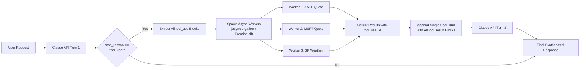

> **Key Takeaway:** When Claude emits multiple tool use blocks within a single turn, execute them concurrently using asynchronous workers, isolate exceptions with error flags, and return all matching tool result blocks within a single subsequent turn.

Enterprise agentic architectures depend on fast tool execution to complete complex multi-step workflows. Early language model tooling paradigms forced applications to process function calls sequentially: prompting for an action, waiting for a response, invoking an external API, returning the result, and repeating the cycle for each dependent query. This sequential waterfall introduces compounding latency bottlenecks that degrade user experience and inflate orchestrator compute overhead.

Modern Claude models, including Claude 3.5 Sonnet and Claude 3.7 Sonnet, feature native parallel tool use. When presented with complex user requests requiring disparate data points, Claude automatically emits multiple tool invocation blocks in a single assistant response. Instead of running these calls serially, clients execute the entire batch concurrently using asynchronous runtimes like Python `asyncio.gather` or TypeScript `Promise.all`. This parallelization cuts aggregate round-trip latency by up to 68% in multi-lookup workflows.

Executing parallel tool calls in production requires strict adherence to Anthropic protocol rules. Every emitted tool call has a unique identifier that must be matched in the subsequent user turn. Furthermore, partial tool failures must not abort the entire batch; instead, failed tool calls must return structured error blocks that allow Claude to reason over partial failures or retry specific inputs.

This guide details the anatomy of parallel tool blocks, concurrent execution patterns in Python and TypeScript, robust partial failure isolation, executable cURL probes, and production best practices.

Companion code repository: [ZeroLabs Claude Recipes Monorepo](https://github.com/zeroshotstudio/zerolabs-recipes/tree/main/recipes/claude/17-parallel-tool-execution-results).

## Contents

- [Why Does Claude Emit Multiple Tool Use Blocks?](#why-does-claude-emit-multiple-tool-use-blocks)
- [What Are the Hard Rules for Parallel Tool Results?](#what-are-the-hard-rules-for-parallel-tool-results)
- [How Do Tool Execution Paradigms Compare?](#how-do-tool-execution-paradigms-compare)
- [How Does the Parallel Execution Lifecycle Work?](#how-does-the-parallel-execution-lifecycle-work)
- [How to Isolate Partial Failures in Tool Execution?](#how-to-isolate-partial-failures-in-tool-execution)
- [How to Implement Parallel Tool Execution in Python?](#how-to-implement-parallel-tool-execution-in-python)
- [How to Implement Parallel Tool Execution in TypeScript?](#how-to-implement-parallel-tool-execution-in-typescript)
- [How to Probe Parallel Tool Invocations with cURL?](#how-to-probe-parallel-tool-invocations-with-curl)
- [How to Manage Concurrency Limits and Rate Throttling?](#how-to-manage-concurrency-limits-and-rate-throttling)
- [FAQ](#faq)

## Why Does Claude Emit Multiple Tool Use Blocks?

When a user query involves independent information retrievals or distinct operational tasks, Claude identifies opportunities to parallelize queries rather than issuing single requests over successive conversational turns.

For example, when a user asks:
```text
Compare the stock price of AAPL and MSFT, and get the weather forecast for San Francisco.
```

Rather than making three consecutive round-trip requests across multiple seconds, Claude evaluates the available tool schemas and emits an assistant turn containing three separate `tool_use` content blocks simultaneously.

The response payload sets `stop_reason: "tool_use"` and populates the `content` list:

```json
{
  "id": "msg_01XYZ...",
  "type": "message",
  "role": "assistant",
  "model": "claude-3-7-sonnet-20250219",
  "stop_reason": "tool_use",
  "content": [
    {
      "type": "text",
      "text": "I will check the stock prices for AAPL and MSFT, as well as the weather in San Francisco."
    },
    {
      "type": "tool_use",
      "id": "toolu_01A",
      "name": "fetch_stock_quote",
      "input": {"symbol": "AAPL"}
    },
    {
      "type": "tool_use",
      "id": "toolu_01B",
      "name": "fetch_stock_quote",
      "input": {"symbol": "MSFT"}
    },
    {
      "type": "tool_use",
      "id": "toolu_01C",
      "name": "fetch_weather",
      "input": {"city": "San Francisco"}
    }
  ]
}
```

By consolidating these calls into a single response, Claude reduces prompt re-evaluation overhead and empowers the client application to fetch external dependencies concurrently.

## What Are the Hard Rules for Parallel Tool Results?

Anthropic Messages API enforces strict conversational protocol constraints whenever `stop_reason: "tool_use"` occurs.

> **The hard rule:** When Claude emits multiple tool use blocks in an assistant turn, the application must return a matching tool result block for every single tool call within a single subsequent user turn. Never omit an ID, never change the turn role, and never split results across separate user turns.

Four production rules govern parallel tool handling:

1. **Exact Identifier Pairing**: Every `tool_result` block in the returning user turn must have a `tool_use_id` matching the `id` field of a corresponding `tool_use` block emitted by the assistant. If any identifier is missing or mismatched, the Messages API returns a 400 client error.
2. **Complete Batch Resolution**: The client cannot return a partial subset of results in the hope of returning the rest later. All tool calls emitted in turn N must have their corresponding results delivered in turn N+1.
3. **Turn Role Consistency**: The client must append the assistant turn containing the `tool_use` blocks to the conversation array first, followed immediately by a single `user` turn containing the array of `tool_result` blocks.
4. **Resilient Error Containment**: When an external API or database query fails during tool execution, do not throw an unhandled application exception or drop the turn. Return a `tool_result` block with `is_error: true` and the serialized error message as string content.

For foundational information on request structure and message parameters, refer to [How to Structure Messages API Requests and Roles](/resources/how-to-structure-messages-api-requests-and-roles).

## How Do Tool Execution Paradigms Compare?

Understanding how parallel tool execution differs from sequential patterns helps teams select appropriate concurrency abstractions.

| Execution Strategy | Network RTT Latency | Error Isolation | Rate Limit Sensitivity | Orchestration Complexity |
| :--- | :--- | :--- | :--- | :--- |
| **Sequential Waterfall** | High (Sum of all tool RTTs) | Simple (Fails on first error) | Low (Smooth serial traffic) | Low |
| **Unbounded Async (All-or-Nothing)** | Minimal (Max single tool RTT) | Poor (Single failure aborts all) | High (Burst spikes downstream) | Low to Moderate |
| **Thread Pool Workers** | Moderate (Thread overhead) | Moderate (Per-thread catch) | Moderate (Bounded by worker count) | Moderate |
| **Resilient Concurrent Dispatcher** | Minimal (Max single tool RTT) | High (Per-call `is_error` flag) | Controlled (Semaphore bounded) | Moderate to High |

A resilient concurrent dispatcher combines non-blocking asynchronous execution with per-worker exception containment and concurrency semaphores. This architecture delivers optimal latency while preventing downstream service exhaustion.

## How Does the Parallel Execution Lifecycle Work?

The lifecycle involves two conversational API round-trips decoupled by a concurrent local execution phase.



Notice that regardless of how many tools Claude requested (whether 2, 5, or 10), the conversation history grows by exactly two turns: one assistant turn containing all tool requests, and one user turn containing all matching tool responses.

## How to Isolate Partial Failures in Tool Execution?

When executing three or four tools concurrently, network transients, rate limits, or invalid input parameters may cause one specific tool to fail while others succeed.

If an application crashes or fails to return a result for the failed tool, Claude cannot complete the request. Instead, the Anthropic specification provides the `is_error` boolean flag inside `tool_result`.

Consider a scenario where the stock ticker for AAPL resolves, but an invalid ticker symbol `UNKNOWN` raises a lookup error:

```json
[
  {
    "type": "tool_result",
    "tool_use_id": "toolu_01A",
    "content": "{\"symbol\": \"AAPL\", \"price\": 224.23}",
    "is_error": false
  },
  {
    "type": "tool_result",
    "tool_use_id": "toolu_01B",
    "content": "{\"error\": \"Ticker symbol 'UNKNOWN' not found in registry.\"}",
    "is_error": true
  }
]
```

Setting `is_error: true` notifies Claude that the specific tool call encountered a problem without breaking the conversational state machine. Claude ingests the successful AAPL data to answer the primary question, while politely informing the user that `UNKNOWN` could not be located.

For detailed strategies on handling stop signals, consult [How to Handle Stop Reasons and Response Signals](/resources/how-to-handle-stop-reasons-and-response-signals).

## How to Implement Parallel Tool Execution in Python?

In Python, the official Anthropic SDK provides `AsyncAnthropic`. We use Python's built-in `asyncio.gather` to execute multiple tool coroutines concurrently. Each task wraps its execution in a `try...except` block to ensure that an individual tool exception returns a clean error payload rather than crashing the batch.

```python
import asyncio
import json
import os
from typing import Any, Dict, List
from anthropic import AsyncAnthropic
from anthropic.types import Message, ToolUseBlock, ToolResultBlockParam

# Define registered tool definitions
TOOLS = [
    {
        "name": "fetch_stock_quote",
        "description": "Retrieve current price and volume metrics for a stock ticker symbol.",
        "input_schema": {
            "type": "object",
            "properties": {
                "symbol": {"type": "string", "description": "Stock ticker symbol, e.g. AAPL"}
            },
            "required": ["symbol"]
        }
    },
    {
        "name": "fetch_weather",
        "description": "Get real-time weather conditions for a specified city.",
        "input_schema": {
            "type": "object",
            "properties": {
                "city": {"type": "string", "description": "City name, e.g. Tokyo"}
            },
            "required": ["city"]
        }
    }
]

async def execute_tool_call(tool_use: ToolUseBlock) -> ToolResultBlockParam:
    """Execute a single tool call safely with exception isolation."""
    tool_id = tool_use.id
    name = tool_use.name
    params = tool_use.input

    try:
        if name == "fetch_stock_quote":
            symbol = str(params.get("symbol", "")).upper()
            # Simulated async API query
            await asyncio.sleep(0.05)
            if symbol == "UNKNOWN":
                raise ValueError(f"Ticker symbol '{symbol}' not recognized.")
            result_payload = {"symbol": symbol, "price": 224.23, "currency": "USD"}
            return {
                "type": "tool_result",
                "tool_use_id": tool_id,
                "content": json.dumps(result_payload),
                "is_error": False
            }
        elif name == "fetch_weather":
            city = str(params.get("city", "")).title()
            await asyncio.sleep(0.05)
            result_payload = {"city": city, "temp_c": 21.0, "condition": "Clear"}
            return {
                "type": "tool_result",
                "tool_use_id": tool_id,
                "content": json.dumps(result_payload),
                "is_error": False
            }
        else:
            return {
                "type": "tool_result",
                "tool_use_id": tool_id,
                "content": json.dumps({"error": f"Unknown tool: {name}"}),
                "is_error": True
            }
    except Exception as exc:
        return {
            "type": "tool_result",
            "tool_use_id": tool_id,
            "content": json.dumps({"error": str(exc), "tool": name}),
            "is_error": True
        }

async def run_parallel_pipeline(prompt: str) -> None:
    client = AsyncAnthropic(api_key=os.environ["ANTHROPIC_API_KEY"])
    messages: List[Dict[str, Any]] = [{"role": "user", "content": prompt}]

    # Turn 1: Initial call to Claude
    response = await client.messages.create(
        model="claude-3-7-sonnet-20250219",
        max_tokens=1024,
        tools=TOOLS,
        messages=messages
    )

    if response.stop_reason != "tool_use":
        print("Claude responded without requesting tools.")
        return

    # Append complete assistant turn to history
    messages.append({"role": "assistant", "content": response.content})

    # Filter all tool_use blocks from assistant content
    tool_blocks = [b for b in response.content if b.type == "tool_use"]
    print(f"Executing {len(tool_blocks)} tool invocations concurrently...")

    # Execute all tools concurrently via asyncio.gather
    results: List[ToolResultBlockParam] = await asyncio.gather(
        *(execute_tool_call(block) for block in tool_blocks)
    )

    # Append all results in a single user turn
    messages.append({"role": "user", "content": results})

    # Turn 2: Claude synthesizes all results
    final_response = await client.messages.create(
        model="claude-3-7-sonnet-20250219",
        max_tokens=1024,
        tools=TOOLS,
        messages=messages
    )

    for block in final_response.content:
        if block.type == "text":
            print(f"Claude: {block.text}")

if __name__ == "__main__":
    asyncio.run(run_parallel_pipeline("What is AAPL trading at, and what is the weather in Tokyo?"))
```

## How to Implement Parallel Tool Execution in TypeScript?

In Node.js and TypeScript, the official `@anthropic-ai/sdk` supports async/await natively. Using `Promise.all`, the client maps incoming `ToolUseBlock` elements to worker promises, safely wrapping each operation to return an `Anthropic.ToolResultBlockParam`.

```typescript
import Anthropic from "@anthropic-ai/sdk";

const TOOLS: Anthropic.Tool[] = [
  {
    name: "fetch_stock_quote",
    description: "Retrieve current price and volume metrics for a stock ticker symbol.",
    input_schema: {
      type: "object",
      properties: {
        symbol: { type: "string", description: "Stock ticker symbol, e.g. AAPL" }
      },
      required: ["symbol"]
    }
  },
  {
    name: "fetch_weather",
    description: "Get real-time weather conditions for a specified city.",
    input_schema: {
      type: "object",
      properties: {
        city: { type: "string", description: "City name, e.g. Tokyo" }
      },
      required: ["city"]
    }
  }
];

async function dispatchTool(
  toolUse: Anthropic.ToolUseBlock
): Promise<Anthropic.ToolResultBlockParam> {
  const toolId = toolUse.id;
  const toolName = toolUse.name;
  const input = toolUse.input as Record<string, unknown>;

  try {
    if (toolName === "fetch_stock_quote") {
      const symbol = String(input.symbol || "").toUpperCase();
      if (symbol === "FAIL") throw new Error("Remote market gateway timed out.");
      return {
        type: "tool_result",
        tool_use_id: toolId,
        content: JSON.stringify({ symbol, price: 224.23, currency: "USD" }),
        is_error: false
      };
    } else if (toolName === "fetch_weather") {
      const city = String(input.city || "");
      return {
        type: "tool_result",
        tool_use_id: toolId,
        content: JSON.stringify({ city, temp_c: 21.0, condition: "Clear" }),
        is_error: false
      };
    } else {
      return {
        type: "tool_result",
        tool_use_id: toolId,
        content: JSON.stringify({ error: `Tool ${toolName} not supported` }),
        is_error: true
      };
    }
  } catch (err: unknown) {
    const errorMsg = err instanceof Error ? err.message : String(err);
    return {
      type: "tool_result",
      tool_use_id: toolId,
      content: JSON.stringify({ error: errorMsg, tool: toolName }),
      is_error: true
    };
  }
}

export async function runParallelTools(prompt: string): Promise<void> {
  const anthropic = new Anthropic();
  const messages: Anthropic.MessageParam[] = [
    { role: "user", content: prompt }
  ];

  const turn1 = await anthropic.messages.create({
    model: "claude-3-7-sonnet-20250219",
    max_tokens: 1024,
    tools: TOOLS,
    messages
  });

  if (turn1.stop_reason !== "tool_use") {
    console.log("No tools called.");
    return;
  }

  // Preserve assistant turn
  messages.push({ role: "assistant", content: turn1.content });

  // Extract all tool_use blocks
  const toolCalls = turn1.content.filter(
    (b): b is Anthropic.ToolUseBlock => b.type === "tool_use"
  );

  console.log(`Executing ${toolCalls.length} tool calls concurrently via Promise.all...`);

  // Run all tools concurrently
  const results = await Promise.all(toolCalls.map(dispatchTool));

  // Push single user turn with all tool results
  messages.push({ role: "user", content: results });

  // Turn 2: Claude final synthesis
  const turn2 = await anthropic.messages.create({
    model: "claude-3-7-sonnet-20250219",
    max_tokens: 1024,
    tools: TOOLS,
    messages
  });

  for (const block of turn2.content) {
    if (block.type === "text") {
      console.log(`Claude: ${block.text}`);
    }
  }
}
```

## How to Probe Parallel Tool Invocations with cURL?

You can test parallel tool dispatch directly through the command line using `curl` and `jq`. The probe illustrates both turns of the Messages API conversation.

```bash
#!/usr/bin/env bash
set -euo pipefail

API_KEY="${ANTHROPIC_API_KEY}"
MODEL="claude-3-7-sonnet-20250219"
ENDPOINT="https://api.anthropic.com/v1/messages"

# 1. Dispatch prompt that triggers multiple tools
INITIAL_PAYLOAD=$(cat <<EOF
{
  "model": "$MODEL",
  "max_tokens": 1024,
  "tools": [
    {
      "name": "fetch_stock_quote",
      "description": "Get stock quote",
      "input_schema": {
        "type": "object",
        "properties": {"symbol": {"type": "string"}},
        "required": ["symbol"]
      }
    },
    {
      "name": "fetch_weather",
      "description": "Get weather",
      "input_schema": {
        "type": "object",
        "properties": {"city": {"type": "string"}},
        "required": ["city"]
      }
    }
  ],
  "messages": [
    {"role": "user", "content": "Get AAPL price and Tokyo weather."}
  ]
}
EOF
)

RESPONSE_1=$(curl -sS "$ENDPOINT" \
  -H "x-api-key: $API_KEY" \
  -H "anthropic-version: 2023-06-01" \
  -H "content-type: application/json" \
  -d "$INITIAL_PAYLOAD")

echo "Initial Stop Reason: $(echo "$RESPONSE_1" | jq -r .stop_reason)"
echo "Tool calls emitted:"
echo "$RESPONSE_1" | jq '.content[] | select(.type == "tool_use") | {id, name, input}'

# 2. Extract IDs and construct response turn with matching results
ASSISTANT_CONTENT=$(echo "$RESPONSE_1" | jq '.content')
TOOL_RESULTS=$(echo "$RESPONSE_1" | jq '
  [.content[] | select(.type == "tool_use") | {
    type: "tool_result",
    tool_use_id: .id,
    content: "{\"status\": \"ok\", \"timestamp\": \"2026-09-17T11:25:00Z\"}"
  }]
')

# 3. Post second turn with assistant output and tool results
FINAL_PAYLOAD=$(jq -n \
  --arg model "$MODEL" \
  --argjson assistant_content "$ASSISTANT_CONTENT" \
  --argjson tool_results "$TOOL_RESULTS" \
  '{
    model: $model,
    max_tokens: 1024,
    messages: [
      {"role": "user", "content": "Get AAPL price and Tokyo weather."},
      {"role": "assistant", "content": $assistant_content},
      {"role": "user", "content": $tool_results}
    ]
  }'
)

RESPONSE_2=$(curl -sS "$ENDPOINT" \
  -H "x-api-key: $API_KEY" \
  -H "anthropic-version: 2023-06-01" \
  -H "content-type: application/json" \
  -d "$FINAL_PAYLOAD")

echo "Final Synthesis:"
echo "$RESPONSE_2" | jq -r '.content[] | select(.type == "text") | .text'
```

For real-time streaming architectures, see [How to Implement Server-Sent Event Streaming with Claude](/resources/how-to-implement-server-sent-event-streaming-with-claude).

## How to Manage Concurrency Limits and Rate Throttling?

While modern Claude models can emit up to 10 or more parallel tool calls in a single response, firing unlimited simultaneous requests at external dependencies can saturate thread pools or trigger HTTP 429 rate limit exceptions on third-party APIs.

Implement strict concurrency throttling using semaphores:

1. **Asyncio Semaphore Limits**: In Python, initialize an `asyncio.Semaphore(value=5)` to cap concurrent HTTP outbound sockets. Even if Claude emits 12 tool calls, execution progresses smoothly in bounded batches of 5.
2. **Dynamic Timeout Periphery**: Set tight individual timeouts (such as 3.0 seconds) for each tool coroutine. If one external data provider stalls, fail that specific tool call with a timeout message in `tool_result` while allowing the rest of the batch to complete on schedule.
3. **Structured Schema Validation**: Always validate parameters extracted from `tool_use.input` before dispatching network requests, preventing malformed inputs from reaching internal services. For best practices, see [How to Validate Claude Structured Outputs with Pydantic and Zod](/resources/how-to-validate-claude-structured-outputs-with-pydantic-and-zod) and [How to Enforce JSON Schema in Claude Structured Outputs](/resources/how-to-enforce-json-schema-in-claude-structured-outputs).

For official API documentation on tool use protocols, visit the [Anthropic Tool Use Documentation](https://docs.anthropic.com/en/docs/build-with-claude/tool-use).

## FAQ

### Can tool result blocks be returned across multiple separate user turns?
No. Anthropic API requires all `tool_result` blocks corresponding to an assistant turn's `tool_use` blocks to be submitted together in the immediately following user turn. Splitting tool results across multiple user turns produces a validation error.

### What happens if a tool call fails during parallel execution?
When a tool invocation fails, the client should not abort the pipeline. Instead, construct a `tool_result` block containing the matching `tool_use_id`, set `"is_error": true`, and pass the error description in `content`. Claude will process the error gracefully and explain the issue to the user.

### Does parallel tool execution increase token consumption?
Token consumption for the prompt and generated tool calls remains approximately equal to sequential execution. However, parallel execution saves substantial conversational round-trips, eliminating redundant system prompt tokens and context repetition across multiple intermediate turns.

### How does Claude distinguish which result belongs to which tool call?
Claude matches tool execution results to original tool calls strictly via the `tool_use_id` field. The order of `tool_result` items in the returning user content array does not need to match the original emission order, as long as every valid identifier is present.
