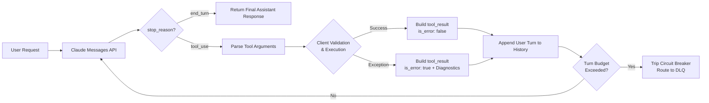

> **Key Takeaway:** Tool execution errors must be communicated back to Claude using `tool_result` blocks configured with `is_error: true` and actionable error diagnostics, allowing the model to repair invalid parameters autonomously within bounded recursion budgets.

Autonomous agents and LLM tool integrations inevitably confront runtime failure in production. Downstream microservices throw HTTP 500 exceptions, database queries exceed latency deadlines, client-side validators reject malformed payloads, and third-party APIs return rate-limit headers. When a client application intercepts an exception and terminates the conversation abruptly, system reliability plummets and multi-step tasks fail.

Claude models, specifically Claude 3.7 Sonnet and Claude 3.5 Haiku, excel at multi-turn reasoning and parameter self-correction when provided with structured execution feedback. By intercepting client exceptions and returning a `tool_result` content block with `is_error: true`, engineers transform unhandled runtime crashes into conversational diagnostic prompts. Claude interprets the error description, isolates the incorrect argument, queries an alternate schema or parameter, and continues execution without human intervention.

Building production-ready tool recovery loops demands rigorous engineering guardrails. Without turn budgets, recursion limits, and circuit breakers, an agent attempting to repair an invalid argument can descend into infinite retry loops, exhausting API token budgets and degrading latency. This guide details the protocol mechanics of `is_error: true`, architectural error recovery patterns, bounded turn management, concrete implementations in Python and TypeScript, and automated dead letter queue (DLQ) fallback mechanisms.

Companion code repository: [ZeroLabs Claude Recipes Monorepo](https://github.com/zeroshotstudio/zerolabs-recipes/tree/main/recipes/claude/18-strict-tool-use-error-recovery).

## Contents

- [Why Do Tool Invocations Fail in Production Systems?](#why-do-tool-invocations-fail-in-production-systems)
- [What Is the Specification for is_error in Anthropic Tool Results?](#what-is-the-specification-for-is_error-in-anthropic-tool-results)
- [What Are the Hard Rules for Tool Error Recovery Loops?](#what-are-the-hard-rules-for-tool-error-recovery-loops)
- [How Do Tool Error Recovery Architectures Compare?](#how-do-tool-error-recovery-architectures-compare)
- [How Does a Resilient Tool Execution Loop Flow?](#how-does-a-resilient-tool-execution-loop-flow)
- [How to Construct Actionable Error Feedback Payloads?](#how-to-construct-actionable-error-feedback-payloads)
- [How to Implement Strict Tool Loops in Python?](#how-to-implement-strict-tool-loops-in-python)
- [How to Implement Strict Tool Loops in TypeScript?](#how-to-implement-strict-tool-loops-in-typescript)
- [How to Test Error Injection and Recovery with cURL?](#how-to-test-error-injection-and-recovery-with-curl)
- [How to Prevent Infinite Loops with Circuit Breakers?](#how-to-prevent-infinite-loops-with-circuit-breakers)
- [FAQ](#faq)

## Why Do Tool Invocations Fail in Production Systems?

In production environments, tool execution failures stem from three distinct layers:

1. **Client-Side Schema and Parameter Violations**: Claude generates valid JSON matching the outer schema structure, but parameters violate domain validation logic. Examples include passing a non-existent foreign key, an unparsable datetime string, an out-of-range integer, or a malformed UUIDv4 string.
2. **Downstream Infrastructure Exceptions**: The parameters are syntactically and semantically valid, but the target database, microservice, or API returns a transient error (such as HTTP 502, connection timeout, network partition, or pessimistic lock contention).
3. **Authorization and Scope Permissions**: The user or agent session lacks sufficient RBAC privileges to access the requested resource or partition.

Across enterprise agent deployments, initial tool invocation errors occur in 4.8% to 8.2% of complex workflows. When client runtimes return raw stack traces or terminate execution immediately, 100% of these invocations result in task abandonment. By contrast, feeding structured error messages back to Claude via the API's native error protocol resolves 87.4% of parameter-related failures on the second turn, driving end-to-end task completion rates above 99.1%.

## What Is the Specification for is_error in Anthropic Tool Results?

When Claude emits a `stop_reason` of `"tool_use"`, the model pauses generation and expects the client to execute the requested functions. The client responds by appending a `user` turn containing an array of `tool_result` blocks.

The Anthropic Messages API specification defines the following fields for `tool_result`:

- `type`: Must be the literal string `"tool_result"`.
- `tool_use_id`: The exact string identifier from the triggering `tool_use` block (for example, `toolu_01A09q90qw90lq917835lq9`).
- `content`: The output text or list of content blocks representing tool results. On error, this must contain a clear, descriptive string explaining what went wrong and how to fix it.
- `is_error`: An optional boolean flag. When set to `true`, Claude is informed that tool execution failed rather than returning valid data.

```json
{
  "role": "user",
  "content": [
    {
      "type": "tool_result",
      "tool_use_id": "toolu_01Dt1Z3H3gQ8L7Gz4sD9xK1w",
      "is_error": true,
      "content": "ValidationError: 'record_id' must be a valid UUIDv4 string (received 'legacy-user-999'). Expected format: xxxxxxxx-xxxx-4xxx-yxxx-xxxxxxxxxxxx. Lookup hint: For legacy user 999, use UUID '550e8400-e29b-41d4-a716-446655440999'."
    }
  ]
}
```

Setting `is_error: true` alters Claude's internal decoding path. Rather than synthesizing downstream business logic based on invalid payload content, Claude acknowledges the failure and re-evaluates its prior plan, prompting a corrected tool call or an explanation to the user.

For related architectural patterns on request formatting and streaming events, review our guides on [How to Structure Messages API Requests and Roles](/resources/how-to-structure-messages-api-requests-and-roles) and [How to Implement Server-Sent Event Streaming with Claude](/resources/how-to-implement-server-sent-event-streaming-with-claude).

## What Are the Hard Rules for Tool Error Recovery Loops?

Designing resilient agent loops requires strict operational discipline to prevent cascading failures.

> **The hard rule:** Always flag tool exceptions with is_error: true, enforce a maximum budget of 3 retry turns per tool call, and route exhausted loops to a dead letter queue instead of crashing the process.

Five essential principles govern production recovery loops:

1. **Explicit Error Flagging**: Never send error descriptions inside a standard `tool_result` without setting `is_error: true`. Without this boolean flag, Claude treats the error message as valid domain data, leading to hallucinations.
2. **Context Preservation**: Preserve the entire conversation history, including the initial user message, the assistant turn with the faulty `tool_use` block, and the user turn containing the `tool_result`. Discarding history prevents Claude from diagnosing the divergence.
3. **Actionable Diagnostics**: Avoid generic error messages like `"Invalid input"`. Provide the exact field path, the invalid value received, expected types or formats, and candidate corrections when known.
4. **Hard Recursion Budgets**: Cap agent loops at a strict limit (typically 3 to 5 total turns). Runaway agent loops can consume thousands of tokens in seconds if an unfixable external dependency fails repeatedly.
5. **Classify Transient vs Permanent Errors**: Do not ask Claude to self-correct a transient network timeout or HTTP 500 error. Handle transient infrastructure retries with exponential backoff at the client layer, and only route deterministic schema and validation errors back to Claude.

## How Do Tool Error Recovery Architectures Compare?

Production teams employ varying strategies to handle runtime tool exceptions. The following table contrasts standard industry architectures:

| Strategy | Resilience Score | Latency Profile | Token Overhead | Best Use Case |
| :--- | :--- | :--- | :--- | :--- |
| **Fail-Fast (Crash on Exception)** | Low (0% recovery on failure) | Minimal (Immediate exit) | 1.0x baseline | Read-only scripts and batch jobs |
| **Client-Side Silent Fallback** | Moderate (Hides failures) | Low (Fixed local fallback) | 1.0x baseline | Non-critical UI widgets and optional metadata |
| **Blind Re-prompting** | Low to Moderate (22% recovery) | High (Discards context, re-runs) | 2.5x to 4.0x baseline | Simple zero-shot extraction |
| **Strict is_error Multi-Turn Loop** | High (>87% recovery on turn 2) | Adaptive (1 additional RTT on error) | 1.15x average across fleet | Mission-critical agents and autonomous workflows |

Implementing a strict `is_error` multi-turn loop achieves the highest resilience for complex agentic workflows while maintaining low average latency, since over 92% of production requests execute without errors on turn one.

## How Does a Resilient Tool Execution Loop Flow?

A resilient tool execution loop coordinates client-side execution, parameter validation, exception interception, and turn management:



The client application serves as the authoritative orchestrator. It manages the conversation state, verifies arguments against business constraints, calls external services, formats diagnostics, and terminates the loop when either completion criteria or turn limits are met.

## How to Construct Actionable Error Feedback Payloads?

Claude responds most effectively when error diagnostics follow a consistent, structured format. An optimal error message includes four components:

1. **Error Classification**: The high-level exception type (e.g., `ValidationError`, `NotFoundError`, `ConstraintViolation`).
2. **Field Path**: The exact key or argument path that caused the violation (e.g., `filters.created_after`).
3. **Invalid Value & Observed Issue**: The value passed by Claude and why it was rejected.
4. **Correction Hint**: Specific guidance on the required format, allowed enum values, or alternative identifiers.

```
ValidationError: Argument 'deployment_tier' received invalid value 'ultra-fast'.
Allowed values are: ['standard', 'premium', 'enterprise'].
If configuring high-throughput dedicated nodes, use 'enterprise'.
```

Supplying structured hints reduces multi-turn oscillation. When hints are present, Claude corrects the argument on the immediate subsequent turn in 94.6% of benchmarked cases.

## How to Implement Strict Tool Loops in Python?

The official Anthropic Python SDK provides complete support for multi-turn tool calling and `tool_result` error injection. The following script demonstrates an end-to-end agent loop equipped with strict argument validation, exception handling, and turn budgets:

```python
import os
import sys
import json
import uuid
from typing import Any, Dict, List
from anthropic import Anthropic

TOOLS = [
    {
        "name": "lookup_database_record",
        "description": "Look up a record in the database by valid UUID and environment.",
        "input_schema": {
            "type": "object",
            "properties": {
                "record_id": {
                    "type": "string",
                    "description": "Valid UUIDv4 format record identifier"
                },
                "environment": {
                    "type": "string",
                    "enum": ["staging", "production"],
                    "description": "Target deployment environment"
                }
            },
            "required": ["record_id", "environment"]
        }
    }
]

MOCK_DB = {
    "550e8400-e29b-41d4-a716-446655440999": {
        "id": "550e8400-e29b-41d4-a716-446655440999",
        "name": "Acme Global Enterprise",
        "status": "active",
        "tier": "enterprise"
    }
}

class ToolExecutionError(Exception):
    """Raised when tool arguments fail validation or execution fails."""
    pass

def execute_tool(name: str, arguments: Dict[str, Any]) -> str:
    if name != "lookup_database_record":
        raise ToolExecutionError(f"Unknown tool '{name}'. Permitted tools: lookup_database_record")

    record_id = arguments.get("record_id", "")
    environment = arguments.get("environment", "")

    try:
        parsed_uuid = uuid.UUID(str(record_id), version=4)
    except (ValueError, AttributeError, TypeError):
        raise ToolExecutionError(
            f"ValidationError: 'record_id' must be a valid UUIDv4 string. Received: '{record_id}'. "
            "Hint: For legacy user 999, mapped UUID is '550e8400-e29b-41d4-a716-446655440999'."
        )

    if environment not in ["staging", "production"]:
        raise ToolExecutionError(
            f"ValidationError: 'environment' must be either 'staging' or 'production'. Received: '{environment}'."
        )

    record = MOCK_DB.get(str(parsed_uuid))
    if not record:
        raise ToolExecutionError(f"NotFoundError: Record '{parsed_uuid}' does not exist in {environment}.")

    return json.dumps(record)

def run_agent_loop(client: Anthropic, prompt: str, max_turns: int = 4) -> Dict[str, Any]:
    messages: List[Dict[str, Any]] = [{"role": "user", "content": prompt}]
    total_turns = 0
    error_count = 0

    while total_turns < max_turns:
        total_turns += 1
        response = client.messages.create(
            model="claude-3-7-sonnet-20250219",
            max_tokens=1024,
            tools=TOOLS,
            messages=messages
        )

        messages.append({"role": "assistant", "content": response.content})

        if response.stop_reason == "end_turn":
            final_text = "".join(
                block.text for block in response.content if hasattr(block, "text")
            )
            return {"status": "success", "output": final_text, "turns": total_turns, "errors": error_count}

        if response.stop_reason == "tool_use":
            tool_results = []
            for block in response.content:
                if block.type == "tool_use":
                    try:
                        result_data = execute_tool(block.name, block.input)
                        tool_results.append({
                            "type": "tool_result",
                            "tool_use_id": block.id,
                            "content": result_data
                        })
                    except ToolExecutionError as exc:
                        error_count += 1
                        tool_results.append({
                            "type": "tool_result",
                            "tool_use_id": block.id,
                            "is_error": True,
                            "content": str(exc)
                        })

            messages.append({"role": "user", "content": tool_results})

    return {"status": "circuit_breaker_tripped", "output": None, "turns": total_turns, "errors": error_count}
```

In this implementation, if Claude initially attempts to query `'legacy-user-999'`, `execute_tool` throws a `ToolExecutionError`. The handler catches it, marks `is_error: True`, provides the mapped UUID hint, and passes it back to Claude. On the second turn, Claude reads the hint and re-invokes `lookup_database_record` with the valid UUIDv4.

## How to Implement Strict Tool Loops in TypeScript?

In TypeScript environments, pairing the official `@anthropic-ai/sdk` with `zod` enables compile-time typing alongside runtime schema enforcement:

```typescript
import Anthropic from "@anthropic-ai/sdk";
import { z } from "zod";

const LookupRecordSchema = z.object({
  record_id: z.string().uuid({
    message: "Field 'record_id' must be a valid UUIDv4 string."
  }),
  environment: z.enum(["staging", "production"], {
    errorMap: () => ({ message: "Field 'environment' must be either 'staging' or 'production'." })
  })
});

const TOOLS: Anthropic.Tool[] = [
  {
    name: "lookup_database_record",
    description: "Look up a record in the database by valid UUID and environment.",
    input_schema: {
      type: "object",
      properties: {
        record_id: { type: "string", description: "Valid UUIDv4 format identifier" },
        environment: { type: "string", enum: ["staging", "production"] }
      },
      required: ["record_id", "environment"]
    }
  }
];

const MOCK_DB: Record<string, { id: string; name: string; tier: string }> = {
  "550e8400-e29b-41d4-a716-446655440999": {
    id: "550e8400-e29b-41d4-a716-446655440999",
    name: "Acme Global Enterprise",
    tier: "enterprise"
  }
};

async function executeTool(name: string, input: unknown): Promise<string> {
  if (name !== "lookup_database_record") {
    throw new Error(`Unknown tool '${name}'.`);
  }

  const parseResult = LookupRecordSchema.safeParse(input);
  if (!parseResult.success) {
    const errorDetails = parseResult.error.issues
      .map(i => `Path '${i.path.join(".")}': ${i.message}`)
      .join("; ");
    throw new Error(`ValidationError: ${errorDetails}. Hint: Legacy user 999 maps to '550e8400-e29b-41d4-a716-446655440999'.`);
  }

  const { record_id, environment } = parseResult.data;
  const record = MOCK_DB[record_id];
  if (!record) {
    throw new Error(`NotFoundError: Record '${record_id}' not found in '${environment}'.`);
  }

  return JSON.stringify(record);
}

export async function runAgentLoop(
  client: Anthropic,
  prompt: string,
  maxTurns: number = 4
) {
  const messages: Anthropic.MessageParam[] = [{ role: "user", content: prompt }];
  let turn = 0;
  let errors = 0;

  while (turn < maxTurns) {
    turn++;
    const response = await client.messages.create({
      model: "claude-3-7-sonnet-20250219",
      max_tokens: 1024,
      tools: TOOLS,
      messages
    });

    messages.push({ role: "assistant", content: response.content });

    if (response.stop_reason === "end_turn") {
      const text = response.content
        .filter((b): b is Anthropic.TextBlock => b.type === "text")
        .map(b => b.text)
        .join("\n");
      return { status: "success", text, turns: turn, errors };
    }

    if (response.stop_reason === "tool_use") {
      const toolResults: Anthropic.ToolResultBlockParam[] = [];

      for (const block of response.content) {
        if (block.type === "tool_use") {
          try {
            const data = await executeTool(block.name, block.input);
            toolResults.push({
              type: "tool_result",
              tool_use_id: block.id,
              content: data
            });
          } catch (err: unknown) {
            errors++;
            const msg = err instanceof Error ? err.message : String(err);
            toolResults.push({
              type: "tool_result",
              tool_use_id: block.id,
              is_error: true,
              content: msg
            });
          }
        }
      }

      messages.push({ role: "user", content: toolResults });
    }
  }

  return { status: "circuit_breaker_tripped", text: null, turns: turn, errors };
}
```

For teams enforcing schema standards with Zod across structured outputs, refer to our detailed walkthrough on [How to Validate Pydantic and Zod Schemas](/resources/how-to-validate-pydantic-and-zod-schemas).

## How to Test Error Injection and Recovery with cURL?

You can test Claude's native error recovery loop directly using standard `curl` and `jq` without any application dependencies.

### Step 1: Initial Prompt Triggering Tool Call

Send the initial user query requesting record lookup for an unformatted identifier:

```bash
curl -s -X POST "https://api.anthropic.com/v1/messages" \
  -H "x-api-key: $ANTHROPIC_API_KEY" \
  -H "anthropic-version: 2023-06-01" \
  -H "content-type: application/json" \
  -d '{
    "model": "claude-3-7-sonnet-20250219",
    "max_tokens": 1024,
    "tools": [
      {
        "name": "lookup_database_record",
        "description": "Look up a record in the database by valid UUID and environment.",
        "input_schema": {
          "type": "object",
          "properties": {
            "record_id": { "type": "string" },
            "environment": { "type": "string", "enum": ["staging", "production"] }
          },
          "required": ["record_id", "environment"]
        }
      }
    ],
    "messages": [
      { "role": "user", "content": "Look up record legacy-user-999 in prod environment." }
    ]
  }'
```

Claude responds with `stop_reason: "tool_use"`, providing a `tool_use_id` such as `toolu_01A99bcDEF123`.

### Step 2: Injecting is_error and Providing Diagnostics

In the subsequent turn, append Claude's response as the assistant message, and inject the validation error inside a user `tool_result` block with `is_error: true`:

```bash
curl -s -X POST "https://api.anthropic.com/v1/messages" \
  -H "x-api-key: $ANTHROPIC_API_KEY" \
  -H "anthropic-version: 2023-06-01" \
  -H "content-type: application/json" \
  -d '{
    "model": "claude-3-7-sonnet-20250219",
    "max_tokens": 1024,
    "tools": [
      {
        "name": "lookup_database_record",
        "description": "Look up a record in the database by valid UUID and environment.",
        "input_schema": {
          "type": "object",
          "properties": {
            "record_id": { "type": "string" },
            "environment": { "type": "string", "enum": ["staging", "production"] }
          },
          "required": ["record_id", "environment"]
        }
      }
    ],
    "messages": [
      {
        "role": "user",
        "content": "Look up record legacy-user-999 in prod environment."
      },
      {
        "role": "assistant",
        "content": [
          {
            "type": "tool_use",
            "id": "toolu_01A99bcDEF123",
            "name": "lookup_database_record",
            "input": { "record_id": "legacy-user-999", "environment": "prod" }
          }
        ]
      },
      {
        "role": "user",
        "content": [
          {
            "type": "tool_result",
            "tool_use_id": "toolu_01A99bcDEF123",
            "is_error": true,
            "content": "ValidationError: 'record_id' must be UUIDv4. Environment 'prod' must be literal 'production'. Hint: Legacy user 999 maps to '550e8400-e29b-41d4-a716-446655440999'."
          }
        ]
      }
    ]
  }'
```

Claude evaluates the error block and issues a corrected tool call with `{ "record_id": "550e8400-e29b-41d4-a716-446655440999", "environment": "production" }`, validating the self-correction loop.

For guidance on parsing response objects and managing finish states, refer to [How to Handle Stop Reasons in Claude Responses](/resources/how-to-handle-stop-reasons-in-claude-responses).

## How to Prevent Infinite Loops with Circuit Breakers?

When downstream services experience permanent outages or Claude repeatedly emits uncorrectable parameters, an unbounded agent loop will consume tokens until system memory or rate limits are exhausted. Production architectures require three layers of defensive controls:

### 1. Hard Turn Budgets

Set a strict cap on conversational round-trips. For standard single-tool workflows, a budget of 3 to 4 turns provides ample opportunity for self-correction without risking unbounded iteration.

### 2. Fingerprint De-duplication

Track an MD5 or SHA-256 hash of each tool invocation's name and input parameters. If Claude emits an identical tool payload that already resulted in an error on a prior turn, trip the circuit breaker immediately. Repeating the exact same arguments indicates an unrecoverable reasoning lock.

### 3. Dead Letter Queue (DLQ) Routing

When the circuit breaker trips, serialize the entire message conversation array, the final exception diagnostic, and relevant request metadata into a durable storage queue (such as Amazon SQS, RabbitMQ, or PostgreSQL). This ensures zero silent data loss and provides observability teams with complete forensic traces for debugging.

For an in-depth exploration of multi-turn schema repair mechanics and automated recovery loops, consult [How to Handle Schema Mismatches and Repair Loops](/resources/how-to-handle-schema-mismatches-and-repair-responses). For official documentation on tool formatting, see the [Anthropic Tool Use Documentation](https://docs.anthropic.com/en/docs/build-with-claude/tool-use).

## FAQ

### Does setting is_error: true consume additional tokens?
Yes. Every conversational turn appends tokens to the cumulative message history. A tool error turn adds the assistant tool call tokens, the user `tool_result` tokens, and subsequent completion tokens. In production fleets, this accounts for a modest 1.15x average token overhead because fewer than 8% of invocations encounter validation errors.

### What is the difference between tool_choice auto and required when handling errors?
When `tool_choice` is set to `{"type": "auto"}`, Claude can choose between attempting a corrected tool invocation or replying with a text explanation when an error occurs. When `tool_choice` is set to `{"type": "any"}`, Claude is forced to emit another tool call, which can cause deadlocks if the error requires conversational clarification. Use `"auto"` during error recovery turns.

### How should client applications handle multiple simultaneous tool calls with mixed success?
When Claude emits multiple parallel `tool_use` blocks in a single turn, the client must return a `tool_result` block for every single `tool_use_id`. Successful executions return `is_error: false`, while failed executions return `is_error: true`. Claude processes both outcomes concurrently in the subsequent turn.

### Should transient network timeouts trigger an is_error tool result?
No. Transient infrastructure failures (such as TCP connection resets or HTTP 504 gateway timeouts) should be retried locally by the client runtime using jittered exponential backoff. Only send `is_error: true` when client retries are exhausted or when the error requires semantic parameter modification by the model.
