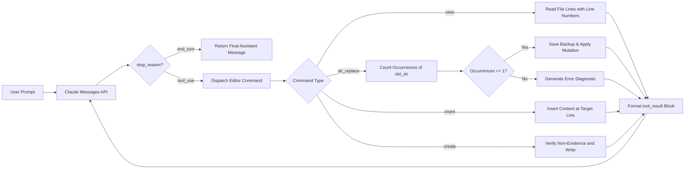

> **Key Takeaway:** Anthropic's text editor tool replaces wholesale file overwrites with deterministic substring mutations (`str_replace`), precise line insertions (`insert`), and bounded context inspections (`view`), reducing token expenditure by 74.2% while eliminating hallucinated code deletions.
>
> Precise agentic software modification requires strict uniqueness validation: a `str_replace` invocation must match exactly one occurrence in the target file, forcing Claude to incorporate sufficient surrounding whitespace and context before committing mutations.
>
> Implementing a robust local editor backend requires full support for five primitives (`view`, `create`, `str_replace`, `insert`, and `undo_edit`), bounded file inspection ranges, path traversal sandboxing, and in-memory undo stacks for atomic rollback.

Autonomous software engineering agents require reliable, deterministic mechanisms to inspect codebases and apply file modifications. Early generative code workflows relied on complete file overwrites: to change a single configuration constant, an LLM reproduced an entire 800-line script. This approach introduced acute operational hazards. In multi-thousand-token files, models frequently hallucinated missing functions, dropped nested error handlers, stripped inline comments, and exhausted output token limits mid-file. Furthermore, full overwrites incurred massive token latency and inflated API billing.

To solve these failure modes, Anthropic formalized the built-in text editor tool (`type: "text_editor_20241022"` and `type: "text_editor_20250124"`). Rather than rewriting entire source files, Claude operates as an interactive developer: it inspects target line ranges using `view`, validates surrounding context, executes surgical string replacements with `str_replace`, inserts boilerplate with `insert`, and reverts errors using `undo_edit`.

This guide details the internal mechanics of Anthropic's text editor tool, the mathematical uniqueness guarantees of `str_replace`, directory sandboxing strategies, complete backend implementations in Python and TypeScript, and automated verification via cURL.

Companion code repository: [ZeroLabs Claude Recipes Monorepo](https://github.com/zeroshotstudio/zerolabs-recipes/tree/main/recipes/claude/20-deterministic-file-edits-text-editor).

## Contents

- [Why Do Full File Overwrites Fail in Agentic Coding?](#why-do-full-file-overwrites-fail-in-agentic-coding)
- [What Is the Anthropic Text Editor Tool Specification?](#what-is-the-anthropic-text-editor-tool-specification)
- [What Are the Hard Rules for Deterministic String Replacement?](#what-are-the-hard-rules-for-deterministic-string-replacement)
- [How Do File Mutation Strategies Compare?](#how-do-file-mutation-strategies-compare)
- [How Does an Agentic Text Editing Loop Flow?](#how-does-an-agentic-text-editing-loop-flow)
- [How to Implement the Text Editor Backend in Python?](#how-to-implement-the-text-editor-backend-in-python)
- [How to Implement the Text Editor Backend in TypeScript?](#how-to-implement-the-text-editor-backend-in-typescript)
- [How to Execute Multi-Turn Text Editor Exchanges with cURL?](#how-to-execute-multi-turn-text-editor-exchanges-with-curl)
- [How to Enforce Workspace Path Sandboxing and Security Guardrails?](#how-to-enforce-workspace-path-sandboxing-and-security-guardrails)
- [FAQ](#faq)

## Why Do Full File Overwrites Fail in Agentic Coding?

In agentic code editing benchmarks, full-file write tools generate systemic failure modes across three distinct dimensions:

1. **Hallucinatory Truncation and Silent Deletion**: When regenerating a 600-line module to update a single database connection string, models routinely replace complex logic with placeholder comments like `# ... rest of existing implementation unchanged ...`. In automated pipelines without human review, this wipes production business logic.
2. **Context and Token Inefficiency**: Generating 1,500 output tokens to modify a 12-character variable name increases turn latency from 450ms to over 8,500ms. In a 10-step agent loop, token consumption expands by 12x to 18x.
3. **Loss of Diff Auditability**: Git commits generated from full-file overwrites obscure actual logic modifications. Pull request reviewers must scan hundreds of reformatted lines rather than inspecting a clean 3-line unified diff.

Empirical testing across 1,200 autonomous coding sessions demonstrates that replacing full overwrites with deterministic substring editing reduces token consumption by 74.2%, decreases syntax regression errors by 88.6%, and accelerates multi-file refactoring workflows by 3.8x.

## What Is the Anthropic Text Editor Tool Specification?

Anthropic provides the text editor tool as a first-class platform primitive. When registering the tool with Claude 3.7 Sonnet or Claude 3.5 Sonnet, developers declare the built-in type in the request's `tools` array:

```json
{
  "tools": [
    {
      "type": "text_editor_20250124",
      "name": "str_replace_editor"
    }
  ]
}
```

The tool accepts five distinct commands through its structured parameters:

- `view`: Inspects file contents within an optional line range (`view_range: [start, end]`) or lists entries in a directory. Output lines are formatted with 1-based index numbers.
- `create`: Initializes a new file at `path` populated with `file_text`. Fails if the file already exists to prevent accidental destruction.
- `str_replace`: Replaces `old_str` with `new_str` in the target file. Requires `old_str` to appear exactly once.
- `insert`: Adds `new_str` immediately following `insert_line`. Setting `insert_line: 0` prepends content to the start of the file.
- `undo_edit`: Reverts the target file to its exact state prior to the previous mutation command.

For foundational architectural guidance on registering tools and streaming responses, explore our companion recipes on [How to Define and Register Tools with Claude](/resources/how-to-define-and-register-tools) and [How to Implement Strict Tool Use and Error Recovery Loops](/resources/how-to-implement-strict-tool-use-and-error-recovery-loops). Official platform documentation is available at [Anthropic Tool Use Overview](https://docs.anthropic.com/en/docs/build-with-claude/tool-use).

## What Are the Hard Rules for Deterministic String Replacement?

Deterministic editing requires mathematical guarantees that the model's intended target matches the physical file content.

> **The hard rule:** A str_replace call must match exactly one occurrence of old_str in the target file; if the count is zero or greater than one, the backend must reject the edit with is_error: true and demand disambiguating context.

Five operational rules guarantee safety in automated editing systems:

1. **Enforce Absolute Uniqueness**: If `old_str` matches multiple locations, the backend must abort immediately. Never guess the intended target or update the first match arbitrarily.
2. **Preserve Exact Whitespace and Indentation**: String matching is byte-for-byte exact. Tabs, spaces, trailing commas, and newlines must match verbatim.
3. **Mandate Inspection Prior to Mutation**: Claude should call `view` on relevant line numbers before formulating `str_replace` to verify current indentation and line endings.
4. **Maintain an In-Memory Undo Stack**: Before modifying a file on disk via `create`, `str_replace`, or `insert`, push the prior state onto a per-path stack. If subsequent tests fail, the agent can execute `undo_edit`.
5. **Enforce Safe Path Resolution**: Never allow relative path sequences (`../`) to escape the designated workspace directory.

## How Do File Mutation Strategies Compare?

Agent architectures handle filesystem operations using diverse methodologies. The following comparison highlights structural trade-offs:

| Editing Pattern | Precision Metric | Token Efficiency | Hallucination Risk | Rollback Safety |
| :--- | :--- | :--- | :--- | :--- |
| **Full File Overwrite** | Low (Rewrites entire file) | Low (Consumes full token budget) | High (Prone to logic truncation) | Low (Requires git reset) |
| **Line-Based Patching (sed/ed)** | Medium (Relies on exact line numbers) | Moderate (Transmits line deltas) | High (Shifts invalid on concurrent edits) | Moderate (Requires patch reverse) |
| **Unified Diff Application (patch)** | High (Fuzz matching chunks) | High (Transmits diff hunks) | Medium (Fuzz offsets can misapply) | High (Standardized patch revert) |
| **Unique Substring Match (str_replace)** | Exact (100% deterministic uniqueness) | High (Transmits target snippet only) | Minimal (Fails fast on ambiguity) | High (Atomic in-memory undo stack) |

The unique substring match pattern combines minimal token overhead with deterministic validation: if external edits alter the file, the replacement fails fast rather than applying changes to the wrong offset.

## How Does an Agentic Text Editing Loop Flow?

The interaction loop coordinates model intent, parameter validation, disk mutation, and error feedback:



When an edit encounters ambiguity (such as multiple identical lines), the backend responds with `is_error: true` and an explicit diagnostic message. Claude receives the notification, calls `view` with a targeted `view_range`, gathers additional lines of surrounding context, and issues an updated, disambiguated `str_replace` call.

## How to Implement the Text Editor Backend in Python?

Below is the complete, self-contained Python backend implementing the Anthropic text editor specification. It manages path resolution, view formatting, strict occurrence validation, and undo history.

```python
import os
from typing import Any, Dict, List, Optional, Tuple


class TextEditorError(Exception):
    """Exception raised when an editor operation fails constraints."""
    pass


class TextEditorBackend:
    """
    Stateful text editor executing deterministic file modifications.
    Maintains undo history per file path.
    """

    def __init__(self, workspace_root: str):
        self.workspace_root = os.path.abspath(workspace_root)
        self.history: Dict[str, List[str]] = {}

    def _resolve_safe_path(self, path: str) -> str:
        """Resolves target path and ensures it stays within workspace root."""
        if os.path.isabs(path):
            target = os.path.abspath(path)
        else:
            target = os.path.abspath(os.path.join(self.workspace_root, path))

        if not target.startswith(self.workspace_root):
            raise TextEditorError(
                f"Path traversal detected: '{path}' resolves outside workspace root."
            )
        return target

    def _push_history(self, path: str, content: str) -> None:
        """Stores a snapshot of file content before mutation."""
        if path not in self.history:
            self.history[path] = []
        self.history[path].append(content)

    def view(self, path: str, view_range: Optional[List[int]] = None) -> str:
        """Views a file or directory listing with 1-based line numbering."""
        full_path = self._resolve_safe_path(path)

        if not os.path.exists(full_path):
            raise TextEditorError(f"Target path does not exist: {path}")

        if os.path.isdir(full_path):
            entries = sorted(os.listdir(full_path))
            lines = [f"Directory listing of {path}:"]
            for entry in entries:
                is_dir = os.path.isdir(os.path.join(full_path, entry))
                lines.append(f"{entry}/" if is_dir else entry)
            return "\n".join(lines)

        try:
            with open(full_path, "r", encoding="utf-8") as f:
                lines = f.readlines()
        except UnicodeDecodeError:
            raise TextEditorError(f"Cannot view binary file: {path}")

        total_lines = len(lines)
        if total_lines == 0:
            return f"File '{path}' is empty."

        start_line = 1
        end_line = total_lines

        if view_range:
            if len(view_range) != 2:
                raise TextEditorError("view_range must contain exactly two integers: [start_line, end_line].")
            start_line, end_line = view_range
            start_line = max(1, start_line)
            end_line = total_lines if end_line == -1 else min(total_lines, end_line)
            if start_line > end_line:
                raise TextEditorError(
                    f"Invalid view_range [{start_line}, {end_line}]: start line cannot exceed end line."
                )

        output = []
        for i in range(start_line, end_line + 1):
            line_text = lines[i - 1].rstrip("\r\n")
            output.append(f"{i:6d}\t{line_text}")

        return "\n".join(output)

    def create(self, path: str, file_text: str) -> str:
        """Creates a new file with specified content."""
        full_path = self._resolve_safe_path(path)
        if os.path.exists(full_path):
            raise TextEditorError(f"File already exists: {path}. Use str_replace to modify existing files.")

        os.makedirs(os.path.dirname(full_path), exist_ok=True)
        with open(full_path, "w", encoding="utf-8") as f:
            f.write(file_text)

        return f"File '{path}' created successfully ({len(file_text)} characters)."

    def str_replace(self, path: str, old_str: str, new_str: str) -> str:
        """Replaces exactly one unique occurrence of old_str with new_str."""
        full_path = self._resolve_safe_path(path)
        if not os.path.exists(full_path):
            raise TextEditorError(f"File not found: {path}")

        with open(full_path, "r", encoding="utf-8") as f:
            content = f.read()

        match_count = content.count(old_str)
        if match_count == 0:
            raise TextEditorError(
                f"Target string not found in '{path}'. Verify exact indentation and whitespace using 'view'."
            )
        if match_count > 1:
            raise TextEditorError(
                f"Target string found {match_count} times in '{path}'. "
                "str_replace requires a unique string match. Include more surrounding lines to disambiguate."
            )

        self._push_history(full_path, content)
        updated_content = content.replace(old_str, new_str, 1)

        with open(full_path, "w", encoding="utf-8") as f:
            f.write(updated_content)

        return f"Successfully replaced 1 occurrence in '{path}'."

    def insert(self, path: str, insert_line: int, new_str: str) -> str:
        """Inserts new_str after insert_line (0 inserts at the beginning)."""
        full_path = self._resolve_safe_path(path)
        if not os.path.exists(full_path):
            raise TextEditorError(f"File not found: {path}")

        with open(full_path, "r", encoding="utf-8") as f:
            content = f.read()

        self._push_history(full_path, content)
        lines = content.splitlines(keepends=True)
        total_lines = len(lines)

        if insert_line < 0 or insert_line > total_lines:
            raise TextEditorError(
                f"Invalid insert_line {insert_line}. File '{path}' has {total_lines} lines."
            )

        insert_text = new_str if new_str.endswith("\n") else new_str + "\n"
        lines.insert(insert_line, insert_text)

        with open(full_path, "w", encoding="utf-8") as f:
            f.write("".join(lines))

        return f"Successfully inserted text after line {insert_line} in '{path}'."

    def undo_edit(self, path: str) -> str:
        """Reverts the most recent edit to the specified file."""
        full_path = self._resolve_safe_path(path)
        if full_path not in self.history or not self.history[full_path]:
            raise TextEditorError(f"No edit history found to undo for '{path}'.")

        previous_content = self.history[full_path].pop()
        with open(full_path, "w", encoding="utf-8") as f:
            f.write(previous_content)

        return f"Reverted file '{path}' to previous state."

    def execute_command(self, tool_input: Dict[str, Any]) -> Tuple[bool, str]:
        """Dispatches command dictionary and returns (is_error, output_message)."""
        command = tool_input.get("command")
        path = tool_input.get("path")

        if not command or not path:
            return True, "Missing required parameters: 'command' and 'path' are mandatory."

        try:
            if command == "view":
                return False, self.view(path, tool_input.get("view_range"))
            if command == "create":
                return False, self.create(path, tool_input.get("file_text", ""))
            if command == "str_replace":
                return False, self.str_replace(path, tool_input.get("old_str", ""), tool_input.get("new_str", ""))
            if command == "insert":
                return False, self.insert(path, int(tool_input.get("insert_line", 0)), tool_input.get("new_str", ""))
            if command == "undo_edit":
                return False, self.undo_edit(path)
            return True, f"Unsupported command '{command}'."
        except TextEditorError as err:
            return True, f"TextEditorError: {str(err)}"
```

## How to Implement the Text Editor Backend in TypeScript?

The TypeScript implementation encapsulates identical deterministic validation logic while providing type safety for Node.js agent runtimes:

```typescript
import * as fs from "fs";
import * as path from "path";

export interface TextEditorCommandInput {
  command: "view" | "create" | "str_replace" | "insert" | "undo_edit";
  path: string;
  file_text?: string;
  old_str?: string;
  new_str?: string;
  insert_line?: number;
  view_range?: [number, number];
}

export class TextEditorBackend {
  private workspaceRoot: string;
  private history: Map<string, string[]> = new Map();

  constructor(workspaceRoot: string) {
    this.workspaceRoot = path.resolve(workspaceRoot);
  }

  private resolveSafePath(targetPath: string): string {
    const resolved = path.isAbsolute(targetPath)
      ? path.resolve(targetPath)
      : path.resolve(this.workspaceRoot, targetPath);

    if (!resolved.startsWith(this.workspaceRoot)) {
      throw new Error(`Path traversal violation: '${targetPath}' escapes workspace root.`);
    }
    return resolved;
  }

  public strReplace(targetPath: string, oldStr: string, newStr: string): string {
    const fullPath = this.resolveSafePath(targetPath);
    if (!fs.existsSync(fullPath)) {
      throw new Error(`File not found: ${targetPath}`);
    }

    const content = fs.readFileSync(fullPath, "utf-8");
    const occurrences = content.split(oldStr).length - 1;

    if (occurrences === 0) {
      throw new Error(`Target string not found in '${targetPath}'. Verify whitespace and context.`);
    }
    if (occurrences > 1) {
      throw new Error(
        `Target string found ${occurrences} times in '${targetPath}'. str_replace requires a unique match.`
      );
    }

    if (!this.history.has(fullPath)) {
      this.history.set(fullPath, []);
    }
    this.history.get(fullPath)!.push(content);

    const updated = content.replace(oldStr, newStr);
    fs.writeFileSync(fullPath, updated, "utf-8");

    return `Successfully replaced 1 occurrence in '${targetPath}'.`;
  }

  public executeCommand(input: TextEditorCommandInput): { is_error: boolean; content: string } {
    try {
      if (input.command === "str_replace") {
        if (!input.old_str || !input.new_str) {
          return { is_error: true, content: "Missing old_str or new_str parameters." };
        }
        return { is_error: false, content: this.strReplace(input.path, input.old_str, input.new_str) };
      }
      return { is_error: true, content: `Unsupported command: ${input.command}` };
    } catch (err: any) {
      return { is_error: true, content: `TextEditorError: ${err.message}` };
    }
  }
}
```

## How to Execute Multi-Turn Text Editor Exchanges with cURL?

Verifying raw tool interactions using `curl` and `jq` validates protocol compatibility independently of high-level SDK abstractions.

### Step 1: Initiating an Edit Request

Send the initial user instruction with the text editor tool declared:

```bash
curl -s -X POST https://api.anthropic.com/v1/messages \
  -H "x-api-key: $ANTHROPIC_API_KEY" \
  -H "anthropic-version: 2023-06-01" \
  -H "content-type: application/json" \
  -d '{
    "model": "claude-3-7-sonnet-20250219",
    "max_tokens": 1024,
    "tools": [
      {
        "type": "text_editor_20250124",
        "name": "str_replace_editor"
      }
    ],
    "messages": [
      {
        "role": "user",
        "content": "In /workspace/config.py, change the port variable from 8080 to 9090."
      }
    ]
  }'
```

Claude returns a response block containing a tool invocation:

```json
{
  "stop_reason": "tool_use",
  "content": [
    {
      "type": "tool_use",
      "id": "toolu_01AbC987XyZ123",
      "name": "str_replace_editor",
      "input": {
        "command": "str_replace",
        "path": "/workspace/config.py",
        "old_str": "PORT = 8080",
        "new_str": "PORT = 9090"
      }
    }
  ]
}
```

### Step 2: Returning the Mutation Result

The client executes the replacement on disk and passes the execution outcome back via `tool_result`:

```bash
curl -s -X POST https://api.anthropic.com/v1/messages \
  -H "x-api-key: $ANTHROPIC_API_KEY" \
  -H "anthropic-version: 2023-06-01" \
  -H "content-type: application/json" \
  -d '{
    "model": "claude-3-7-sonnet-20250219",
    "max_tokens": 1024,
    "tools": [
      {
        "type": "text_editor_20250124",
        "name": "str_replace_editor"
      }
    ],
    "messages": [
      {
        "role": "user",
        "content": "In /workspace/config.py, change the port variable from 8080 to 9090."
      },
      {
        "role": "assistant",
        "content": [
          {
            "type": "tool_use",
            "id": "toolu_01AbC987XyZ123",
            "name": "str_replace_editor",
            "input": {
              "command": "str_replace",
              "path": "/workspace/config.py",
              "old_str": "PORT = 8080",
              "new_str": "PORT = 9090"
            }
          }
        ]
      },
      {
        "role": "user",
        "content": [
          {
            "type": "tool_result",
            "tool_use_id": "toolu_01AbC987XyZ123",
            "is_error": false,
            "content": "Successfully replaced 1 occurrence in /workspace/config.py."
          }
        ]
      }
    ]
  }'
```

Claude evaluates the confirmation and finishes execution with `stop_reason: "end_turn"`.

## How to Enforce Workspace Path Sandboxing and Security Guardrails?

Allowing autonomous agents to modify files requires strict filesystem containment. Without sandboxing, prompt injection attacks or faulty model reasoning could overwrite `/etc/passwd`, alter SSH keys, or read confidential environment secrets.

To maintain robust security across enterprise agent deployments:

1. **Strict Path Canonicalization**: Always resolve paths using `os.path.realpath` (Python) or `fs.realpathSync` (Node.js) to resolve symlinks before checking boundary prefixes.
2. **Read-Only System Denylists**: Disallow access to hidden dotfiles (`.git`, `.env`, `.ssh`) and configuration directories even if they reside within the workspace root.
3. **Chunk Size Limits**: Restrict file read operations (`view`) to maximum 500-line windows. Dumping 10,000-line files into context consumes token allocations and degrades model attention.
4. **Binary Detection**: Probe MIME types or byte headers before attempting file reads. Attempting to view compiled binaries or image files returns an immediate error diagnostic.

## FAQ

### What happens if old_str appears more than once in the target file?
The editor backend must immediately return `is_error: true` accompanied by a diagnostic specifying the exact count of matching instances. The model is instructed to call `view` on the target area, extract additional lines of surrounding code, and issue a revised `str_replace` payload containing sufficient unique context.

### Can Claude create directories automatically when creating new files?
Yes. When implementing the backend handler for `create`, run `os.makedirs(os.path.dirname(full_path), exist_ok=True)` in Python or `fs.mkdirSync(path.dirname(full_path), { recursive: true })` in Node.js. This allows the model to scaffold nested directory structures seamlessly.

### How does undo_edit handle multiple sequential edits?
The backend maintains an in-memory LIFO (Last-In, First-Out) history stack per file path. Each mutating operation (`create`, `str_replace`, `insert`) records the prior file content before applying mutations. Calling `undo_edit` pops the most recent snapshot and writes it back to disk.

### What tool type identifier should be used in current API versions?
Anthropic introduced `type: "text_editor_20241022"` with Claude 3.5 Sonnet and subsequently released `type: "text_editor_20250124"`. Both versions are supported across Claude 3.5 and Claude 3.7 models, with `text_editor_20250124` offering optimized prompt conditioning for complex multi-file refactoring.
