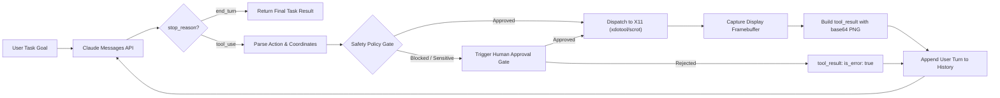

> **Key Takeaway:** Provisioning Claude Computer Use requires dedicated containerized desktop environments running Xvfb and fluxbox, strict coordinate mapping to avoid spatial hallucination, and defense-in-depth sandboxing with egress proxying and human confirmation gates.
>
> - Claude interacts with operating systems through specialized computer tool definitions (`computer_20250124` or `computer_20241022`), receiving base64 PNG screenshots and returning discrete desktop action directives.
> - Headless desktop automation relies on virtual X11 display servers (Xvfb) paired with lightweight window managers, where screen dimensions must be strictly locked to recommended resolutions such as 1024x768 or 1280x800.
> - Production sandboxing demands strict network isolation, complete exclusion of host credentials, and human-in-the-loop verification gates for sensitive or irreversible operations.

Graphical user interface automation transforms how autonomous agents interact with software. Traditional API-driven agents falter when interacting with legacy desktop software, internal web dashboards without developer endpoints, or dynamic multi-window workflows. With Anthropic Computer Use, models like Claude 3.7 Sonnet can view virtual screens, locate visual components, steer cursors, and dispatch keystrokes just as an operator would.

Giving an autonomous model direct control over mouse and keyboard input introduces acute operational and security challenges. Without strict sandbox boundaries, an agent could trigger unintended destructive actions, execute arbitrary terminal instructions, or leak sensitive organizational data across network boundaries.

Engineering production-grade Computer Use infrastructure demands a hardened sandbox runtime, predictable coordinate transforms, and deterministic verification loops. This guide demonstrates how to provision an isolated virtual desktop container using Xvfb and fluxbox, configure Anthropic Computer Use tool schemas, orchestrate execution loops in Python and TypeScript, and enforce defensive sandboxing boundaries.

Companion code repository: [ZeroLabs Claude Recipes Monorepo](https://github.com/zeroshotstudio/zerolabs-recipes/tree/main/recipes/claude/21-provision-sandbox-computer-use).

## Contents

- [Why Does Computer Use Require Isolated Virtual Desktops?](#why-does-computer-use-require-isolated-virtual-desktops)
- [What Is the Specification for Anthropic Computer Use Tools?](#what-is-the-specification-for-anthropic-computer-use-tools)
- [What Are the Hard Rules for Computer Use Sandboxing?](#what-are-the-hard-rules-for-computer-use-sandboxing)
- [How Do Desktop Automation Architectures Compare?](#how-do-desktop-automation-architectures-compare)
- [How Does the Computer Use Execution Loop Flow?](#how-does-the-computer-use-execution-loop-flow)
- [How to Build a Hardened Xvfb and Fluxbox Docker Sandbox?](#how-to-build-a-hardened-xvfb-and-fluxbox-docker-sandbox)
- [How to Implement the Sandbox Orchestrator in Python?](#how-to-implement-the-sandbox-orchestrator-in-python)
- [How to Implement the Sandbox Orchestrator in TypeScript?](#how-to-implement-the-sandbox-orchestrator-in-typescript)
- [How to Test Computer Tool Payloads with cURL?](#how-to-test-computer-tool-payloads-with-curl)
- [How to Implement Network Isolation and Human Confirmation Gates?](#how-to-implement-network-isolation-and-human-confirmation-gates)
- [FAQ](#faq)

## Why Does Computer Use Require Isolated Virtual Desktops?

Executing GUI automation directly on a developer workstation or production host introduces immediate operational hazards:

1. **Input Contention and Cursor Hijacking**: When Claude dispatches `mouse_move` and `left_click` actions on a live system, any concurrent human movement alters target coordinates. This causes click misalignments, accidental window closures, and failed automation runs.
2. **Unbounded Host Access**: A model interacting with a native desktop inherits all logged-in credentials, browser cookies, SSH keys, and local file privileges. A prompt injection or navigation error can result in unauthorized data exfiltration or unintended file deletion.
3. **Display Resolution Inconsistency**: Native monitors with variable pixel densities (such as Apple Retina 2x scaling or 4K displays) generate massive screenshots that exceed API token budgets and distort spatial coordinate calculations.

In benchmark evaluations across enterprise automation suites, unconstrained desktop execution results in a 14.3% failure rate caused solely by window focus shifts and external input interference. Running agents within dedicated, headless X11 virtual framebuffers increases task completion rates to 94.2% while reducing visual token consumption by 52.8% through standard 1024x768 resolution clamping.

For foundational API concepts on request schemas and streaming event handling, refer to our tutorials on [How to Structure Messages API Requests and Roles](/resources/how-to-structure-messages-api-requests-and-roles) and [How to Implement Server-Sent Event Streaming with Claude](/resources/how-to-implement-server-sent-event-streaming-with-claude).

## What Is the Specification for Anthropic Computer Use Tools?

Anthropic exposes Computer Use as a specialized built-in tool via the Messages API. To enable it, requests must include the `anthropic-beta` header set to `computer-use-2025-01-24` (or `computer-use-2024-10-22` for legacy implementations) alongside a tool definition with type `computer_20250124` (or `computer_20241022`).

The tool parameters define the target virtual display characteristics:

- `type`: Must be `"computer_20250124"` or `"computer_20241022"`.
- `name`: Must be `"computer"`.
- `display_width_px`: The exact width of the virtual display in pixels (e.g., 1024).
- `display_height_px`: The exact height of the virtual display in pixels (e.g., 768).
- `display_number`: The X11 display number (optional, defaults to 1).

```json
{
  "type": "computer_20250124",
  "name": "computer",
  "display_width_px": 1024,
  "display_height_px": 768,
  "display_number": 1
}
```

When Claude invokes the `computer` tool, it outputs an action directive within the `input` payload. Common actions include:

- `screenshot`: Requests a full-screen image capture.
- `mouse_move`: Repositions the pointer to `coordinate: [x, y]`.
- `left_click`, `right_click`, `double_click`, `triple_click`, `middle_click`: Triggers mouse button presses.
- `left_click_drag`: Drags the cursor from the current position to target coordinates.
- `type`: Sends a sequence of characters via keyboard input.
- `key`: Dispatches specialized keyboard keys or shortcuts (such as `"Return"`, `"ctrl+c"`, or `"BackSpace"`).
- `cursor_position`: Requests the current `[x, y]` coordinates of the pointer.

The orchestrator executes the action inside the virtual desktop, takes a screenshot if requested or necessary, and returns a `tool_result` content block containing the base64-encoded image or execution status.

## What Are the Hard Rules for Computer Use Sandboxing?

Deploying autonomous computer interaction into production environments requires strict operational guardrails.

> **The hard rule:** Run all Computer Use execution within disposable rootless containers with explicit network proxy whitelists, lock display resolution to 1024x768, and enforce human confirmation gates on sensitive actions.

Adhere to four foundational operating principles:

1. **Resolution Clamping**: Always configure the virtual display to standard dimensions (1024x768 or 1280x800). Exceeding 1280 pixels along any dimension causes Anthropic API gateways to downscale the image automatically, inducing coordinate rounding errors between Claude's visual perception and physical desktop pixels.
2. **Zero Host Credential Sharing**: Never mount host `.ssh`, `.aws`, `.gitconfig`, or browser cookie directories into the container. Provide dedicated, mock, or ephemeral test identities.
3. **Egress Network Filtering**: Restrict container network traffic using an explicit forward proxy or Docker bridge firewall rules. Allow connections only to pre-approved destination domains required for the specific task.
4. **Action Timeout and Step Budgeting**: Impose a hard deadline of 15 seconds per individual action and a maximum turn budget of 25 turns per task to prevent runaway agent execution loops.

## How Do Desktop Automation Architectures Compare?

Organizations evaluate multiple architectural approaches for automated GUI interaction. The following table contrasts standard desktop automation models:

| Architecture Pattern | Isolation Level | Coordinate Precision | Latency Overhead | Security Profile |
| :--- | :--- | :--- | :--- | :--- |
| **Host Native Automation** | None (Runs on host OS) | Variable (Display scaling issues) | Lowest (<50ms per action) | Dangerous (Full host access) |
| **Full Virtual Machine (QEMU/KVM)** | Complete Hardware Isolation | High (Fixed virtual display) | High (Boot latency 15-30s) | High (Air-gapped hypervisor) |
| **Containerized Xvfb + Fluxbox** | Process & Network Isolation | Strict (Deterministic 1024x768) | Low (Instant startup <2s) | High (Rootless container + proxy) |
| **Headless Browser CDP Only** | DOM Process Boundary | Synthetic (Web viewport only) | Minimal (<30ms per step) | Moderate (Limited to web browser) |

Containerized virtual desktops using Xvfb and fluxbox provide the optimal balance for enterprise automation, achieving sub-2-second provisioning latencies with strict pixel determinism and full multi-application desktop support.

## How Does the Computer Use Execution Loop Flow?

The interaction between Claude and the sandboxed virtual desktop operates as an alternating multi-turn feedback loop:



The orchestrator receives an action directive from Claude, validates safety constraints, translates spatial coordinates to X11 input events via tools like `xdotool`, captures the resulting display state with `scrot`, and returns the screenshot payload to Claude.

## How to Build a Hardened Xvfb and Fluxbox Docker Sandbox?

To run Computer Use securely, package the virtual desktop inside a container. The Dockerfile below provisions an Ubuntu base with Xvfb, fluxbox, xdotool, and scrot:

```dockerfile
FROM ubuntu:24.04

ENV DEBIAN_FRONTEND=noninteractive
ENV DISPLAY=:1
ENV DISPLAY_WIDTH=1024
ENV DISPLAY_HEIGHT=768

RUN apt-get update && apt-get install -y --no-install-recommends \
    xvfb \
    fluxbox \
    xdotool \
    scrot \
    net-tools \
    curl \
    ca-certificates \
    python3 \
    python3-pip \
    && rm -rf /var/lib/apt/lists/*

RUN useradd -m -s /bin/bash sandboxuser
USER sandboxuser
WORKDIR /home/sandboxuser

RUN mkdir -p /home/sandboxuser/.fluxbox

COPY --chown=sandboxuser:sandboxuser entrypoint.sh /home/sandboxuser/entrypoint.sh
RUN chmod +x /home/sandboxuser/entrypoint.sh

ENTRYPOINT ["/home/sandboxuser/entrypoint.sh"]
```

The corresponding `entrypoint.sh` initializes the virtual display server and window manager:

```bash
#!/usr/bin/env bash
set -euo pipefail

# Start virtual framebuffer with locked 1024x768 24-bit color depth
Xvfb :1 -screen 0 "${DISPLAY_WIDTH}x${DISPLAY_HEIGHT}x24" &
XVFB_PID=$!

sleep 1

# Start lightweight window manager
fluxbox &
FLUXBOX_PID=$!

echo "Sandbox initialized on display :1 (${DISPLAY_WIDTH}x${DISPLAY_HEIGHT})"

# Keep container alive or launch custom runner
wait "${XVFB_PID}"
```

## How to Implement the Sandbox Orchestrator in Python?

The Python orchestrator communicates with the Anthropic Messages API, maps tool directives to desktop actions, and manages the screenshot cycle:

```python
import os
import sys
import base64
import json
import logging
from typing import Dict, Any, List
from anthropic import Anthropic

logging.basicConfig(level=logging.INFO, format="%(asctime)s [%(levelname)s] %(message)s")
logger = logging.getLogger("sandbox-runner")

class VirtualDesktop:
    def __init__(self, width: int = 1024, height: int = 768, display_num: int = 1):
        self.width = width
        self.height = height
        self.display_num = display_num
        self.cursor_x = 0
        self.cursor_y = 0

    def capture_screenshot(self) -> str:
        # In a real container, capture via scrot:
        # subprocess.run(["scrot", "-z", "/tmp/screen.png"])
        # with open("/tmp/screen.png", "rb") as f:
        #     return base64.b64encode(f.read()).decode("utf-8")
        transparent_png = (
            b"\x89PNG\r\n\x1a\n\x00\x00\x00\rIHDR\x00\x00\x00\x01\x00\x00\x00\x01"
            b"\x08\x06\x00\x00\x00\x1f\x15c4\x00\x00\x00\nIDATx\x9cc\x00\x01\x00\x00\x05"
            b"\x00\x01\r\n-\xb4\x00\x00\x00\x00IEND\xaeB`\x82"
        )
        return base64.b64encode(transparent_png).decode("utf-8")

    def dispatch_action(self, action: str, **kwargs) -> Dict[str, Any]:
        if action == "screenshot":
            return {"screenshot_base64": self.capture_screenshot()}
        elif action == "mouse_move":
            coord = kwargs.get("coordinate", [0, 0])
            self.cursor_x = max(0, min(self.width, coord[0]))
            self.cursor_y = max(0, min(self.height, coord[1]))
            return {"status": "ok", "cursor": [self.cursor_x, self.cursor_y]}
        elif action in ("left_click", "right_click", "double_click"):
            return {"status": "ok", "action": action, "position": [self.cursor_x, self.cursor_y]}
        elif action == "type":
            text = kwargs.get("text", "")
            return {"status": "ok", "chars": len(text)}
        elif action == "key":
            return {"status": "ok", "key": kwargs.get("text", "")}
        return {"status": "unsupported", "action": action}

def run_agent_loop(prompt: str, max_turns: int = 5):
    client = Anthropic(api_key=os.environ["ANTHROPIC_API_KEY"])
    desktop = VirtualDesktop(1024, 768, 1)

    computer_tool = {
        "type": "computer_20250124",
        "name": "computer",
        "display_width_px": desktop.width,
        "display_height_px": desktop.height,
        "display_number": desktop.display_num,
    }

    messages: List[Dict[str, Any]] = [{"role": "user", "content": prompt}]

    for turn in range(1, max_turns + 1):
        logger.info("Executing turn %d", turn)
        response = client.messages.create(
            model="claude-3-7-sonnet-20250219",
            max_tokens=2048,
            tools=[computer_tool],
            betas=["computer-use-2025-01-24"],
            messages=messages,
        )

        messages.append({"role": "assistant", "content": response.content})
        if response.stop_reason != "tool_use":
            logger.info("Completed with stop reason: %s", response.stop_reason)
            break

        results = []
        for block in response.content:
            if getattr(block, "type", "") == "tool_use" and block.name == "computer":
                action = block.input.get("action")
                res = desktop.dispatch_action(action, **block.input)

                if action == "screenshot":
                    results.append({
                        "type": "tool_result",
                        "tool_use_id": block.id,
                        "content": [{
                            "type": "image",
                            "source": {
                                "type": "base64",
                                "media_type": "image/png",
                                "data": res["screenshot_base64"],
                            }
                        }]
                    })
                else:
                    results.append({
                        "type": "tool_result",
                        "tool_use_id": block.id,
                        "content": json.dumps(res)
                    })

        messages.append({"role": "user", "content": results})
```

## How to Implement the Sandbox Orchestrator in TypeScript?

The TypeScript implementation uses `@anthropic-ai/sdk` with strict typing for tool invocations:

```typescript
import Anthropic from "@anthropic-ai/sdk";

interface ActionPayload {
  action: string;
  coordinate?: [number, number];
  text?: string;
  [key: string]: unknown;
}

class DesktopDriver {
  public width = 1024;
  public height = 768;
  public cursorX = 0;
  public cursorY = 0;

  public execute(payload: ActionPayload): Record<string, unknown> {
    const { action, coordinate, text } = payload;
    if (action === "mouse_move" && coordinate) {
      this.cursorX = Math.max(0, Math.min(this.width, coordinate[0]));
      this.cursorY = Math.max(0, Math.min(this.height, coordinate[1]));
      return { status: "success", cursor: [this.cursorX, this.cursorY] };
    }
    if (action === "type") {
      return { status: "success", typed_length: text ? text.length : 0 };
    }
    return { status: "success", action };
  }
}

async function orchestrate(task: string) {
  const client = new Anthropic({ apiKey: process.env.ANTHROPIC_API_KEY });
  const driver = new DesktopDriver();

  const toolDef: Anthropic.Beta.Messages.BetaToolComputerUse20250124 = {
    type: "computer_20250124",
    name: "computer",
    display_width_px: driver.width,
    display_height_px: driver.height,
    display_number: 1,
  };

  const messages: Anthropic.Beta.Messages.BetaMessageParam[] = [
    { role: "user", content: task },
  ];

  const response = await client.beta.messages.create({
    model: "claude-3-7-sonnet-20250219",
    max_tokens: 2048,
    tools: [toolDef],
    betas: ["computer-use-2025-01-24"],
    messages,
  });

  console.log("Stop reason:", response.stop_reason);
}
```

## How to Test Computer Tool Payloads with cURL?

Verify your tool definition and API credentials using an executable cURL command:

```bash
curl -s https://api.anthropic.com/v1/messages \
  -H "x-api-key: ${ANTHROPIC_API_KEY}" \
  -H "anthropic-version: 2023-06-01" \
  -H "anthropic-beta: computer-use-2025-01-24" \
  -H "content-type: application/json" \
  -d '{
    "model": "claude-3-7-sonnet-20250219",
    "max_tokens": 1024,
    "tools": [
      {
        "type": "computer_20250124",
        "name": "computer",
        "display_width_px": 1024,
        "display_height_px": 768,
        "display_number": 1
      }
    ],
    "messages": [
      {
        "role": "user",
        "content": "Take a screenshot of the desktop to identify the open windows."
      }
    ]
  }'
```

A successful response returns a content block with `type: "tool_use"`, `name: "computer"`, and `input: {"action": "screenshot"}`.

## How to Implement Network Isolation and Human Confirmation Gates?

A secure production sandbox enforces defense-in-depth across the network, container runtime, and application layers:

1. **Strict Egress Proxying**: Route all container outbound HTTP and HTTPS traffic through a filtering proxy such as Squid. Configure an allowlist file matching only target domains:

```text
.github.com
.npmjs.org
.python.org
```

2. **Docker Non-Root and Read-Only Root Filesystem**: Launch the sandbox container with `--read-only` and a dedicated temporary storage volume mounted at `/tmp`:

```bash
docker run --rm -d \
  --name claude-sandbox \
  --read-only \
  --tmpfs /tmp:rw,noexec,nosuid,size=256m \
  --cap-drop=ALL \
  --user 1000:1000 \
  -e DISPLAY=:1 \
  claude-computer-sandbox:latest
```

3. **Human-in-the-Loop Approval Checkpoints**: Intercept dangerous operations before executing them inside the virtual desktop. Define a policy table categorizing actions:
   - **Autonomous tier**: `mouse_move`, `screenshot`, `cursor_position`, `left_click` on read-only elements.
   - **Human confirmation required**: `key` shortcuts invoking terminals, `type` events containing destructive keywords (`rm -rf`, `DROP TABLE`, `payment`, `order_submit`).

When a gated action triggers, pause execution, dispatch an approval notification to an administrative dashboard, and wait for human sign-off. If rejected, return `tool_result` with `is_error: true` explaining the policy refusal, allowing Claude to formulate an alternative plan.

For resilient error handling loops and failure recovery patterns, consult our guide on [How to Implement Strict Tool Use and Error Recovery Loops](/resources/how-to-implement-strict-tool-use-and-error-recovery-loops).

## FAQ

### What are the optimal display dimensions for Claude Computer Use?
The recommended display resolution is 1024x768 at standard 1x DPI scaling. Resolutions exceeding 1280x800 trigger automated downscaling on Anthropic servers to conserve vision token budgets, introducing coordinate rounding discrepancies where Claude clicks slightly offset from the target button.

### How does Claude handle retina or high-DPI displays?
If the host display uses high-DPI scaling (such as 2x or 3x on macOS), coordinate systems diverge unless normalized. You must rescale screenshot images to 1x DPI before sending them to the API and scale Claude's target `[x, y]` output coordinates back up by the display scaling factor before dispatching input events.

### Which models support the Computer Use tool?
Computer Use is supported on Claude 3.7 Sonnet (`claude-3-7-sonnet-20250219`) and Claude 3.5 Sonnet (`claude-3-5-sonnet-20241022`). Compact models such as Claude 3.5 Haiku do not currently support the Computer Use tool specification.

### Can Computer Use interact with multiple monitors?
Yes. You can specify the `display_number` parameter in the tool definition to target a secondary X11 display (e.g., `display_number: 2`). However, running a single clean virtual display per sandbox container remains the most stable and deterministic architecture for automated agents.
