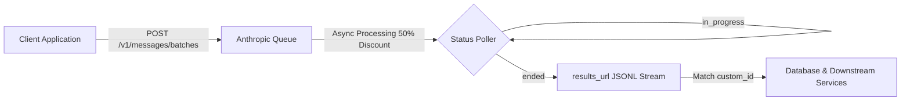

> Key Takeaways:
> - The Anthropic Message Batches API (`/v1/messages/batches`) cuts standard model pricing by 50% across both input and output tokens for non-latency-sensitive workloads.
> - Workloads process within a guaranteed 24-hour service level agreement (SLA), freeing applications from tight synchronous connection timeouts.
> - Batches utilize caller-defined `custom_id` strings to preserve strict deterministic mapping between input prompts and streaming JSONL results.
> - The batch lifecycle transitions through three processing statuses: `in_progress`, `canceling`, and `ended`.
> - Item-level results provide granular execution states: `succeeded`, `errored`, `canceled`, or `expired`.

When designing large-scale generative AI workflows such as document summarization, nightly code reviews, evaluation sweeps, or data enrichment pipelines, executing hundreds or thousands of synchronous requests is both financially costly and operationally fragile. Synchronous HTTP connections frequently hit gateway timeouts, rate limit throttling, and socket resets under high concurrency.

Anthropic solves this challenge with the Message Batches API. By packaging prompt requests into asynchronous batches, we eliminate network wait times while instantly reducing token expenditure by 50%. In this recipe, we walk through constructing asynchronous batch payloads, polling execution states, streaming JSONL results, and gracefully handling item-level errors.

## Batch Processing Mechanics and Lifecycle

Unlike standard synchronous calls handled through [our structured Messages API guidelines](https://labs.zeroshot.studio/resources/how-to-structure-messages-api-requests-and-roles), the Message Batches API decouples prompt submission from inference execution.

A batch job progresses through distinct architectural stages:

1. **Submission**: You send up to 10,000 individual message requests or 32 MB of JSON data to `/v1/messages/batches`. Each request must include a caller-generated `custom_id`.
2. **Asynchronous Execution**: Anthropic schedules requests across available infrastructure within a target 24-hour SLA window. The overall batch enters `in_progress`.
3. **Completion**: When all items finish, fail, or expire, the batch enters `ended`. If you issue a cancel command, it moves through `canceling` to `ended`.
4. **Result Streaming**: Completed results are streamed as newline-delimited JSON (JSONL) via a temporary signed URL (`results_url`), allowing your client to download and index output items by their `custom_id`.



### Understanding Status Codes and Item States

The batch object tracks aggregate progress while item-level lines record granular outcomes:

| Processing Status | Description |
| :--- | :--- |
| `in_progress` | The batch has been received and queued or active workers are processing requests. |
| `canceling` | A cancellation request was received; active requests are terminating. |
| `ended` | All requests have completed processing, errored, canceled, or reached the 24-hour expiration limit. |

Within the downloaded JSONL results, each line features a `custom_id` and a `result` object categorized into one of four states:

- `succeeded`: Contains the standard message response object, including message content and token usage.
- `errored`: Contains error details (for example, bad parameter or context window overflow).
- `canceled`: Returned if the batch was canceled before this specific item could run.
- `expired`: Returned if the request was not completed within the 24-hour SLA window.

## Prerequisites

Before deploying the batch processor, ensure you have:

- Python 3.10+ or Node.js 18+ installed on your host system.
- An active Anthropic API key with sufficient workspace credits.
- Network access to `https://api.anthropic.com`.
- Understanding of token budgeting and stop reasons as covered in [our guide to stop reasons and token truncation](https://labs.zeroshot.studio/resources/how-to-handle-stop-reasons-and-max-token-truncation).
- For maximum efficiency, you can also pair batch processing with caching patterns explained in [our ephemeral prompt caching guide](https://labs.zeroshot.studio/resources/how-to-optimize-token-costs-with-1-hour-ephemeral-cache).

Set your API key in your current shell:

```bash
export ANTHROPIC_API_KEY="your-anthropic-api-key"
```

## Python Implementation: Batch Client and Poller

We construct our batch processor using the official `anthropic` Python SDK. The client creates batched requests, monitors the status counters, and streams the final JSONL records.

Create the file `python/batch_processor.py`:

```python
import os
import sys
import time
from typing import Dict, Any, List
from anthropic import Anthropic
from anthropic.types.message_create_params import MessageCreateParamsNonStreaming
from anthropic.types.messages.batch_create_params import Request


def init_client() -> Anthropic:
    """Initialize Anthropic client using environment variable."""
    api_key = os.environ.get("ANTHROPIC_API_KEY")
    if not api_key:
        print("ERROR: ANTHROPIC_API_KEY environment variable is missing.", file=sys.stderr)
        sys.exit(1)
    return Anthropic(api_key=api_key)


def build_batch_requests(prompts: List[Dict[str, str]], model: str = "claude-3-5-sonnet-20241022") -> List[Request]:
    """Construct individual batch requests tagged with deterministic custom_ids."""
    requests: List[Request] = []
    for item in prompts:
        req = Request(
            custom_id=item["id"],
            params=MessageCreateParamsNonStreaming(
                model=model,
                max_tokens=500,
                messages=[
                    {"role": "user", "content": item["prompt"]}
                ]
            )
        )
        requests.append(req)
    return requests


def submit_batch(client: Anthropic, requests: List[Request]):
    """Submit requests batch to the Anthropic Message Batches API endpoint."""
    print(f"[+] Submitting batch containing {len(requests)} requests...")
    batch = client.messages.batches.create(requests=requests)
    print(f"[+] Batch created successfully! ID: {batch.id}")
    print(f"    Processing status: {batch.processing_status}")
    print(f"    Created at: {batch.created_at}")
    return batch


def poll_batch_status(client: Anthropic, batch_id: str, poll_interval_seconds: int = 5, timeout_seconds: int = 300):
    """
    Poll batch status until it reaches 'ended' status or times out.
    Status transitions: in_progress -> canceling (if canceled) -> ended.
    """
    start_time = time.time()
    print(f"[+] Polling batch status for {batch_id} (interval: {poll_interval_seconds}s)...")
    
    while True:
        batch = client.messages.batches.retrieve(batch_id)
        counts = batch.request_counts
        print(
            f"    Status: {batch.processing_status} | "
            f"Processing: {counts.processing} | "
            f"Succeeded: {counts.succeeded} | "
            f"Errored: {counts.errored} | "
            f"Canceled: {counts.canceled} | "
            f"Expired: {counts.expired}"
        )

        if batch.processing_status == "ended":
            print(f"[+] Batch completed with final status 'ended' at {batch.ended_at}")
            return batch

        if time.time() - start_time > timeout_seconds:
            print(f"[!] Polling timed out after {timeout_seconds}s. Batch is still in progress.")
            return batch

        time.sleep(poll_interval_seconds)


def retrieve_and_parse_results(client: Anthropic, batch_id: str) -> Dict[str, Any]:
    """
    Stream and inspect JSONL results from completed batch.
    Maps custom_id to individual results (succeeded, errored, canceled, expired).
    """
    print(f"[+] Streaming batch results for {batch_id}...")
    results_map: Dict[str, Any] = {}
    
    for result in client.messages.batches.results(batch_id):
        cid = result.custom_id
        res_type = result.result.type

        if res_type == "succeeded":
            message = result.result.message
            text_blocks = [b.text for b in message.content if hasattr(b, "text")]
            content_text = "\n".join(text_blocks)
            usage = message.usage
            results_map[cid] = {
                "status": "succeeded",
                "content": content_text,
                "input_tokens": usage.input_tokens,
                "output_tokens": usage.output_tokens,
            }
            print(f"  [{cid}] SUCCEEDED ({usage.input_tokens} in / {usage.output_tokens} out tokens)")
        elif res_type == "errored":
            err = result.result.error
            results_map[cid] = {
                "status": "errored",
                "error": str(err)
            }
            print(f"  [{cid}] ERRORED: {err}")
        elif res_type == "canceled":
            results_map[cid] = {"status": "canceled"}
            print(f"  [{cid}] CANCELED")
        elif res_type == "expired":
            results_map[cid] = {"status": "expired"}
            print(f"  [{cid}] EXPIRED")

    return results_map


def cancel_batch(client: Anthropic, batch_id: str):
    """Cancel an active in-flight batch."""
    print(f"[!] Requesting cancellation for batch {batch_id}...")
    batch = client.messages.batches.cancel(batch_id)
    print(f"[!] Batch status updated to: {batch.processing_status}")
    return batch
```

## TypeScript Implementation: Typed Batch Dispatcher

For Node.js and modern TypeScript environments, the `@anthropic-ai/sdk` exposes async iterable generators over the results stream.

Save the following module as `typescript/src/batch_processor.ts`:

```typescript
import Anthropic from '@anthropic-ai/sdk';
import * as dotenv from 'dotenv';

dotenv.config();

const apiKey = process.env.ANTHROPIC_API_KEY;
if (!apiKey) {
  console.error('ERROR: ANTHROPIC_API_KEY environment variable is required.');
  process.exit(1);
}

const client = new Anthropic({ apiKey });

export interface BatchPrompt {
  id: string;
  prompt: string;
}

export interface ParsedBatchResult {
  customId: string;
  status: 'succeeded' | 'errored' | 'canceled' | 'expired';
  content?: string;
  error?: string;
  inputTokens?: number;
  outputTokens?: number;
}

export async function createBatch(prompts: BatchPrompt[]) {
  console.log(`[+] Submitting batch containing ${prompts.length} requests...`);
  
  const requests = prompts.map((item) => ({
    custom_id: item.id,
    params: {
      model: 'claude-3-5-sonnet-20241022',
      max_tokens: 500,
      messages: [{ role: 'user' as const, content: item.prompt }]
    }
  }));

  const batch = await client.messages.batches.create({ requests });
  console.log(`[+] Batch created successfully! ID: ${batch.id}`);
  console.log(`    Processing status: ${batch.processing_status}`);
  return batch;
}

export async function pollBatch(batchId: string, intervalSeconds: number = 5, timeoutSeconds: number = 300) {
  const startTime = Date.now();
  console.log(`[+] Polling batch status for ${batchId} every ${intervalSeconds}s...`);

  while (true) {
    const batch = await client.messages.batches.retrieve(batchId);
    const counts = batch.request_counts;
    console.log(
      `    Status: ${batch.processing_status} | ` +
      `Processing: ${counts.processing} | ` +
      `Succeeded: ${counts.succeeded} | ` +
      `Errored: ${counts.errored} | ` +
      `Canceled: ${counts.canceled} | ` +
      `Expired: ${counts.expired}`
    );

    if (batch.processing_status === 'ended') {
      console.log(`[+] Batch ended at ${batch.ended_at}`);
      return batch;
    }

    if ((Date.now() - startTime) / 1000 > timeoutSeconds) {
      console.log(`[!] Polling timed out after ${timeoutSeconds}s.`);
      return batch;
    }

    await new Promise((resolve) => setTimeout(resolve, intervalSeconds * 1000));
  }
}

export async function streamResults(batchId: string): Promise<Map<string, ParsedBatchResult>> {
  console.log(`[+] Streaming results for batch ${batchId}...`);
  const results = new Map<string, ParsedBatchResult>();

  const resultsStream = await client.messages.batches.results(batchId);

  for await (const entry of resultsStream) {
    const customId = entry.custom_id;
    const resultType = entry.result.type;

    if (resultType === 'succeeded') {
      const msg = entry.result.message;
      const text = msg.content
        .filter((c) => c.type === 'text')
        .map((c) => (c as { type: 'text'; text: string }).text)
        .join('\n');

      results.set(customId, {
        customId,
        status: 'succeeded',
        content: text,
        inputTokens: msg.usage.input_tokens,
        outputTokens: msg.usage.output_tokens
      });
      console.log(`  [${customId}] SUCCEEDED (${msg.usage.input_tokens} in / ${msg.usage.output_tokens} out tokens)`);
    } else if (resultType === 'errored') {
      const err = entry.result.error;
      results.set(customId, {
        customId,
        status: 'errored',
        error: JSON.stringify(err)
      });
      console.log(`  [${customId}] ERRORED:`, err);
    } else if (resultType === 'canceled') {
      results.set(customId, { customId, status: 'canceled' });
      console.log(`  [${customId}] CANCELED`);
    } else if (resultType === 'expired') {
      results.set(customId, { customId, status: 'expired' });
      console.log(`  [${customId}] EXPIRED`);
    }
  }

  return results;
}
```

## Low-Level Verification with cURL

When debugging proxy environments or testing API endpoints directly from continuous integration scripts, you can interact with the raw REST interface using cURL.

Execute the following commands to create and inspect a single-item probe:

```bash
# [Step 1] Create a batch job
BATCH_RESP=$(curl -s -X POST "https://api.anthropic.com/v1/messages/batches" \
  -H "x-api-key: $ANTHROPIC_API_KEY" \
  -H "anthropic-version: 2023-06-01" \
  -H "content-type: application/json" \
  -d '{
    "requests": [
      {
        "custom_id": "probe-check-001",
        "params": {
          "model": "claude-3-5-sonnet-20241022",
          "max_tokens": 100,
          "messages": [{"role": "user", "content": "Respond with: BATCH_SYSTEM_OK"}]
        }
      }
    ]
  }')

echo "$BATCH_RESP"
BATCH_ID=$(echo "$BATCH_RESP" | jq -r .id)

# [Step 2] Poll the status
curl -s -X GET "https://api.anthropic.com/v1/messages/batches/$BATCH_ID" \
  -H "x-api-key: $ANTHROPIC_API_KEY" \
  -H "anthropic-version: 2023-06-01" | jq .

# [Step 3] Stream results once processing_status is ended
curl -s -X GET "https://api.anthropic.com/v1/messages/batches/$BATCH_ID/results" \
  -H "x-api-key: $ANTHROPIC_API_KEY" \
  -H "anthropic-version: 2023-06-01"
```

## Production Architecture and Best Practices

To extract the highest reliability and cost savings from the Message Batches API, we follow several architectural conventions:

### 1. Deterministic and Idempotent Custom IDs

Never generate random UUIDs for `custom_id` without persisting them locally first. If an ingestion worker restarts mid-run, deterministic identifiers allow you to cross-reference processed results without submitting duplicate jobs. Use composite keys such as:

```text
tenant_id:entity_type:entity_id:version_hash
```

For instance: `cust_402:doc:manual_v3:a9f1b8`.

### 2. Decouple Submission from Retrieval

Do not hold an active synchronous connection open for hours waiting for a batch to conclude. Instead, structure your batch workers into two independent stages:

- **Dispatcher Worker**: Collects pending database records, aggregates them into batches of 1,000 to 10,000 requests, submits the batch, and stores the `batch_id` with state `SUBMITTED` in your task database.
- **Collector Worker**: A scheduled cron or queue worker that periodically polls active batches. Once status reaches `ended`, it pulls the JSONL stream, writes the outputs to storage, updates database states, and notifies downstream consumers.

### 3. Graceful Error Handling and Partial Retries

A single failed item inside a batch of 5,000 prompts does not fail the entire batch. The other 4,999 items complete successfully with status `succeeded`. Inspect the `result.type` attribute of every row. When an item has status `errored`, parse its error payload and append it to a dead-letter queue for inspection or individual synchronous retry.

### 4. Proactive Cancellation

If an upstream user revokes an evaluation task or deletes a document collection, call the cancellation endpoint (`client.messages.batches.cancel(batch_id)`). Anthropic immediately halts processing unstarted items, preventing unneeded token charges.

## References and Source Code

- [Anthropic Official Batch Processing Documentation](https://docs.anthropic.com/en/docs/build-with-claude/batch-processing)
- [ZeroLabs Monorepo Recipe Code](https://github.com/zeroshotstudio/zerolabs-recipes/tree/main/recipes/claude/28-asynchronous-batch-processing)
- [How to Structure Messages API Requests](https://labs.zeroshot.studio/resources/how-to-structure-messages-api-requests-and-roles)
- [How to Handle Stop Reasons and Token Truncation](https://labs.zeroshot.studio/resources/how-to-handle-stop-reasons-and-max-token-truncation)
- [Optimize Token Costs with Prompt Caching](https://labs.zeroshot.studio/resources/how-to-optimize-token-costs-with-1-hour-ephemeral-cache)
